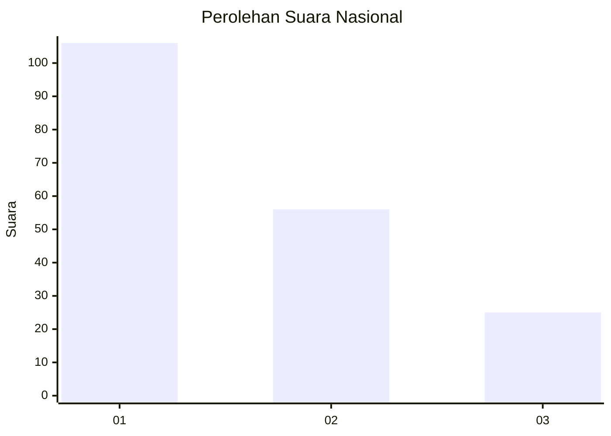
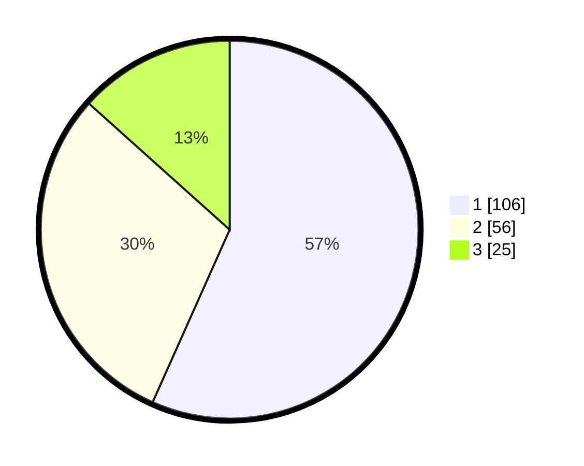

# Hasil

## Grafik

## Tabel

| No.    | Nama Paslon    | Suara | Suara (raw) | Persentase |
|:------ |:-------------- | -----:| -----------:| ----------:|
| 100025 | ANIES MUHAIMIN | 106   | [106][p-1]  | 56,68      |
| 100026 | PRABOWO GIBRAN | 56    | [56][p-2]   | 29,95      |
| 100027 | GANJAR MAHFUD  | 25    | [25][p-3]   | 13,37      |

[p-1]: https://github.com/gigit-pemilu/pemilu-2024/blob/main/pilpres/hitung-suara/sub/31-dki-jakarta/sub/74-jakarta-selatan/sub/01-tebet/sub/1005-bukit-duri/sub/081-tps/sub/paslon-1.txt
[p-2]: https://github.com/gigit-pemilu/pemilu-2024/blob/main/pilpres/hitung-suara/sub/31-dki-jakarta/sub/74-jakarta-selatan/sub/01-tebet/sub/1005-bukit-duri/sub/081-tps/sub/paslon-2.txt
[p-3]: https://github.com/gigit-pemilu/pemilu-2024/blob/main/pilpres/hitung-suara/sub/31-dki-jakarta/sub/74-jakarta-selatan/sub/01-tebet/sub/1005-bukit-duri/sub/081-tps/sub/paslon-3.txt

## Foto C Plano

https://sirekap-obj-formc.kpu.go.id/8ac3/pemilu/ppwp/31/74/01/10/05/3174011005081-20240214-192438--ccc11fe5-8c81-467f-b30f-c313c6285c7b.jpg

https://sirekap-obj-formc.kpu.go.id/8ac3/pemilu/ppwp/31/74/01/10/05/3174011005081-20240214-160139--bf4e31fb-d5c0-4366-bdf1-b458091270fd.jpg

https://sirekap-obj-formc.kpu.go.id/8ac3/pemilu/ppwp/31/74/01/10/05/3174011005081-20240214-155621--d211522f-16e3-450c-989a-98587e6a7311.jpg

## Metadata

| Key        | Value               |
| ---------- | ------------------- |
| Time Stamp | 2024-02-14 21:46:01 |

