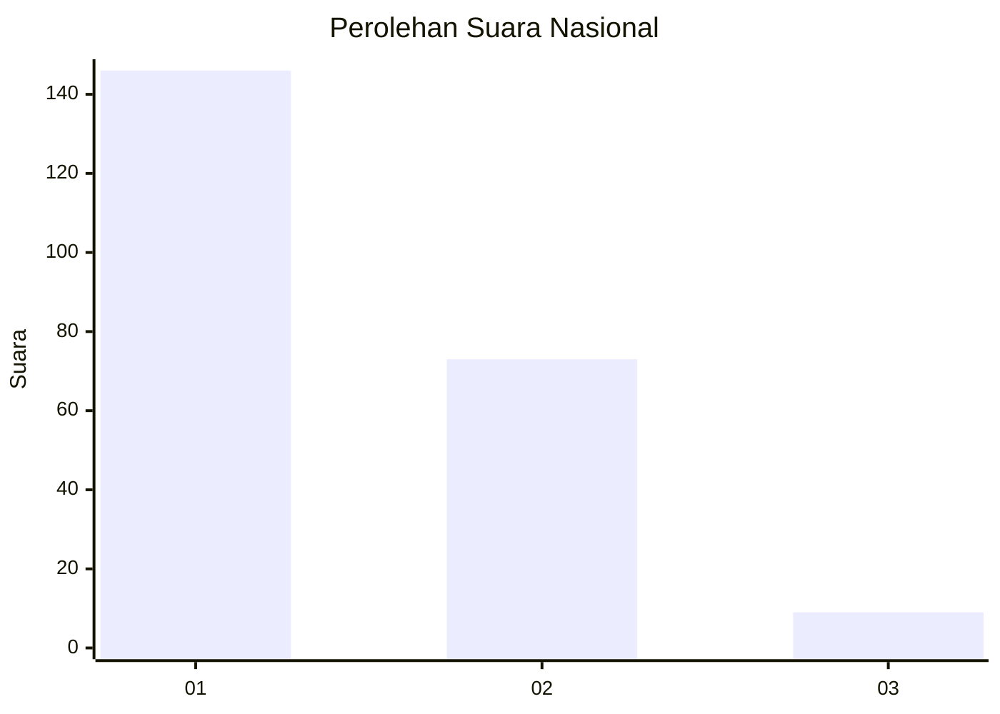
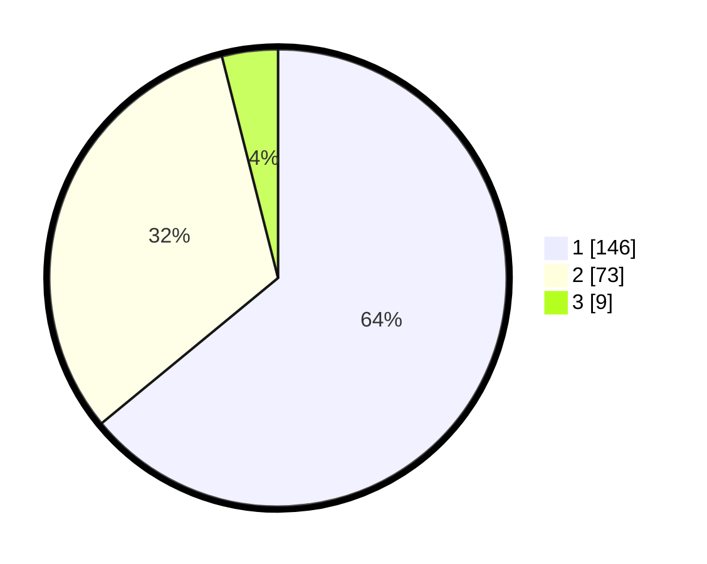

# Hasil

## Grafik

## Tabel

| No.    | Nama Paslon    | Suara | Suara (raw) | Persentase |
|:------ |:-------------- | -----:| -----------:| ----------:|
| 100025 | ANIES MUHAIMIN | 146   | [146][p-1]  | 64,04      |
| 100026 | PRABOWO GIBRAN | 73    | [73][p-2]   | 32,02      |
| 100027 | GANJAR MAHFUD  | 9     | [9][p-3]    | 3,95       |

[p-1]: https://github.com/gigit-pemilu/pemilu-2024/blob/main/pilpres/hitung-suara/sub/31-dki-jakarta/sub/74-jakarta-selatan/sub/01-tebet/sub/1005-bukit-duri/sub/089-tps/sub/paslon-1.txt
[p-2]: https://github.com/gigit-pemilu/pemilu-2024/blob/main/pilpres/hitung-suara/sub/31-dki-jakarta/sub/74-jakarta-selatan/sub/01-tebet/sub/1005-bukit-duri/sub/089-tps/sub/paslon-2.txt
[p-3]: https://github.com/gigit-pemilu/pemilu-2024/blob/main/pilpres/hitung-suara/sub/31-dki-jakarta/sub/74-jakarta-selatan/sub/01-tebet/sub/1005-bukit-duri/sub/089-tps/sub/paslon-3.txt

## Foto C Plano

https://sirekap-obj-formc.kpu.go.id/25ae/pemilu/ppwp/31/74/01/10/05/3174011005089-20240214-212314--ebdd9873-1750-4c21-a402-cfce119eae24.jpg

https://sirekap-obj-formc.kpu.go.id/25ae/pemilu/ppwp/31/74/01/10/05/3174011005089-20240214-211027--540113c6-e3d1-4e61-97ab-c4274f5400e2.jpg

https://sirekap-obj-formc.kpu.go.id/25ae/pemilu/ppwp/31/74/01/10/05/3174011005089-20240214-211046--21dbb2a8-ca61-4f06-a668-a1855038daa6.jpg

## Metadata

| Key        | Value               |
| ---------- | ------------------- |
| Time Stamp | 2024-02-17 18:30:00 |

