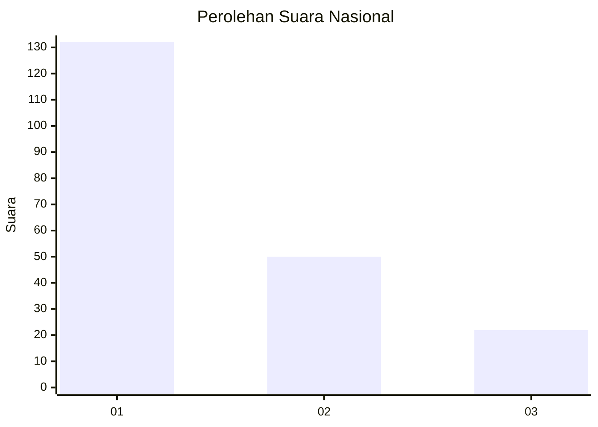
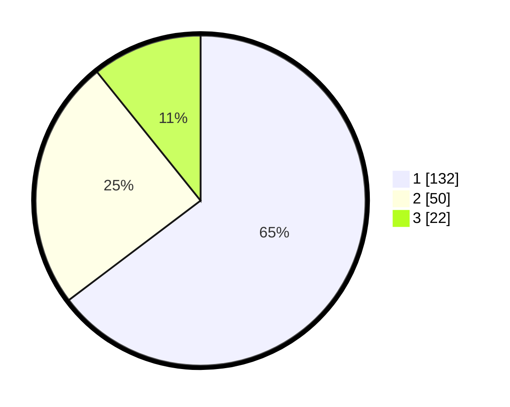

# Hasil

## Grafik

## Tabel

| No.    | Nama Paslon    | Suara | Suara (raw) | Persentase |
|:------ |:-------------- | -----:| -----------:| ----------:|
| 100025 | ANIES MUHAIMIN | 132   | [132][p-1]  | 64,71      |
| 100026 | PRABOWO GIBRAN | 50    | [50][p-2]   | 24,51      |
| 100027 | GANJAR MAHFUD  | 22    | [22][p-3]   | 10,78      |

[p-1]: https://github.com/gigit-pemilu/pemilu-2024/blob/main/pilpres/hitung-suara/sub/31-dki-jakarta/sub/74-jakarta-selatan/sub/01-tebet/sub/1005-bukit-duri/sub/117-tps/sub/paslon-1.txt
[p-2]: https://github.com/gigit-pemilu/pemilu-2024/blob/main/pilpres/hitung-suara/sub/31-dki-jakarta/sub/74-jakarta-selatan/sub/01-tebet/sub/1005-bukit-duri/sub/117-tps/sub/paslon-2.txt
[p-3]: https://github.com/gigit-pemilu/pemilu-2024/blob/main/pilpres/hitung-suara/sub/31-dki-jakarta/sub/74-jakarta-selatan/sub/01-tebet/sub/1005-bukit-duri/sub/117-tps/sub/paslon-3.txt

## Foto C Plano

https://sirekap-obj-formc.kpu.go.id/e9d1/pemilu/ppwp/31/74/01/10/05/3174011005117-20240215-191047--5fcc45a0-62d0-4759-91bd-2d8d54f25bd3.jpg

https://sirekap-obj-formc.kpu.go.id/e9d1/pemilu/ppwp/31/74/01/10/05/3174011005117-20240215-191123--2df0f54b-bee7-4dc9-86f3-923823e874ee.jpg

https://sirekap-obj-formc.kpu.go.id/e9d1/pemilu/ppwp/31/74/01/10/05/3174011005117-20240215-191203--bb39cf58-2895-491e-ac2b-076f216ac24f.jpg

## Metadata

| Key        | Value               |
| ---------- | ------------------- |
| Time Stamp | 2024-02-24 22:31:28 |

