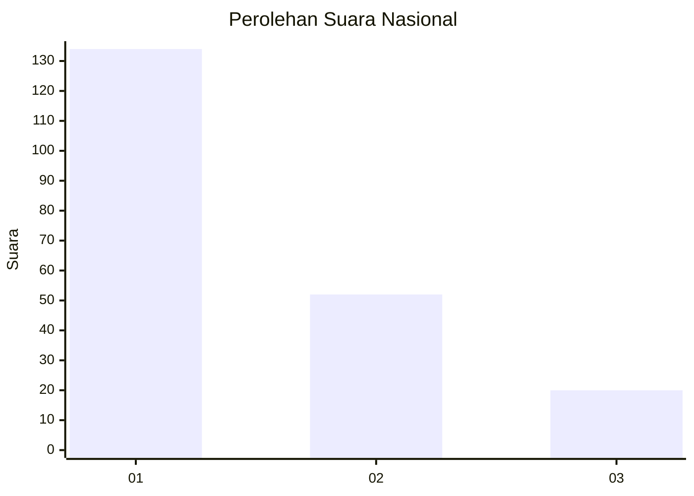
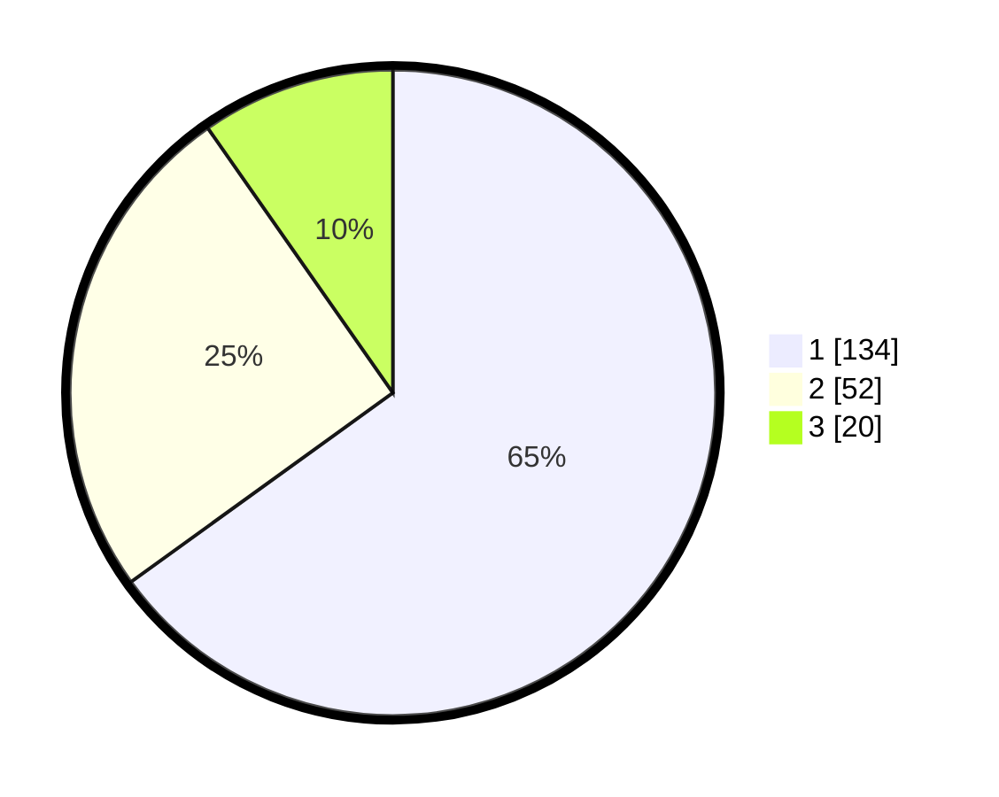

# Hasil

## Grafik

## Tabel

| No.    | Nama Paslon    | Suara | Suara (raw) | Persentase |
|:------ |:-------------- | -----:| -----------:| ----------:|
| 100025 | ANIES MUHAIMIN | 134   | [134][p-1]  | 65,05      |
| 100026 | PRABOWO GIBRAN | 52    | [52][p-2]   | 25,24      |
| 100027 | GANJAR MAHFUD  | 20    | [20][p-3]   | 9,71       |

[p-1]: https://github.com/gigit-pemilu/pemilu-2024/blob/main/pilpres/hitung-suara/sub/31-dki-jakarta/sub/74-jakarta-selatan/sub/01-tebet/sub/1006-manggarai-selatan/sub/006-tps/sub/paslon-1.txt
[p-2]: https://github.com/gigit-pemilu/pemilu-2024/blob/main/pilpres/hitung-suara/sub/31-dki-jakarta/sub/74-jakarta-selatan/sub/01-tebet/sub/1006-manggarai-selatan/sub/006-tps/sub/paslon-2.txt
[p-3]: https://github.com/gigit-pemilu/pemilu-2024/blob/main/pilpres/hitung-suara/sub/31-dki-jakarta/sub/74-jakarta-selatan/sub/01-tebet/sub/1006-manggarai-selatan/sub/006-tps/sub/paslon-3.txt

## Foto C Plano

https://sirekap-obj-formc.kpu.go.id/2881/pemilu/ppwp/31/74/01/10/06/3174011006006-20240214-235241--6a607d22-95c2-4379-8e3d-799719e6469e.jpg

https://sirekap-obj-formc.kpu.go.id/2881/pemilu/ppwp/31/74/01/10/06/3174011006006-20240214-235445--9c35904b-9eb2-4793-b68a-a855bb121393.jpg

https://sirekap-obj-formc.kpu.go.id/2881/pemilu/ppwp/31/74/01/10/06/3174011006006-20240214-235612--a55829db-e239-4078-ba82-8ac58514d7d6.jpg

## Metadata

| Key        | Value               |
| ---------- | ------------------- |
| Time Stamp | 2024-02-24 22:31:28 |

