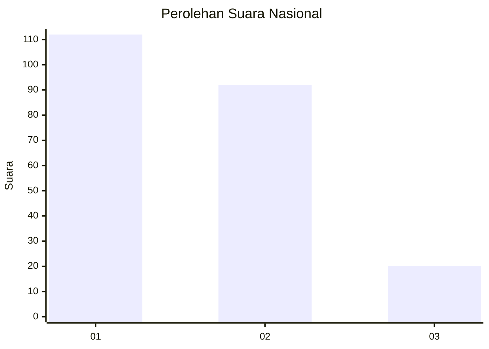
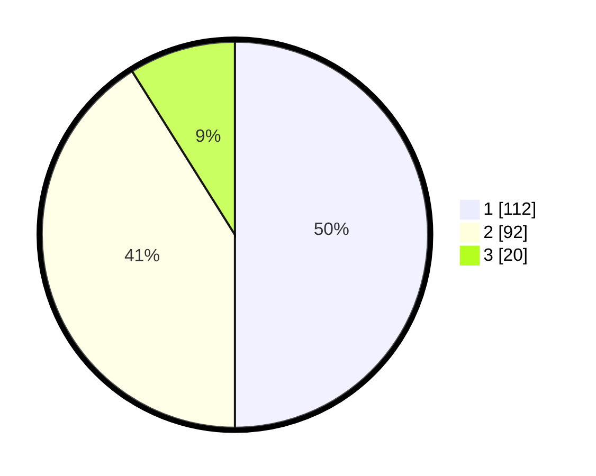

# Hasil

## Grafik

## Tabel

| No.    | Nama Paslon    | Suara | Suara (raw) | Persentase |
|:------ |:-------------- | -----:| -----------:| ----------:|
| 100025 | ANIES MUHAIMIN | 112   | [112][p-1]  | 50,00      |
| 100026 | PRABOWO GIBRAN | 92    | [92][p-2]   | 41,07      |
| 100027 | GANJAR MAHFUD  | 20    | [20][p-3]   | 8,93       |

[p-1]: https://github.com/gigit-pemilu/pemilu-2024/blob/main/pilpres/hitung-suara/sub/31-dki-jakarta/sub/74-jakarta-selatan/sub/01-tebet/sub/1006-manggarai-selatan/sub/011-tps/sub/paslon-1.txt
[p-2]: https://github.com/gigit-pemilu/pemilu-2024/blob/main/pilpres/hitung-suara/sub/31-dki-jakarta/sub/74-jakarta-selatan/sub/01-tebet/sub/1006-manggarai-selatan/sub/011-tps/sub/paslon-2.txt
[p-3]: https://github.com/gigit-pemilu/pemilu-2024/blob/main/pilpres/hitung-suara/sub/31-dki-jakarta/sub/74-jakarta-selatan/sub/01-tebet/sub/1006-manggarai-selatan/sub/011-tps/sub/paslon-3.txt

## Foto C Plano

https://sirekap-obj-formc.kpu.go.id/74ab/pemilu/ppwp/31/74/01/10/06/3174011006011-20240215-061345--a16d35c0-0af8-4206-b97c-1aaf84073e24.jpg

https://sirekap-obj-formc.kpu.go.id/74ab/pemilu/ppwp/31/74/01/10/06/3174011006011-20240215-061425--aedcd996-7c7b-43ee-bf9b-4669bc29cae4.jpg

https://sirekap-obj-formc.kpu.go.id/74ab/pemilu/ppwp/31/74/01/10/06/3174011006011-20240215-061447--924512b6-ea82-4dbb-8cfa-4e587dc408d0.jpg

## Metadata

| Key        | Value               |
| ---------- | ------------------- |
| Time Stamp | 2024-02-24 22:31:28 |

