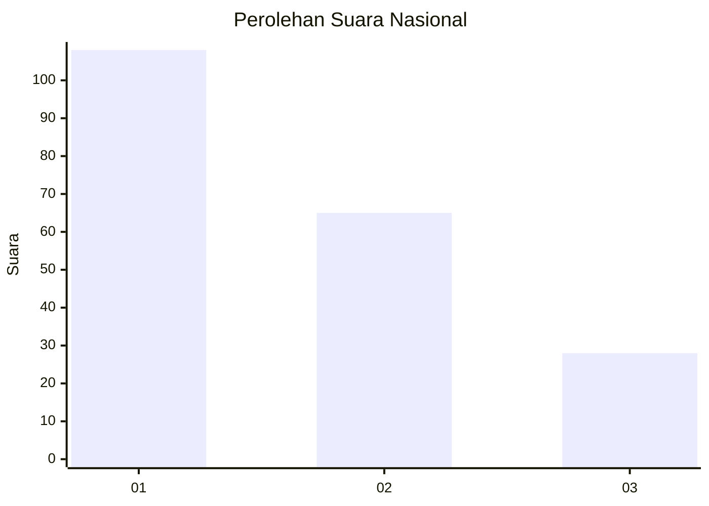
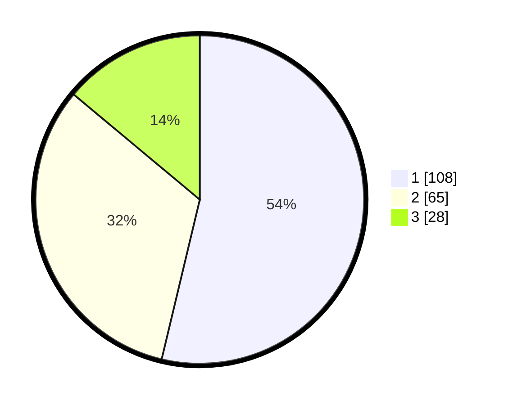

# Hasil

## Grafik

## Tabel

| No.    | Nama Paslon    | Suara | Suara (raw) | Persentase |
|:------ |:-------------- | -----:| -----------:| ----------:|
| 100025 | ANIES MUHAIMIN | 108   | [108][p-1]  | 53,73      |
| 100026 | PRABOWO GIBRAN | 65    | [65][p-2]   | 32,34      |
| 100027 | GANJAR MAHFUD  | 28    | [28][p-3]   | 13,93      |

[p-1]: https://github.com/gigit-pemilu/pemilu-2024/blob/main/pilpres/hitung-suara/sub/31-dki-jakarta/sub/74-jakarta-selatan/sub/01-tebet/sub/1006-manggarai-selatan/sub/067-tps/sub/paslon-1.txt
[p-2]: https://github.com/gigit-pemilu/pemilu-2024/blob/main/pilpres/hitung-suara/sub/31-dki-jakarta/sub/74-jakarta-selatan/sub/01-tebet/sub/1006-manggarai-selatan/sub/067-tps/sub/paslon-2.txt
[p-3]: https://github.com/gigit-pemilu/pemilu-2024/blob/main/pilpres/hitung-suara/sub/31-dki-jakarta/sub/74-jakarta-selatan/sub/01-tebet/sub/1006-manggarai-selatan/sub/067-tps/sub/paslon-3.txt

## Foto C Plano

https://sirekap-obj-formc.kpu.go.id/397f/pemilu/ppwp/31/74/01/10/06/3174011006067-20240214-215212--34c56e3a-0758-405c-a776-376c3b456fd4.jpg

https://sirekap-obj-formc.kpu.go.id/397f/pemilu/ppwp/31/74/01/10/06/3174011006067-20240214-214944--4a10cb86-871b-4165-baca-e53fdac9defe.jpg

https://sirekap-obj-formc.kpu.go.id/397f/pemilu/ppwp/31/74/01/10/06/3174011006067-20240214-215450--f1e47524-2456-4ce5-8c12-55788be0adb3.jpg

## Metadata

| Key        | Value               |
| ---------- | ------------------- |
| Time Stamp | 2024-02-24 22:31:28 |

