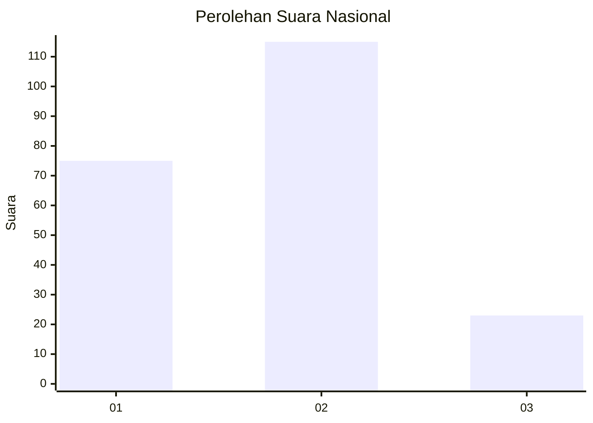
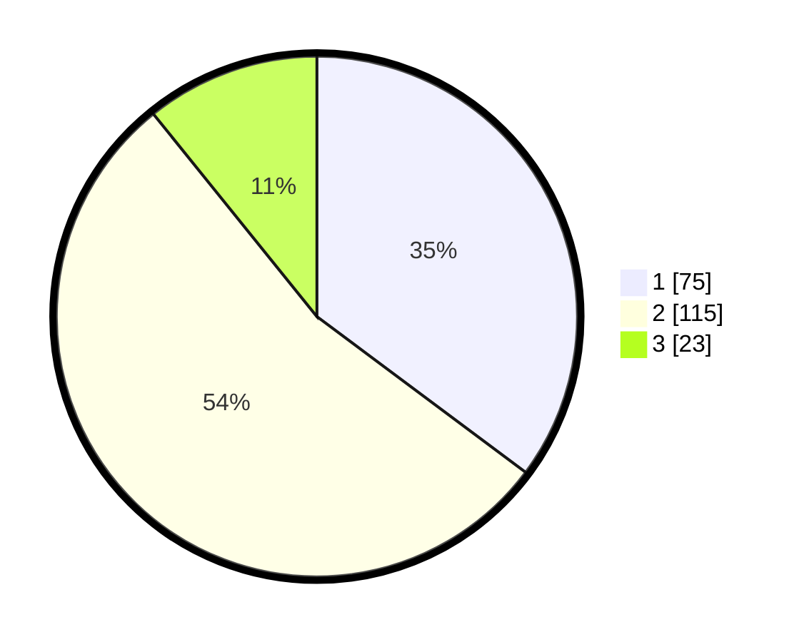

# Hasil

## Grafik

## Tabel

| No.    | Nama Paslon    | Suara | Suara (raw) | Persentase |
|:------ |:-------------- | -----:| -----------:| ----------:|
| 100025 | ANIES MUHAIMIN | 75    | [75][p-1]   | 35,21      |
| 100026 | PRABOWO GIBRAN | 115   | [115][p-2]  | 53,99      |
| 100027 | GANJAR MAHFUD  | 23    | [23][p-3]   | 10,80      |

[p-1]: https://github.com/gigit-pemilu/pemilu-2024/blob/main/pilpres/hitung-suara/sub/31-dki-jakarta/sub/74-jakarta-selatan/sub/01-tebet/sub/1007-manggarai/sub/027-tps/sub/paslon-1.txt
[p-2]: https://github.com/gigit-pemilu/pemilu-2024/blob/main/pilpres/hitung-suara/sub/31-dki-jakarta/sub/74-jakarta-selatan/sub/01-tebet/sub/1007-manggarai/sub/027-tps/sub/paslon-2.txt
[p-3]: https://github.com/gigit-pemilu/pemilu-2024/blob/main/pilpres/hitung-suara/sub/31-dki-jakarta/sub/74-jakarta-selatan/sub/01-tebet/sub/1007-manggarai/sub/027-tps/sub/paslon-3.txt

## Foto C Plano

https://sirekap-obj-formc.kpu.go.id/e141/pemilu/ppwp/31/74/01/10/07/3174011007027-20240214-201109--0de8cb4e-ebdf-4a24-a6ac-5364df1a6791.jpg

https://sirekap-obj-formc.kpu.go.id/e141/pemilu/ppwp/31/74/01/10/07/3174011007027-20240214-200648--d57324ba-7857-4e5c-b744-f4e9f5edca3f.jpg

https://sirekap-obj-formc.kpu.go.id/e141/pemilu/ppwp/31/74/01/10/07/3174011007027-20240214-200803--2de688ab-2bd7-4cae-a7bc-00ed4358f91d.jpg

## Metadata

| Key        | Value               |
| ---------- | ------------------- |
| Time Stamp | 2024-02-24 22:31:28 |

