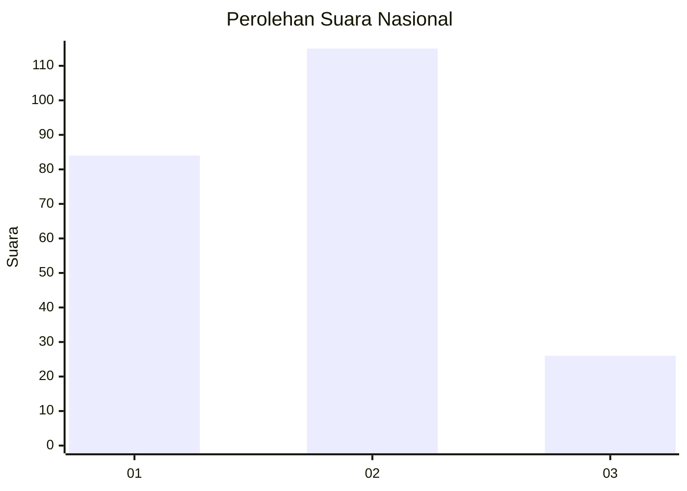
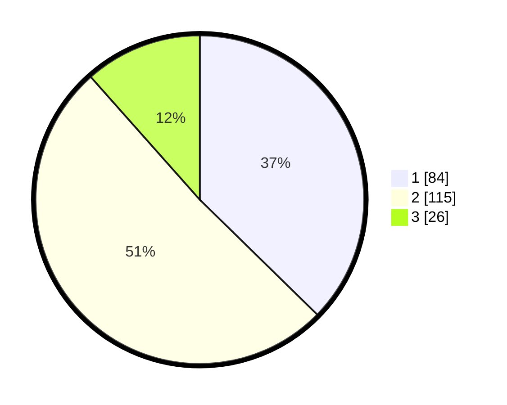

# Hasil

## Grafik

## Tabel

| No.    | Nama Paslon    | Suara | Suara (raw) | Persentase |
|:------ |:-------------- | -----:| -----------:| ----------:|
| 100025 | ANIES MUHAIMIN | 84    | [84][p-1]   | 37,33      |
| 100026 | PRABOWO GIBRAN | 115   | [115][p-2]  | 51,11      |
| 100027 | GANJAR MAHFUD  | 26    | [26][p-3]   | 11,56      |

[p-1]: https://github.com/gigit-pemilu/pemilu-2024/blob/main/pilpres/hitung-suara/sub/31-dki-jakarta/sub/74-jakarta-selatan/sub/01-tebet/sub/1007-manggarai/sub/045-tps/sub/paslon-1.txt
[p-2]: https://github.com/gigit-pemilu/pemilu-2024/blob/main/pilpres/hitung-suara/sub/31-dki-jakarta/sub/74-jakarta-selatan/sub/01-tebet/sub/1007-manggarai/sub/045-tps/sub/paslon-2.txt
[p-3]: https://github.com/gigit-pemilu/pemilu-2024/blob/main/pilpres/hitung-suara/sub/31-dki-jakarta/sub/74-jakarta-selatan/sub/01-tebet/sub/1007-manggarai/sub/045-tps/sub/paslon-3.txt

## Foto C Plano

https://sirekap-obj-formc.kpu.go.id/37c2/pemilu/ppwp/31/74/01/10/07/3174011007045-20240214-235028--7c6a04c9-5191-4c15-934b-f439a380cafd.jpg

https://sirekap-obj-formc.kpu.go.id/37c2/pemilu/ppwp/31/74/01/10/07/3174011007045-20240215-000023--abff5857-31ce-4401-9295-cf3152be1bae.jpg

https://sirekap-obj-formc.kpu.go.id/37c2/pemilu/ppwp/31/74/01/10/07/3174011007045-20240215-000047--1bd42bd0-0648-4f6f-bb89-e890d52dad11.jpg

## Metadata

| Key        | Value               |
| ---------- | ------------------- |
| Time Stamp | 2024-02-19 06:16:00 |

