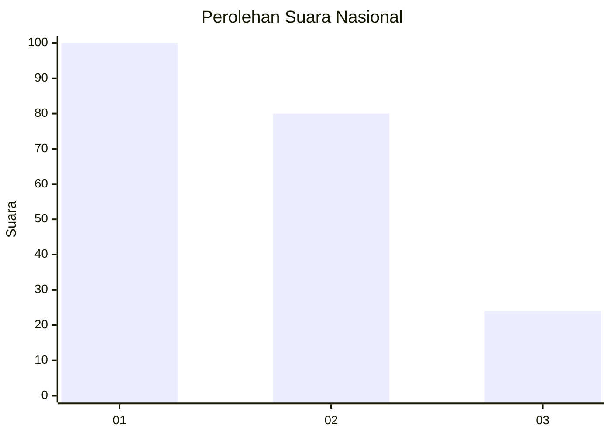
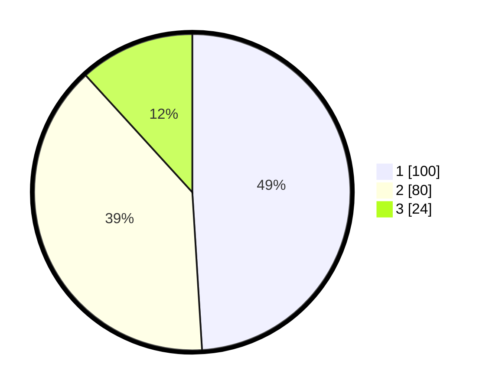

# Hasil

## Grafik

## Tabel

| No.    | Nama Paslon    | Suara | Suara (raw) | Persentase |
|:------ |:-------------- | -----:| -----------:| ----------:|
| 100025 | ANIES MUHAIMIN | 100   | [100][p-1]  | 49,02      |
| 100026 | PRABOWO GIBRAN | 80    | [80][p-2]   | 39,22      |
| 100027 | GANJAR MAHFUD  | 24    | [24][p-3]   | 11,76      |

[p-1]: https://github.com/gigit-pemilu/pemilu-2024/blob/main/pilpres/hitung-suara/sub/31-dki-jakarta/sub/74-jakarta-selatan/sub/01-tebet/sub/1007-manggarai/sub/053-tps/sub/paslon-1.txt
[p-2]: https://github.com/gigit-pemilu/pemilu-2024/blob/main/pilpres/hitung-suara/sub/31-dki-jakarta/sub/74-jakarta-selatan/sub/01-tebet/sub/1007-manggarai/sub/053-tps/sub/paslon-2.txt
[p-3]: https://github.com/gigit-pemilu/pemilu-2024/blob/main/pilpres/hitung-suara/sub/31-dki-jakarta/sub/74-jakarta-selatan/sub/01-tebet/sub/1007-manggarai/sub/053-tps/sub/paslon-3.txt

## Foto C Plano

https://sirekap-obj-formc.kpu.go.id/ee3d/pemilu/ppwp/31/74/01/10/07/3174011007053-20240215-000210--6f3bd2e4-9b07-4344-b7f7-54bbe12e362f.jpg

https://sirekap-obj-formc.kpu.go.id/ee3d/pemilu/ppwp/31/74/01/10/07/3174011007053-20240215-000318--16b97696-f6f0-4b27-9166-94e34c683df7.jpg

https://sirekap-obj-formc.kpu.go.id/ee3d/pemilu/ppwp/31/74/01/10/07/3174011007053-20240215-000515--33c3eb15-3e48-4123-97b5-3ada882ff04e.jpg

## Metadata

| Key        | Value               |
| ---------- | ------------------- |
| Time Stamp | 2024-02-25 11:00:00 |

