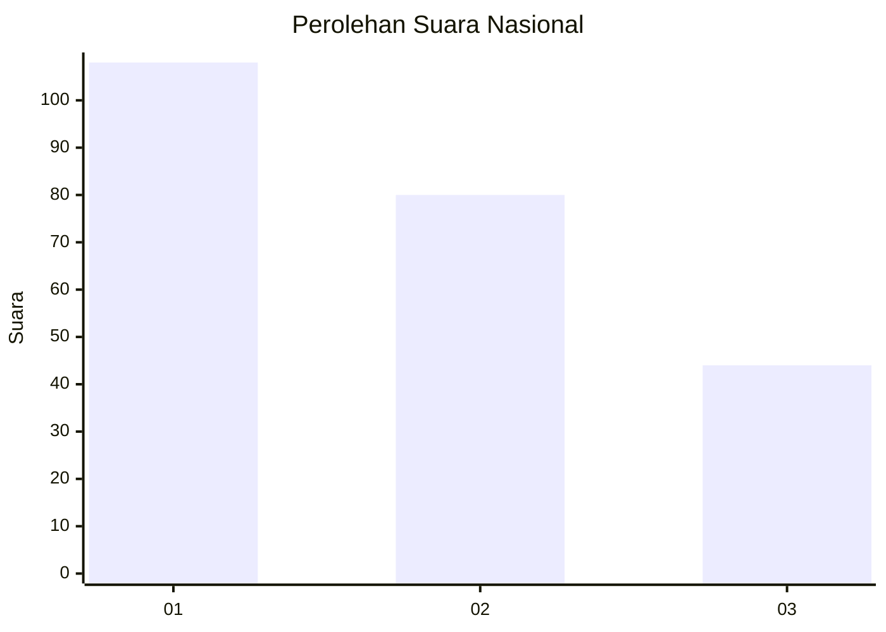
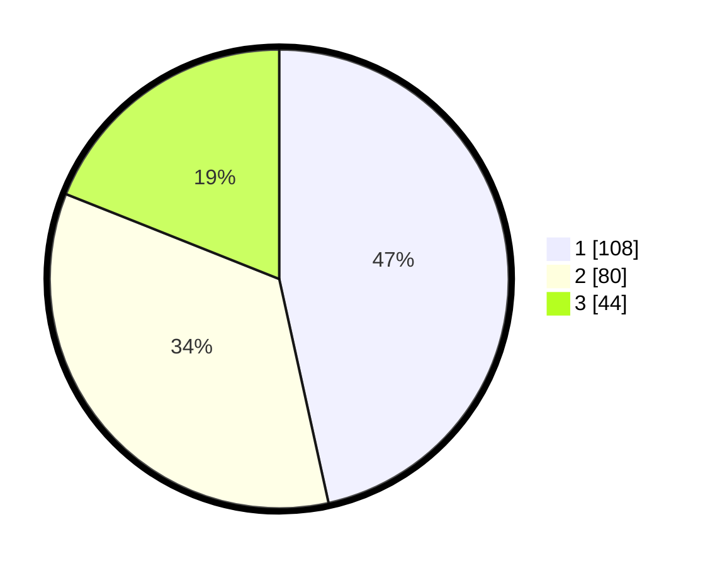

# Hasil

## Grafik

## Tabel

| No.    | Nama Paslon    | Suara | Suara (raw) | Persentase |
|:------ |:-------------- | -----:| -----------:| ----------:|
| 100025 | ANIES MUHAIMIN | 108   | [108][p-1]  | 46,55      |
| 100026 | PRABOWO GIBRAN | 80    | [80][p-2]   | 34,48      |
| 100027 | GANJAR MAHFUD  | 44    | [44][p-3]   | 18,97      |

[p-1]: https://github.com/gigit-pemilu/pemilu-2024/blob/main/pilpres/hitung-suara/sub/31-dki-jakarta/sub/74-jakarta-selatan/sub/01-tebet/sub/1007-manggarai/sub/065-tps/sub/paslon-1.txt
[p-2]: https://github.com/gigit-pemilu/pemilu-2024/blob/main/pilpres/hitung-suara/sub/31-dki-jakarta/sub/74-jakarta-selatan/sub/01-tebet/sub/1007-manggarai/sub/065-tps/sub/paslon-2.txt
[p-3]: https://github.com/gigit-pemilu/pemilu-2024/blob/main/pilpres/hitung-suara/sub/31-dki-jakarta/sub/74-jakarta-selatan/sub/01-tebet/sub/1007-manggarai/sub/065-tps/sub/paslon-3.txt

## Foto C Plano

https://sirekap-obj-formc.kpu.go.id/6a90/pemilu/ppwp/31/74/01/10/07/3174011007065-20240215-014038--a6f230e7-a490-4b89-a219-598db9715e83.jpg

https://sirekap-obj-formc.kpu.go.id/6a90/pemilu/ppwp/31/74/01/10/07/3174011007065-20240215-014238--b916c0cd-b4c6-455c-a632-625cd8828c14.jpg

https://sirekap-obj-formc.kpu.go.id/6a90/pemilu/ppwp/31/74/01/10/07/3174011007065-20240215-014325--8677c731-3970-4810-98e4-f22a9e4ad3a5.jpg

## Metadata

| Key        | Value               |
| ---------- | ------------------- |
| Time Stamp | 2024-02-25 15:00:00 |

