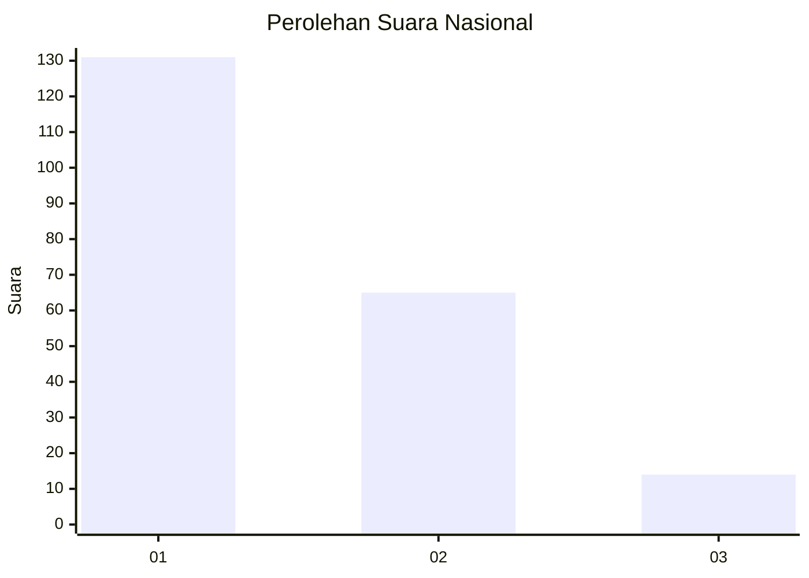
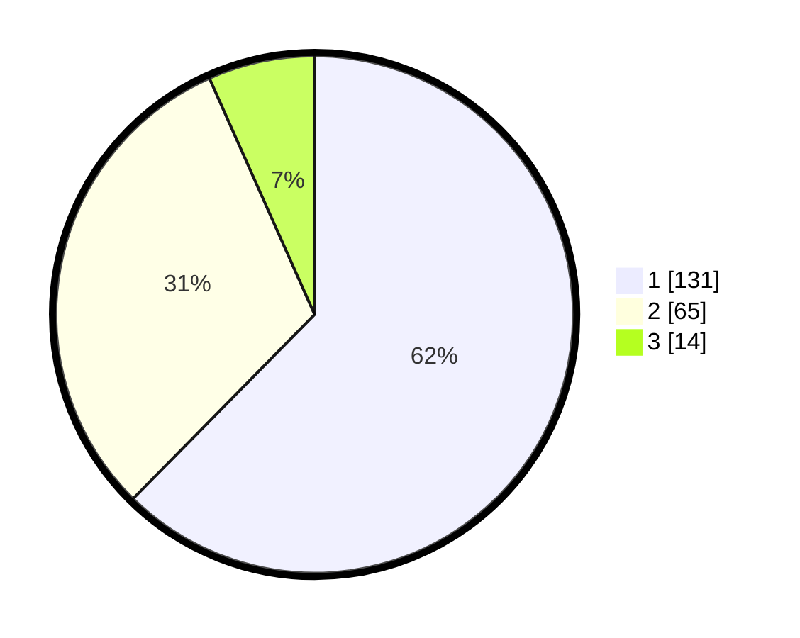

# Hasil

## Grafik

## Tabel

| No.    | Nama Paslon    | Suara | Suara (raw) | Persentase |
|:------ |:-------------- | -----:| -----------:| ----------:|
| 100025 | ANIES MUHAIMIN | 131   | [131][p-1]  | 62,38      |
| 100026 | PRABOWO GIBRAN | 65    | [65][p-2]   | 30,95      |
| 100027 | GANJAR MAHFUD  | 14    | [14][p-3]   | 6,67       |

[p-1]: https://github.com/gigit-pemilu/pemilu-2024/blob/main/pilpres/hitung-suara/sub/31-dki-jakarta/sub/74-jakarta-selatan/sub/01-tebet/sub/1007-manggarai/sub/069-tps/sub/paslon-1.txt
[p-2]: https://github.com/gigit-pemilu/pemilu-2024/blob/main/pilpres/hitung-suara/sub/31-dki-jakarta/sub/74-jakarta-selatan/sub/01-tebet/sub/1007-manggarai/sub/069-tps/sub/paslon-2.txt
[p-3]: https://github.com/gigit-pemilu/pemilu-2024/blob/main/pilpres/hitung-suara/sub/31-dki-jakarta/sub/74-jakarta-selatan/sub/01-tebet/sub/1007-manggarai/sub/069-tps/sub/paslon-3.txt

## Foto C Plano

https://sirekap-obj-formc.kpu.go.id/922e/pemilu/ppwp/31/74/01/10/07/3174011007069-20240214-220226--86bcbbc0-3046-4045-b6c6-2c6d8104d370.jpg

https://sirekap-obj-formc.kpu.go.id/922e/pemilu/ppwp/31/74/01/10/07/3174011007069-20240214-220256--a73b56fa-4dd6-47d5-96a1-3fcb313da8a1.jpg

https://sirekap-obj-formc.kpu.go.id/922e/pemilu/ppwp/31/74/01/10/07/3174011007069-20240214-220409--65750697-dfa8-4c26-b27d-9ef21abbdb38.jpg

## Metadata

| Key        | Value               |
| ---------- | ------------------- |
| Time Stamp | 2024-02-25 17:00:00 |

