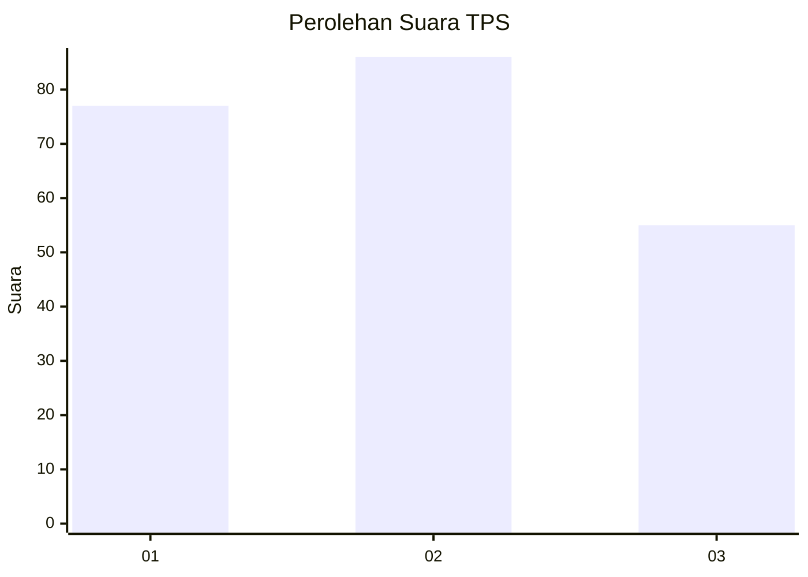
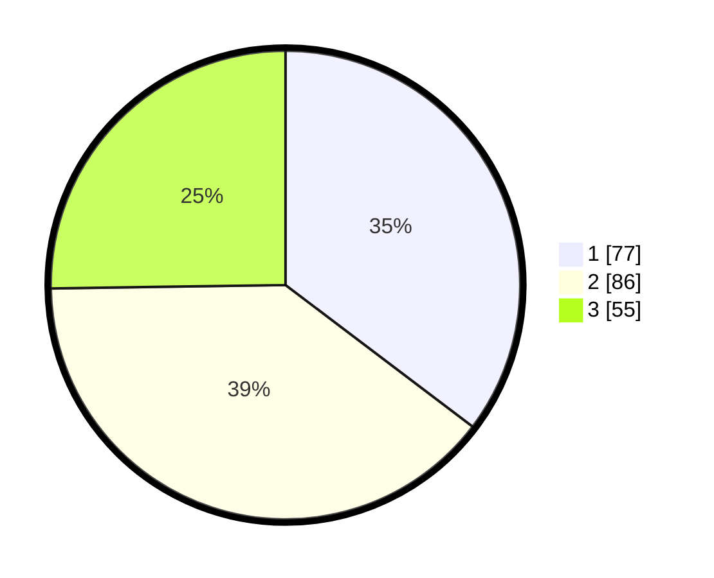

# Hasil

## Grafik

## Tabel

| No. | Nama Paslon    | Suara | Suara (raw) | Persentase |
|:--- |:-------------- | -----:| -----------:| ----------:|
| 1   | ANIES MUHAIMIN | 77    | [77][p-1]   | 35,32      |
| 2   | PRABOWO GIBRAN | 86    | [86][p-2]   | 39,45      |
| 3   | GANJAR MAHFUD  | 55    | [55][p-3]   | 25,23      |

[p-1]: https://github.com/gigit-pemilu/pemilu-2024-31-dki-jakarta/blob/main/pilpres/hitung-suara/sub/31-dki-jakarta/sub/74-jakarta-selatan/sub/02-setiabudi/sub/1001-setia-budi/sub/004-tps/sub/paslon-1.txt
[p-2]: https://github.com/gigit-pemilu/pemilu-2024-31-dki-jakarta/blob/main/pilpres/hitung-suara/sub/31-dki-jakarta/sub/74-jakarta-selatan/sub/02-setiabudi/sub/1001-setia-budi/sub/004-tps/sub/paslon-2.txt
[p-3]: https://github.com/gigit-pemilu/pemilu-2024-31-dki-jakarta/blob/main/pilpres/hitung-suara/sub/31-dki-jakarta/sub/74-jakarta-selatan/sub/02-setiabudi/sub/1001-setia-budi/sub/004-tps/sub/paslon-3.txt

## Foto C Plano

https://sirekap-obj-formc.kpu.go.id/2a58/pemilu/ppwp/31/74/02/10/01/3174021001004-20240214-162223--4503319f-d6d3-41b8-88b6-c6e67008c591.jpg

https://sirekap-obj-formc.kpu.go.id/2a58/pemilu/ppwp/31/74/02/10/01/3174021001004-20240214-184628--74795396-8da7-43de-b7e0-9fbe344bc629.jpg

https://sirekap-obj-formc.kpu.go.id/2a58/pemilu/ppwp/31/74/02/10/01/3174021001004-20240214-184633--cbceec26-b0c5-413d-8c47-9301cfca7e5e.jpg

## Metadata

| Key        | Value               |
| ---------- | ------------------- |
| Time Stamp | 2024-02-15 16:30:25 |

