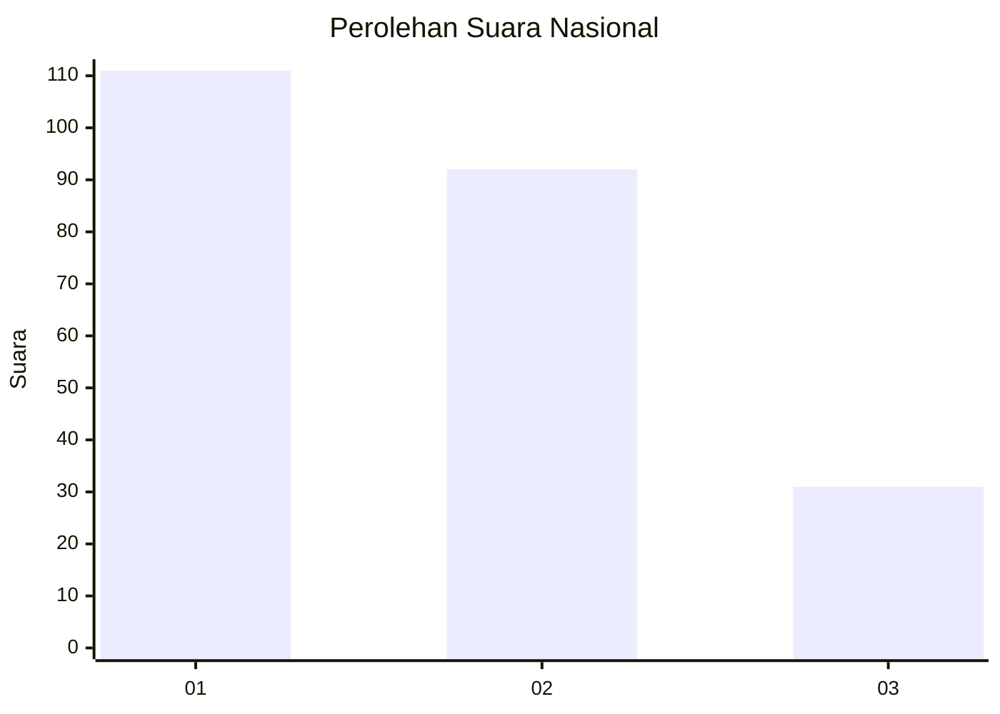
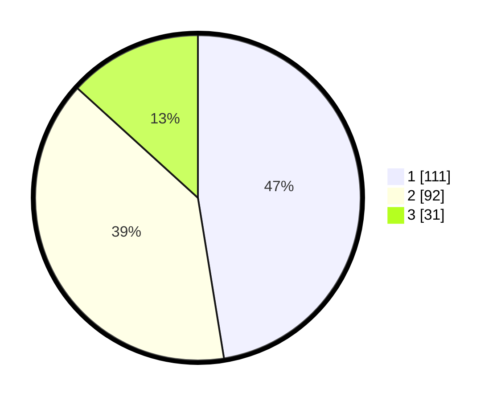

# Hasil

## Grafik

## Tabel

| No.    | Nama Paslon    | Suara | Suara (raw) | Persentase |
|:------ |:-------------- | -----:| -----------:| ----------:|
| 100025 | ANIES MUHAIMIN | 111   | [111][p-1]  | 47,44      |
| 100026 | PRABOWO GIBRAN | 92    | [92][p-2]   | 39,32      |
| 100027 | GANJAR MAHFUD  | 31    | [31][p-3]   | 13,25      |

[p-1]: https://github.com/gigit-pemilu/pemilu-2024/blob/main/pilpres/hitung-suara/sub/31-dki-jakarta/sub/74-jakarta-selatan/sub/02-setiabudi/sub/1001-setia-budi/sub/006-tps/sub/paslon-1.txt
[p-2]: https://github.com/gigit-pemilu/pemilu-2024/blob/main/pilpres/hitung-suara/sub/31-dki-jakarta/sub/74-jakarta-selatan/sub/02-setiabudi/sub/1001-setia-budi/sub/006-tps/sub/paslon-2.txt
[p-3]: https://github.com/gigit-pemilu/pemilu-2024/blob/main/pilpres/hitung-suara/sub/31-dki-jakarta/sub/74-jakarta-selatan/sub/02-setiabudi/sub/1001-setia-budi/sub/006-tps/sub/paslon-3.txt

## Foto C Plano

https://sirekap-obj-formc.kpu.go.id/9878/pemilu/ppwp/31/74/02/10/01/3174021001006-20240214-213356--c46f4b15-204a-47d9-b7ab-7bba58cdece1.jpg

https://sirekap-obj-formc.kpu.go.id/9878/pemilu/ppwp/31/74/02/10/01/3174021001006-20240214-214000--9338bb20-c015-40fc-a647-d44296a35327.jpg

https://sirekap-obj-formc.kpu.go.id/9878/pemilu/ppwp/31/74/02/10/01/3174021001006-20240214-214114--f1549d3b-4d63-4ba8-847d-3e3dda494d2f.jpg

## Metadata

| Key        | Value               |
| ---------- | ------------------- |
| Time Stamp | 2024-02-15 15:30:25 |

