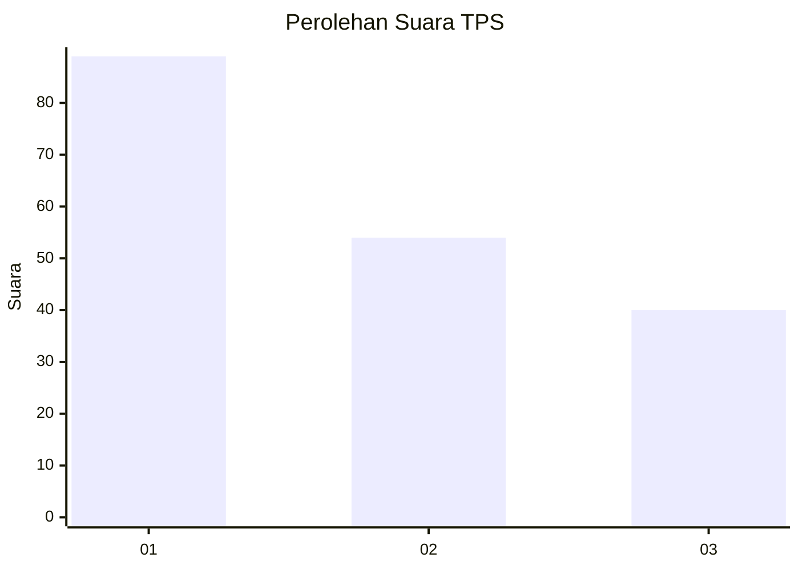
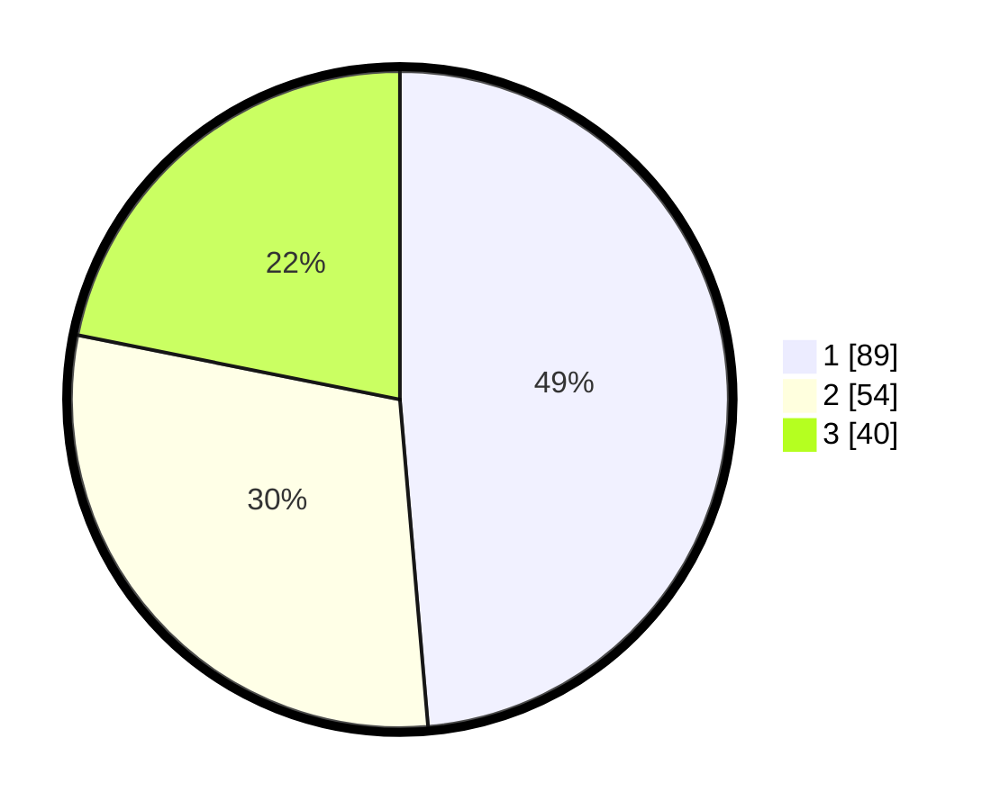

# Hasil

## Grafik

## Tabel

| No. | Nama Paslon    | Suara | Suara (raw) | Persentase |
|:--- |:-------------- | -----:| -----------:| ----------:|
| 1   | ANIES MUHAIMIN | 89    | [89][p-1]   | 48,63      |
| 2   | PRABOWO GIBRAN | 54    | [54][p-2]   | 29,51      |
| 3   | GANJAR MAHFUD  | 40    | [40][p-3]   | 21,86      |

[p-1]: https://github.com/gigit-pemilu/pemilu-2024-31-dki-jakarta/blob/main/pilpres/hitung-suara/sub/31-dki-jakarta/sub/74-jakarta-selatan/sub/02-setiabudi/sub/1001-setia-budi/sub/008-tps/sub/paslon-1.txt
[p-2]: https://github.com/gigit-pemilu/pemilu-2024-31-dki-jakarta/blob/main/pilpres/hitung-suara/sub/31-dki-jakarta/sub/74-jakarta-selatan/sub/02-setiabudi/sub/1001-setia-budi/sub/008-tps/sub/paslon-2.txt
[p-3]: https://github.com/gigit-pemilu/pemilu-2024-31-dki-jakarta/blob/main/pilpres/hitung-suara/sub/31-dki-jakarta/sub/74-jakarta-selatan/sub/02-setiabudi/sub/1001-setia-budi/sub/008-tps/sub/paslon-3.txt

## Foto C Plano

https://sirekap-obj-formc.kpu.go.id/47f4/pemilu/ppwp/31/74/02/10/01/3174021001008-20240214-203942--4b6d9def-e00d-448c-b4ae-1f2f26c4e5d0.jpg

https://sirekap-obj-formc.kpu.go.id/47f4/pemilu/ppwp/31/74/02/10/01/3174021001008-20240214-203754--50af04e8-6ec5-4987-9e5a-353084367670.jpg

https://sirekap-obj-formc.kpu.go.id/47f4/pemilu/ppwp/31/74/02/10/01/3174021001008-20240214-203832--79d24593-3199-4f08-96c9-9c484dbccfdd.jpg

## Metadata

| Key        | Value               |
| ---------- | ------------------- |
| Time Stamp | 2024-02-24 22:31:28 |

