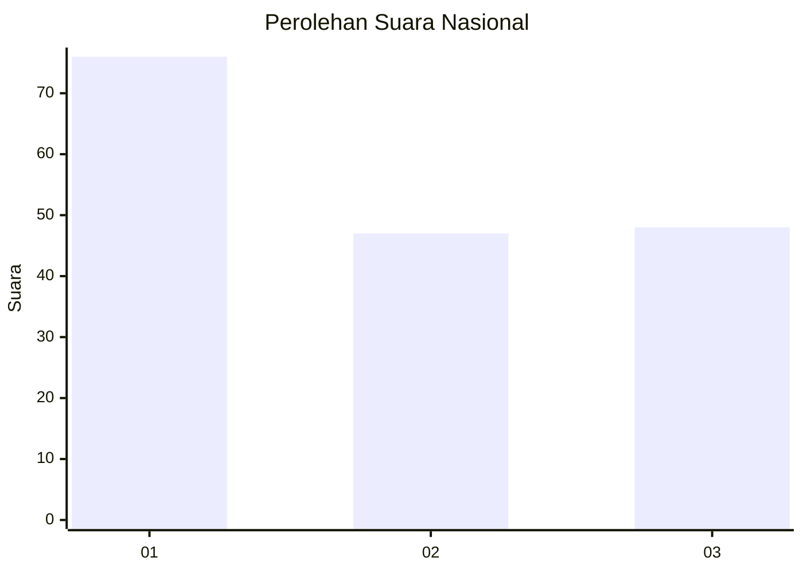
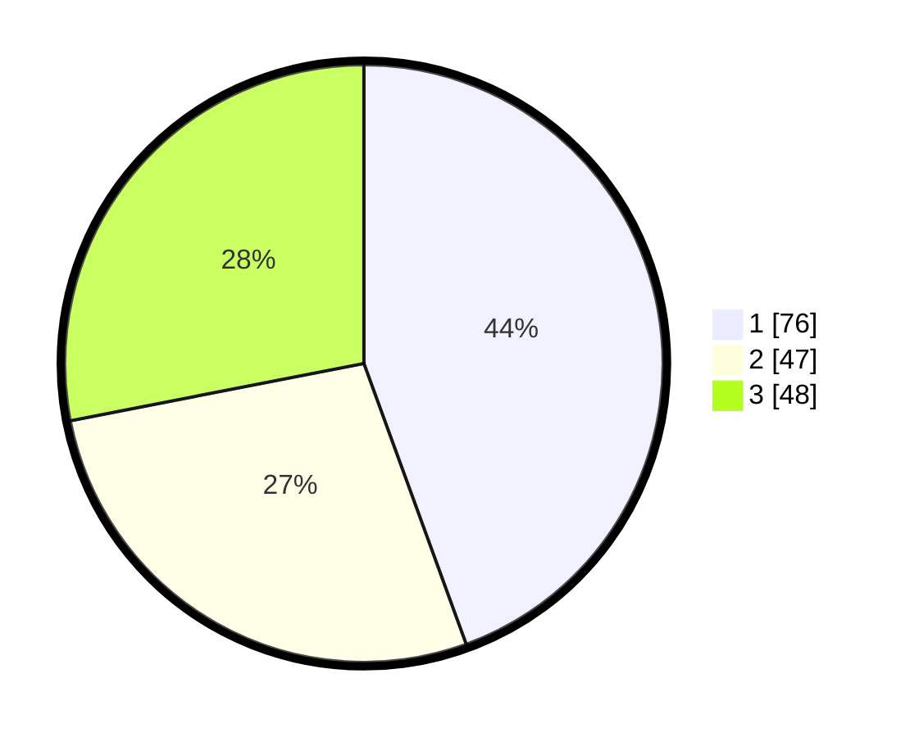

# Hasil

## Grafik

## Tabel

| No. | Nama Paslon    | Suara | Suara (raw) | Persentase |
|:--- |:-------------- | -----:| -----------:| ----------:|
| 1   | ANIES MUHAIMIN | 76    | [76][p-1]   | 44,44      |
| 2   | PRABOWO GIBRAN | 47    | [47][p-2]   | 27,49      |
| 3   | GANJAR MAHFUD  | 48    | [48][p-3]   | 28,07      |

[p-1]: https://github.com/gigit-pemilu/pemilu-2024/blob/main/pilpres/hitung-suara/sub/31-dki-jakarta/sub/74-jakarta-selatan/sub/02-setiabudi/sub/1001-setia-budi/sub/011-tps/sub/paslon-1.txt
[p-2]: https://github.com/gigit-pemilu/pemilu-2024/blob/main/pilpres/hitung-suara/sub/31-dki-jakarta/sub/74-jakarta-selatan/sub/02-setiabudi/sub/1001-setia-budi/sub/011-tps/sub/paslon-2.txt
[p-3]: https://github.com/gigit-pemilu/pemilu-2024/blob/main/pilpres/hitung-suara/sub/31-dki-jakarta/sub/74-jakarta-selatan/sub/02-setiabudi/sub/1001-setia-budi/sub/011-tps/sub/paslon-3.txt

## Foto C Plano

https://sirekap-obj-formc.kpu.go.id/1da5/pemilu/ppwp/31/74/02/10/01/3174021001011-20240214-221932--3c08c781-4222-49c8-8602-6476e371d1af.jpg

https://sirekap-obj-formc.kpu.go.id/1da5/pemilu/ppwp/31/74/02/10/01/3174021001011-20240214-222146--6a9e30a2-895b-4c20-97d7-9a1f46c030c8.jpg

https://sirekap-obj-formc.kpu.go.id/1da5/pemilu/ppwp/31/74/02/10/01/3174021001011-20240214-222640--58113bd8-9b33-4d8c-8b54-8fa910e73577.jpg

## Metadata

| Key        | Value               |
| ---------- | ------------------- |
| Time Stamp | 2024-02-24 22:31:28 |

