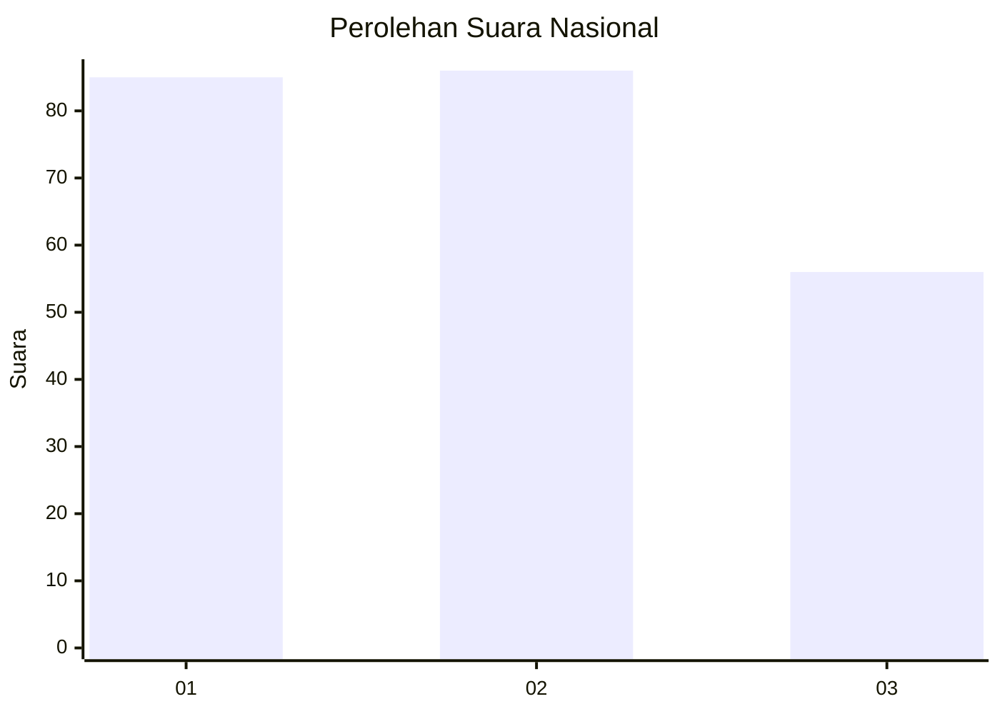

# Hasil

## Grafik

## Tabel

| No.    | Nama Paslon    | Suara | Suara (raw) | Persentase |
|:------ |:-------------- | -----:| -----------:| ----------:|
| 100025 | ANIES MUHAIMIN | 85    | [85][p-1]   | 37,44      |
| 100026 | PRABOWO GIBRAN | 86    | [86][p-2]   | 37,89      |
| 100027 | GANJAR MAHFUD  | 56    | [56][p-3]   | 24,67      |

[p-1]: https://github.com/gigit-pemilu/pemilu-2024/blob/main/pilpres/hitung-suara/sub/31-dki-jakarta/sub/74-jakarta-selatan/sub/02-setiabudi/sub/1003-karet-kuningan/sub/005-tps/sub/paslon-1.txt
[p-2]: https://github.com/gigit-pemilu/pemilu-2024/blob/main/pilpres/hitung-suara/sub/31-dki-jakarta/sub/74-jakarta-selatan/sub/02-setiabudi/sub/1003-karet-kuningan/sub/005-tps/sub/paslon-2.txt
[p-3]: https://github.com/gigit-pemilu/pemilu-2024/blob/main/pilpres/hitung-suara/sub/31-dki-jakarta/sub/74-jakarta-selatan/sub/02-setiabudi/sub/1003-karet-kuningan/sub/005-tps/sub/paslon-3.txt

## Foto C Plano

https://sirekap-obj-formc.kpu.go.id/7a04/pemilu/ppwp/31/74/02/10/03/3174021003005-20240214-215817--ea3ed45e-daf4-41b2-b8a1-324fef0fc057.jpg

https://sirekap-obj-formc.kpu.go.id/7a04/pemilu/ppwp/31/74/02/10/03/3174021003005-20240214-160125--324206f7-0649-4c4b-a863-6e8bd9249cde.jpg

https://sirekap-obj-formc.kpu.go.id/7a04/pemilu/ppwp/31/74/02/10/03/3174021003005-20240214-220330--960e0603-726c-4b57-87d6-3356d7e7d297.jpg

## Metadata

| Key        | Value               |
| ---------- | ------------------- |
| Time Stamp | 2024-02-24 22:31:28 |

