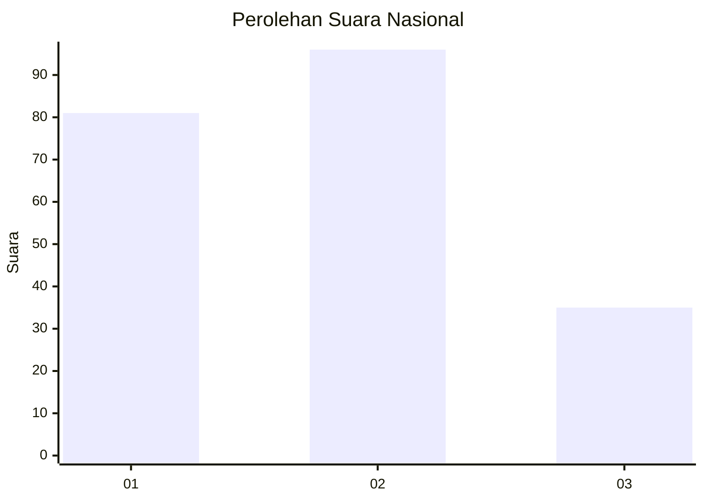
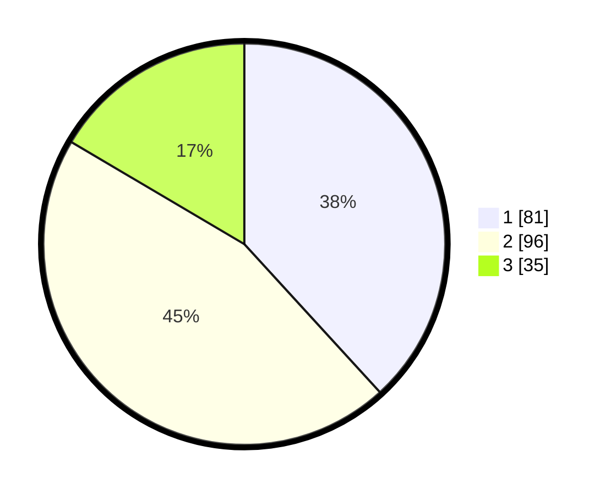

# Hasil

## Grafik

## Tabel

| No.    | Nama Paslon    | Suara | Suara (raw) | Persentase |
|:------ |:-------------- | -----:| -----------:| ----------:|
| 100025 | ANIES MUHAIMIN | 81    | [81][p-1]   | 38,21      |
| 100026 | PRABOWO GIBRAN | 96    | [96][p-2]   | 45,28      |
| 100027 | GANJAR MAHFUD  | 35    | [35][p-3]   | 16,51      |

[p-1]: https://github.com/gigit-pemilu/pemilu-2024/blob/main/pilpres/hitung-suara/sub/31-dki-jakarta/sub/74-jakarta-selatan/sub/02-setiabudi/sub/1003-karet-kuningan/sub/050-tps/sub/paslon-1.txt
[p-2]: https://github.com/gigit-pemilu/pemilu-2024/blob/main/pilpres/hitung-suara/sub/31-dki-jakarta/sub/74-jakarta-selatan/sub/02-setiabudi/sub/1003-karet-kuningan/sub/050-tps/sub/paslon-2.txt
[p-3]: https://github.com/gigit-pemilu/pemilu-2024/blob/main/pilpres/hitung-suara/sub/31-dki-jakarta/sub/74-jakarta-selatan/sub/02-setiabudi/sub/1003-karet-kuningan/sub/050-tps/sub/paslon-3.txt

## Foto C Plano

https://sirekap-obj-formc.kpu.go.id/4472/pemilu/ppwp/31/74/02/10/03/3174021003050-20240219-180522--76706b7f-9b7d-4816-a1ec-6084906fe6a7.jpg

https://sirekap-obj-formc.kpu.go.id/4472/pemilu/ppwp/31/74/02/10/03/3174021003050-20240219-175954--b53e4c64-d161-4329-af46-e67aa3a99551.jpg

https://sirekap-obj-formc.kpu.go.id/4472/pemilu/ppwp/31/74/02/10/03/3174021003050-20240219-180432--2768c8f1-80b1-4272-9a01-87804537ec9c.jpg

## Metadata

| Key        | Value               |
| ---------- | ------------------- |
| Time Stamp | 2024-02-24 22:31:28 |

