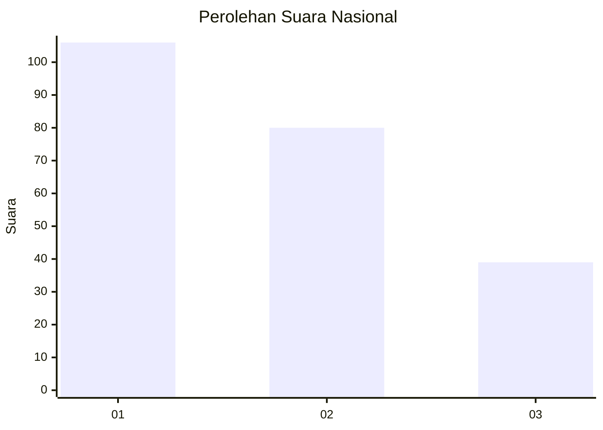
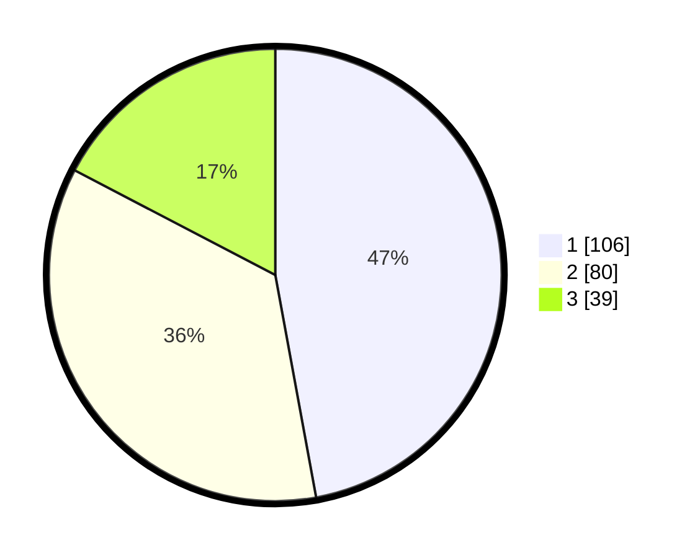

# Hasil

## Grafik

## Tabel

| No.    | Nama Paslon    | Suara | Suara (raw) | Persentase |
|:------ |:-------------- | -----:| -----------:| ----------:|
| 100025 | ANIES MUHAIMIN | 106   | [106][p-1]  | 47,11      |
| 100026 | PRABOWO GIBRAN | 80    | [80][p-2]   | 35,56      |
| 100027 | GANJAR MAHFUD  | 39    | [39][p-3]   | 17,33      |

[p-1]: https://github.com/gigit-pemilu/pemilu-2024/blob/main/pilpres/hitung-suara/sub/31-dki-jakarta/sub/74-jakarta-selatan/sub/02-setiabudi/sub/1003-karet-kuningan/sub/053-tps/sub/paslon-1.txt
[p-2]: https://github.com/gigit-pemilu/pemilu-2024/blob/main/pilpres/hitung-suara/sub/31-dki-jakarta/sub/74-jakarta-selatan/sub/02-setiabudi/sub/1003-karet-kuningan/sub/053-tps/sub/paslon-2.txt
[p-3]: https://github.com/gigit-pemilu/pemilu-2024/blob/main/pilpres/hitung-suara/sub/31-dki-jakarta/sub/74-jakarta-selatan/sub/02-setiabudi/sub/1003-karet-kuningan/sub/053-tps/sub/paslon-3.txt

## Foto C Plano

https://sirekap-obj-formc.kpu.go.id/c182/pemilu/ppwp/31/74/02/10/03/3174021003053-20240215-144528--2f7741fd-50c1-445f-b675-f7634cac43d8.jpg

https://sirekap-obj-formc.kpu.go.id/c182/pemilu/ppwp/31/74/02/10/03/3174021003053-20240215-144531--8564b54a-38d2-43d9-a52f-471f432289e8.jpg

https://sirekap-obj-formc.kpu.go.id/c182/pemilu/ppwp/31/74/02/10/03/3174021003053-20240215-144535--d1f401c6-dd80-403f-870f-14d9a690f8a7.jpg

## Metadata

| Key        | Value               |
| ---------- | ------------------- |
| Time Stamp | 2024-02-24 22:31:28 |

