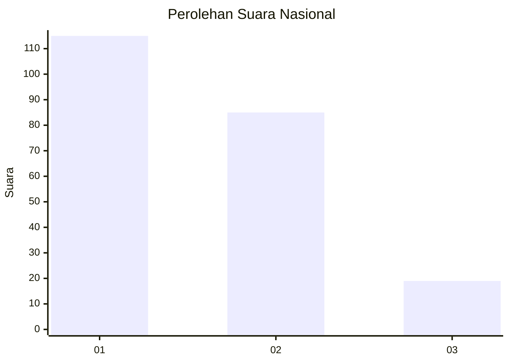
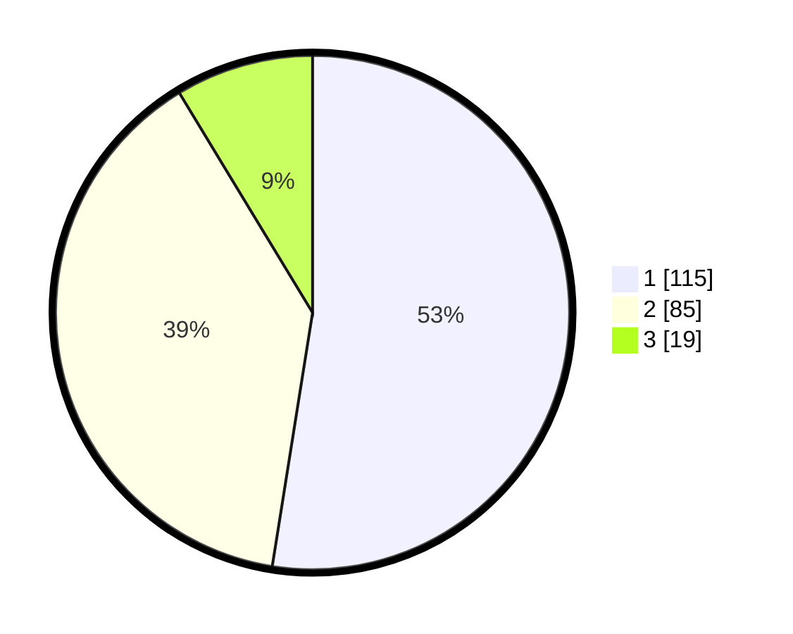

# Hasil

## Grafik

## Tabel

| No.    | Nama Paslon    | Suara | Suara (raw) | Persentase |
|:------ |:-------------- | -----:| -----------:| ----------:|
| 100025 | ANIES MUHAIMIN | 115   | [115][p-1]  | 52,51      |
| 100026 | PRABOWO GIBRAN | 85    | [85][p-2]   | 38,81      |
| 100027 | GANJAR MAHFUD  | 19    | [19][p-3]   | 8,68       |

[p-1]: https://github.com/gigit-pemilu/pemilu-2024/blob/main/pilpres/hitung-suara/sub/31-dki-jakarta/sub/74-jakarta-selatan/sub/02-setiabudi/sub/1004-karet/sub/028-tps/sub/paslon-1.txt
[p-2]: https://github.com/gigit-pemilu/pemilu-2024/blob/main/pilpres/hitung-suara/sub/31-dki-jakarta/sub/74-jakarta-selatan/sub/02-setiabudi/sub/1004-karet/sub/028-tps/sub/paslon-2.txt
[p-3]: https://github.com/gigit-pemilu/pemilu-2024/blob/main/pilpres/hitung-suara/sub/31-dki-jakarta/sub/74-jakarta-selatan/sub/02-setiabudi/sub/1004-karet/sub/028-tps/sub/paslon-3.txt

## Foto C Plano

https://sirekap-obj-formc.kpu.go.id/31a1/pemilu/ppwp/31/74/02/10/04/3174021004028-20240215-193603--15727046-e21d-4ac3-8476-99b99af06da5.jpg

https://sirekap-obj-formc.kpu.go.id/31a1/pemilu/ppwp/31/74/02/10/04/3174021004028-20240215-193648--94e6a71f-471f-4ae0-b95b-0bed76f24a71.jpg

https://sirekap-obj-formc.kpu.go.id/31a1/pemilu/ppwp/31/74/02/10/04/3174021004028-20240215-193738--2f7f3c0e-7957-49f6-a0f1-43a928f23038.jpg

## Metadata

| Key        | Value               |
| ---------- | ------------------- |
| Time Stamp | 2024-02-25 16:00:00 |

