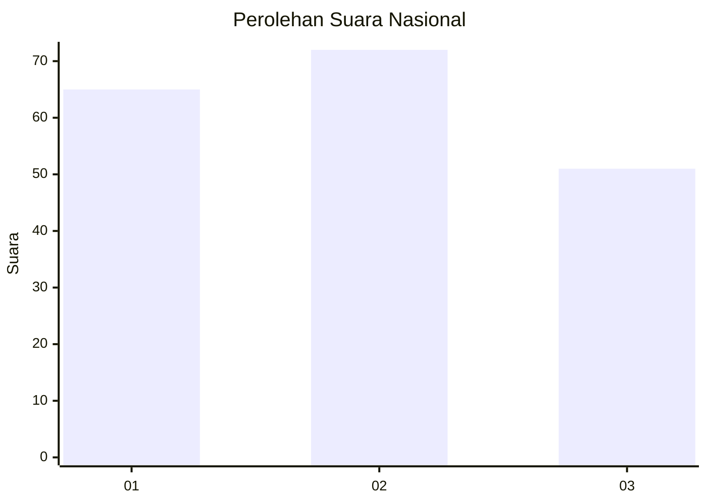
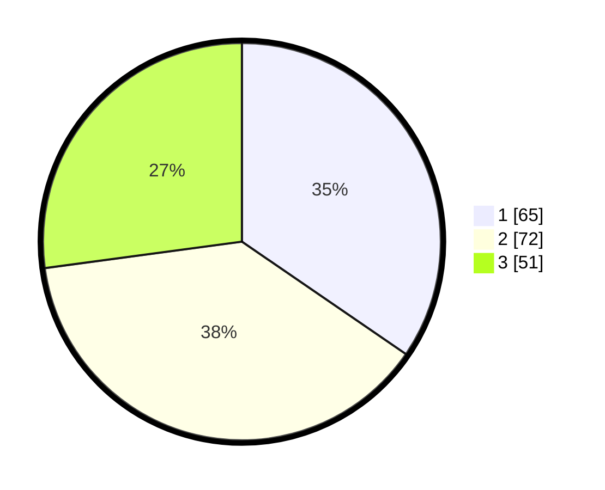

# Hasil

## Grafik

## Tabel

| No.    | Nama Paslon    | Suara | Suara (raw) | Persentase |
|:------ |:-------------- | -----:| -----------:| ----------:|
| 100025 | ANIES MUHAIMIN | 65    | [65][p-1]   | 34,57      |
| 100026 | PRABOWO GIBRAN | 72    | [72][p-2]   | 38,30      |
| 100027 | GANJAR MAHFUD  | 51    | [51][p-3]   | 27,13      |

[p-1]: https://github.com/gigit-pemilu/pemilu-2024/blob/main/pilpres/hitung-suara/sub/31-dki-jakarta/sub/74-jakarta-selatan/sub/02-setiabudi/sub/1004-karet/sub/032-tps/sub/paslon-1.txt
[p-2]: https://github.com/gigit-pemilu/pemilu-2024/blob/main/pilpres/hitung-suara/sub/31-dki-jakarta/sub/74-jakarta-selatan/sub/02-setiabudi/sub/1004-karet/sub/032-tps/sub/paslon-2.txt
[p-3]: https://github.com/gigit-pemilu/pemilu-2024/blob/main/pilpres/hitung-suara/sub/31-dki-jakarta/sub/74-jakarta-selatan/sub/02-setiabudi/sub/1004-karet/sub/032-tps/sub/paslon-3.txt

## Foto C Plano

https://sirekap-obj-formc.kpu.go.id/3f45/pemilu/ppwp/31/74/02/10/04/3174021004032-20240214-190025--ee8789c0-fb36-4cff-b542-36faf03582c8.jpg

https://sirekap-obj-formc.kpu.go.id/3f45/pemilu/ppwp/31/74/02/10/04/3174021004032-20240214-210716--2d44b047-1efa-45cb-9217-77f2a46425bd.jpg

https://sirekap-obj-formc.kpu.go.id/3f45/pemilu/ppwp/31/74/02/10/04/3174021004032-20240214-210905--4dc86dab-4baa-45fd-94dc-46eca22a1298.jpg

## Metadata

| Key        | Value               |
| ---------- | ------------------- |
| Time Stamp | 2024-02-24 22:31:28 |

