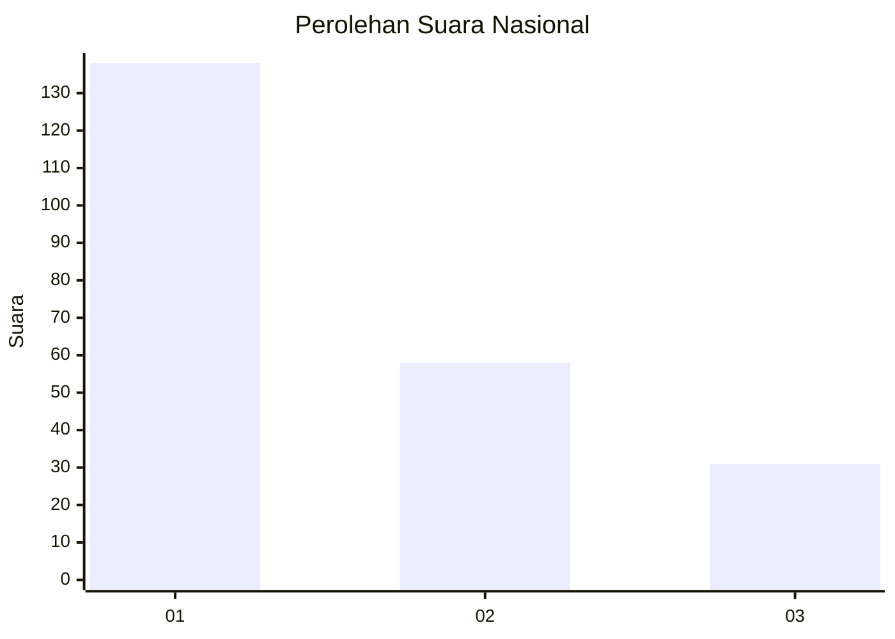
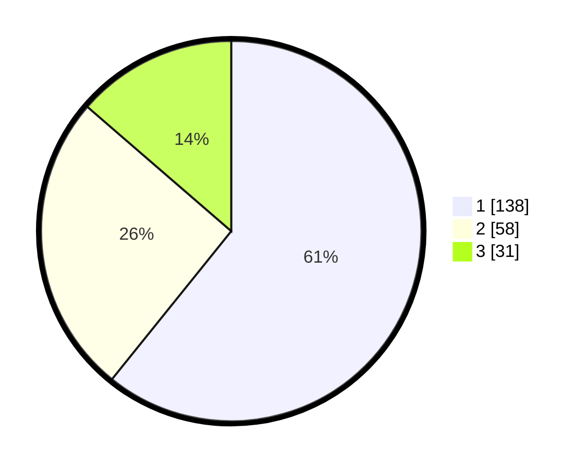

# Hasil

## Grafik

## Tabel

| No.    | Nama Paslon    | Suara | Suara (raw) | Persentase |
|:------ |:-------------- | -----:| -----------:| ----------:|
| 100025 | ANIES MUHAIMIN | 138   | [138][p-1]  | 60,79      |
| 100026 | PRABOWO GIBRAN | 58    | [58][p-2]   | 25,55      |
| 100027 | GANJAR MAHFUD  | 31    | [31][p-3]   | 13,66      |

[p-1]: https://github.com/gigit-pemilu/pemilu-2024/blob/main/pilpres/hitung-suara/sub/31-dki-jakarta/sub/74-jakarta-selatan/sub/02-setiabudi/sub/1005-menteng-atas/sub/004-tps/sub/paslon-1.txt
[p-2]: https://github.com/gigit-pemilu/pemilu-2024/blob/main/pilpres/hitung-suara/sub/31-dki-jakarta/sub/74-jakarta-selatan/sub/02-setiabudi/sub/1005-menteng-atas/sub/004-tps/sub/paslon-2.txt
[p-3]: https://github.com/gigit-pemilu/pemilu-2024/blob/main/pilpres/hitung-suara/sub/31-dki-jakarta/sub/74-jakarta-selatan/sub/02-setiabudi/sub/1005-menteng-atas/sub/004-tps/sub/paslon-3.txt

## Foto C Plano

https://sirekap-obj-formc.kpu.go.id/0f8d/pemilu/ppwp/31/74/02/10/05/3174021005004-20240214-234615--79c79e5c-ff10-4a94-bd23-3a9ba00219b4.jpg

https://sirekap-obj-formc.kpu.go.id/0f8d/pemilu/ppwp/31/74/02/10/05/3174021005004-20240214-234718--15c3a79a-6002-4ffc-8611-0b5f57b30f2b.jpg

https://sirekap-obj-formc.kpu.go.id/0f8d/pemilu/ppwp/31/74/02/10/05/3174021005004-20240214-234800--cc4e6c84-9a21-4078-8065-6f98dcdaa0c9.jpg

## Metadata

| Key        | Value               |
| ---------- | ------------------- |
| Time Stamp | 2024-02-25 13:00:00 |

