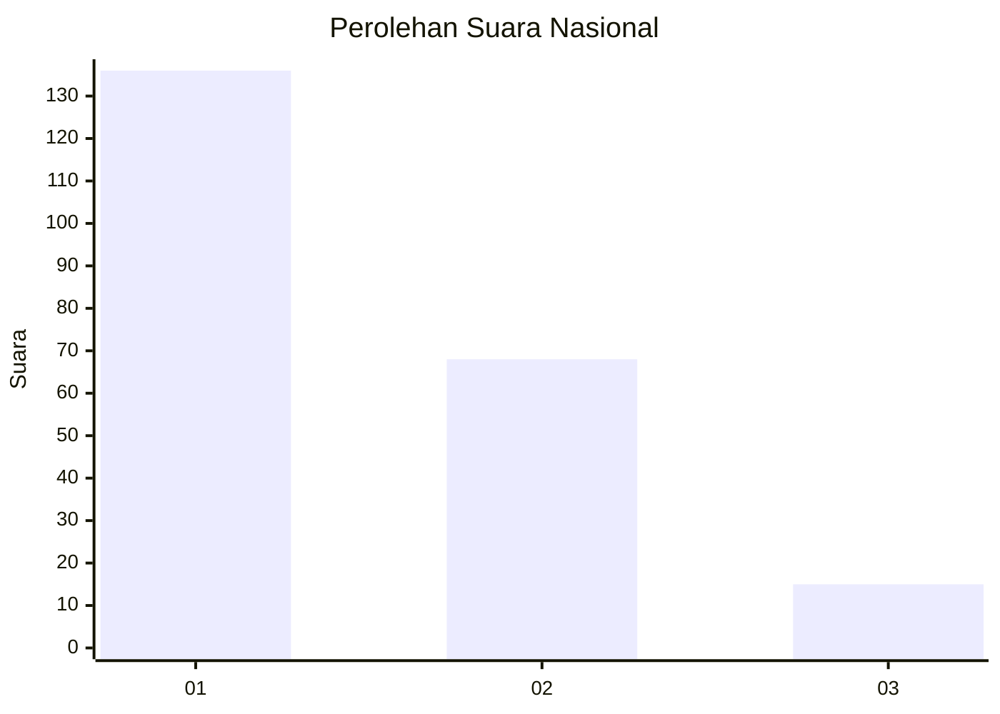
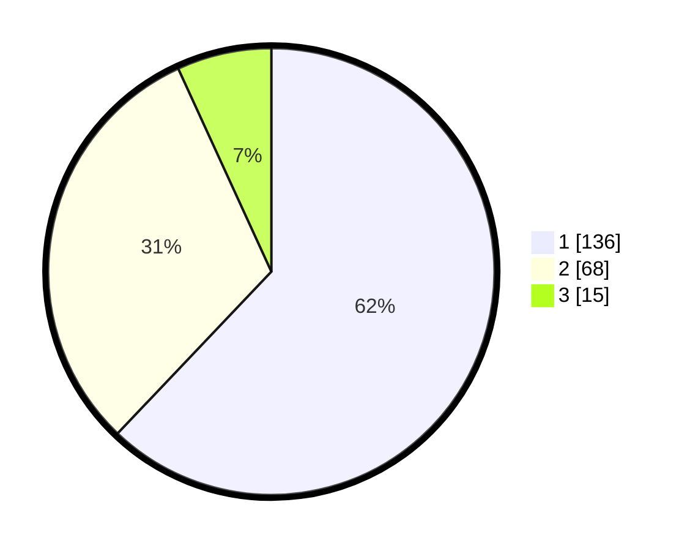

# Hasil

## Grafik

## Tabel

| No.    | Nama Paslon    | Suara | Suara (raw) | Persentase |
|:------ |:-------------- | -----:| -----------:| ----------:|
| 100025 | ANIES MUHAIMIN | 136   | [136][p-1]  | 62,10      |
| 100026 | PRABOWO GIBRAN | 68    | [68][p-2]   | 31,05      |
| 100027 | GANJAR MAHFUD  | 15    | [15][p-3]   | 6,85       |

[p-1]: https://github.com/gigit-pemilu/pemilu-2024/blob/main/pilpres/hitung-suara/sub/31-dki-jakarta/sub/74-jakarta-selatan/sub/02-setiabudi/sub/1005-menteng-atas/sub/006-tps/sub/paslon-1.txt
[p-2]: https://github.com/gigit-pemilu/pemilu-2024/blob/main/pilpres/hitung-suara/sub/31-dki-jakarta/sub/74-jakarta-selatan/sub/02-setiabudi/sub/1005-menteng-atas/sub/006-tps/sub/paslon-2.txt
[p-3]: https://github.com/gigit-pemilu/pemilu-2024/blob/main/pilpres/hitung-suara/sub/31-dki-jakarta/sub/74-jakarta-selatan/sub/02-setiabudi/sub/1005-menteng-atas/sub/006-tps/sub/paslon-3.txt

## Foto C Plano

https://sirekap-obj-formc.kpu.go.id/4fe9/pemilu/ppwp/31/74/02/10/05/3174021005006-20240214-235928--9e169672-8eb5-4d93-9bf7-f7fa41e514e2.jpg

https://sirekap-obj-formc.kpu.go.id/4fe9/pemilu/ppwp/31/74/02/10/05/3174021005006-20240214-234453--ba03dbaf-87b7-427f-a95e-cfcfd380114b.jpg

https://sirekap-obj-formc.kpu.go.id/4fe9/pemilu/ppwp/31/74/02/10/05/3174021005006-20240215-000124--0c997a19-83cc-4ffb-b8cb-722d5bcd820b.jpg

## Metadata

| Key        | Value               |
| ---------- | ------------------- |
| Time Stamp | 2024-02-25 18:00:00 |

