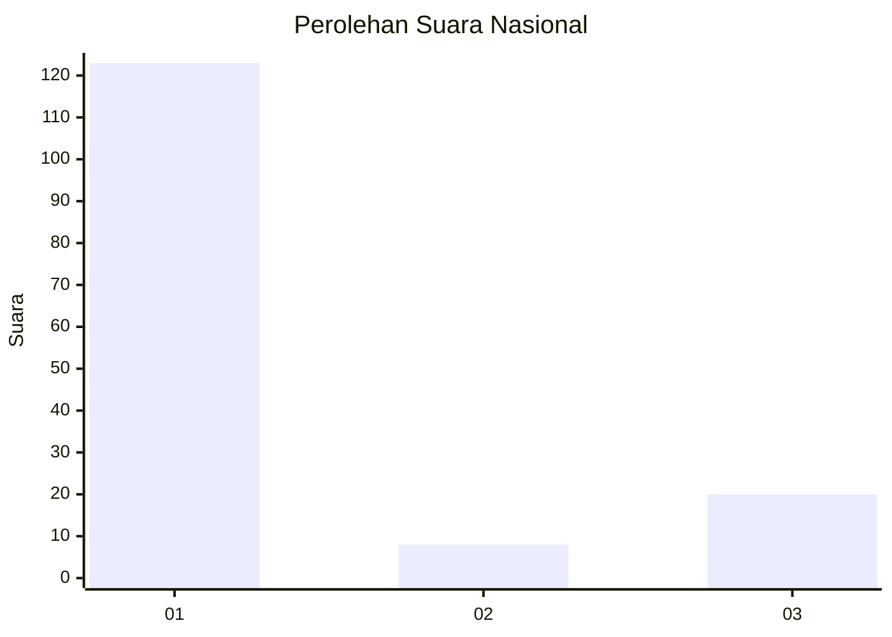
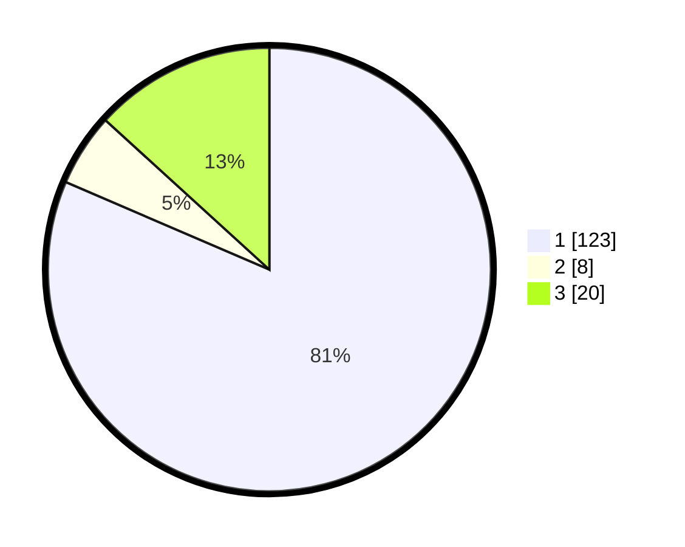

# Hasil

## Grafik

## Tabel

| No.    | Nama Paslon    | Suara | Suara (raw) | Persentase |
|:------ |:-------------- | -----:| -----------:| ----------:|
| 100025 | ANIES MUHAIMIN | 123   | [123][p-1]  | 81,46      |
| 100026 | PRABOWO GIBRAN | 8     | [8][p-2]    | 5,30       |
| 100027 | GANJAR MAHFUD  | 20    | [20][p-3]   | 13,25      |

[p-1]: https://github.com/gigit-pemilu/pemilu-2024/blob/main/pilpres/hitung-suara/sub/31-dki-jakarta/sub/74-jakarta-selatan/sub/02-setiabudi/sub/1005-menteng-atas/sub/015-tps/sub/paslon-1.txt
[p-2]: https://github.com/gigit-pemilu/pemilu-2024/blob/main/pilpres/hitung-suara/sub/31-dki-jakarta/sub/74-jakarta-selatan/sub/02-setiabudi/sub/1005-menteng-atas/sub/015-tps/sub/paslon-2.txt
[p-3]: https://github.com/gigit-pemilu/pemilu-2024/blob/main/pilpres/hitung-suara/sub/31-dki-jakarta/sub/74-jakarta-selatan/sub/02-setiabudi/sub/1005-menteng-atas/sub/015-tps/sub/paslon-3.txt

## Foto C Plano

https://sirekap-obj-formc.kpu.go.id/6aa2/pemilu/ppwp/31/74/02/10/05/3174021005015-20240215-005750--16e4664c-1099-4d69-a7bb-045d7c462143.jpg

https://sirekap-obj-formc.kpu.go.id/6aa2/pemilu/ppwp/31/74/02/10/05/3174021005015-20240215-005918--416d2e55-9df5-4e0d-a103-06536487f4e7.jpg

https://sirekap-obj-formc.kpu.go.id/6aa2/pemilu/ppwp/31/74/02/10/05/3174021005015-20240215-005955--231ff32a-dde4-4f25-a188-f43ac26a0809.jpg

## Metadata

| Key        | Value               |
| ---------- | ------------------- |
| Time Stamp | 2024-02-25 15:00:00 |

