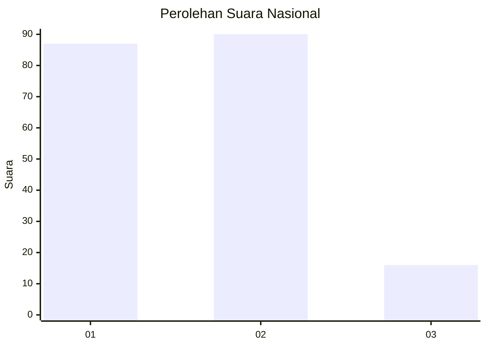
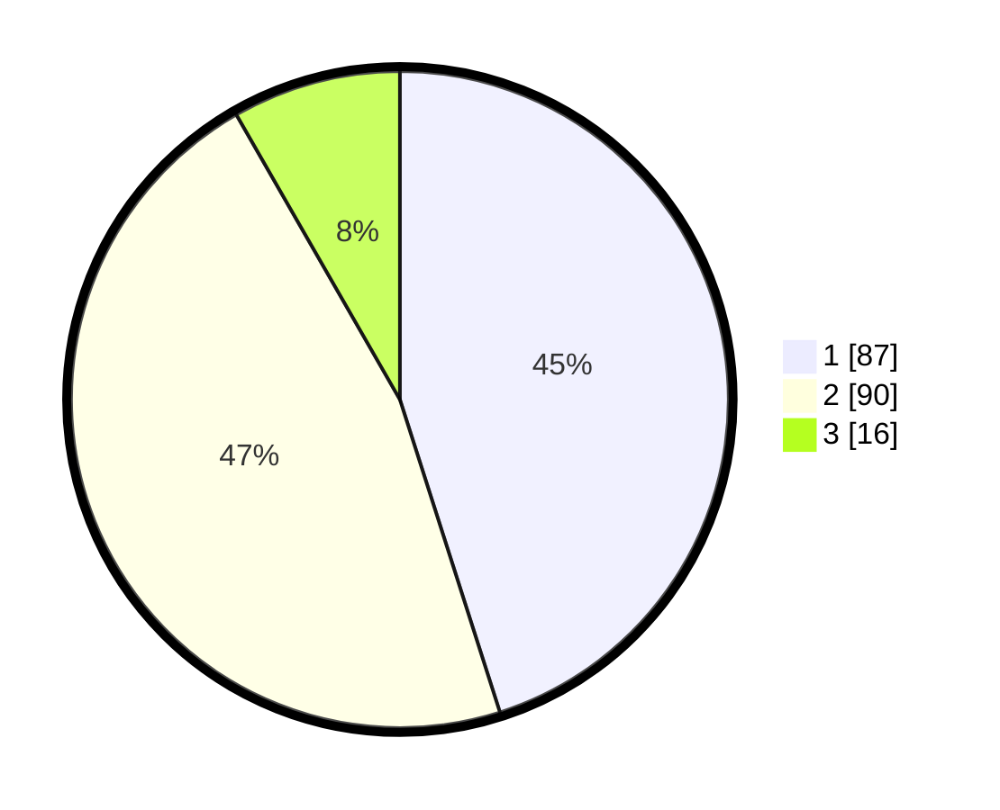

# Hasil

## Grafik

## Tabel

| No.    | Nama Paslon    | Suara | Suara (raw) | Persentase |
|:------ |:-------------- | -----:| -----------:| ----------:|
| 100025 | ANIES MUHAIMIN | 87    | [87][p-1]   | 45,08      |
| 100026 | PRABOWO GIBRAN | 90    | [90][p-2]   | 46,63      |
| 100027 | GANJAR MAHFUD  | 16    | [16][p-3]   | 8,29       |

[p-1]: https://github.com/gigit-pemilu/pemilu-2024/blob/main/pilpres/hitung-suara/sub/31-dki-jakarta/sub/74-jakarta-selatan/sub/02-setiabudi/sub/1005-menteng-atas/sub/037-tps/sub/paslon-1.txt
[p-2]: https://github.com/gigit-pemilu/pemilu-2024/blob/main/pilpres/hitung-suara/sub/31-dki-jakarta/sub/74-jakarta-selatan/sub/02-setiabudi/sub/1005-menteng-atas/sub/037-tps/sub/paslon-2.txt
[p-3]: https://github.com/gigit-pemilu/pemilu-2024/blob/main/pilpres/hitung-suara/sub/31-dki-jakarta/sub/74-jakarta-selatan/sub/02-setiabudi/sub/1005-menteng-atas/sub/037-tps/sub/paslon-3.txt

## Foto C Plano

https://sirekap-obj-formc.kpu.go.id/853a/pemilu/ppwp/31/74/02/10/05/3174021005037-20240215-031846--1d68e906-722c-4f98-9d24-3406857ee90e.jpg

https://sirekap-obj-formc.kpu.go.id/853a/pemilu/ppwp/31/74/02/10/05/3174021005037-20240215-004709--14d35638-4c54-4fd6-a21d-bb3f78ebc4dd.jpg

https://sirekap-obj-formc.kpu.go.id/853a/pemilu/ppwp/31/74/02/10/05/3174021005037-20240215-004801--928a6d0c-f346-469e-a214-a1b37451bc60.jpg

## Metadata

| Key        | Value               |
| ---------- | ------------------- |
| Time Stamp | 2024-02-24 22:31:28 |

