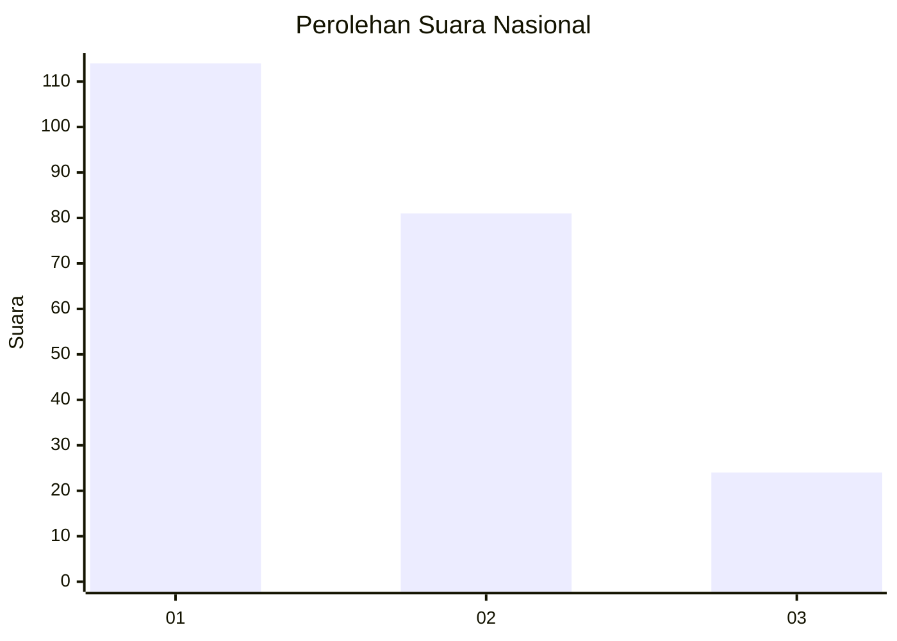
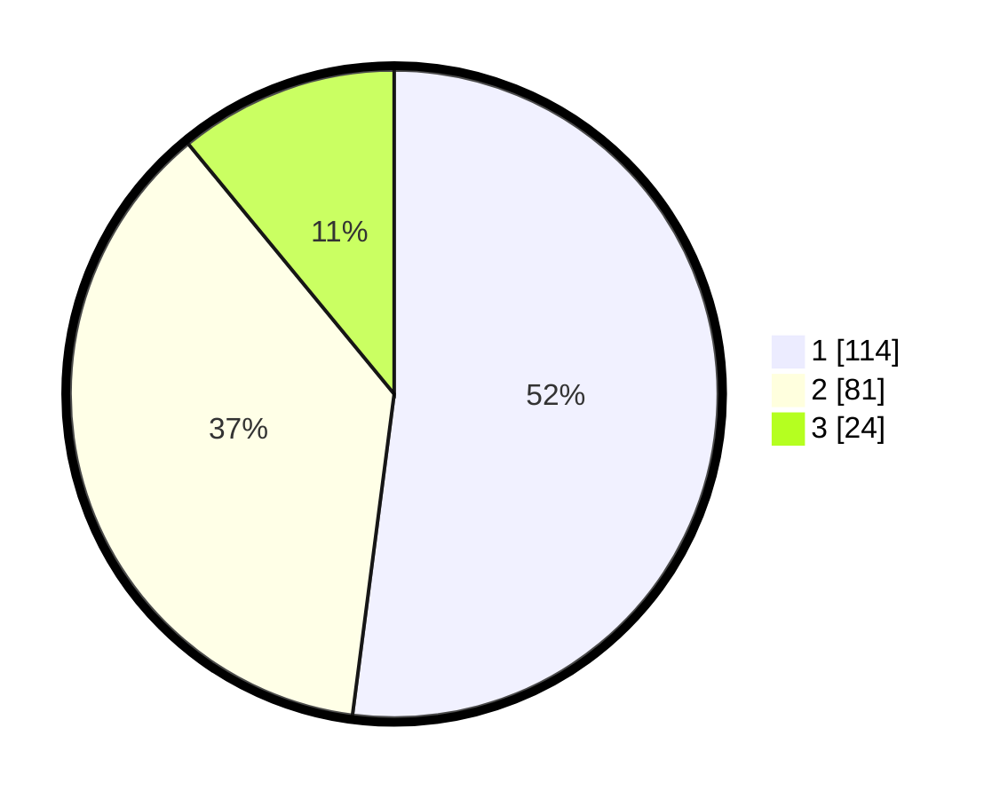

# Hasil

## Grafik

## Tabel

| No.    | Nama Paslon    | Suara | Suara (raw) | Persentase |
|:------ |:-------------- | -----:| -----------:| ----------:|
| 100025 | ANIES MUHAIMIN | 114   | [114][p-1]  | 52,05      |
| 100026 | PRABOWO GIBRAN | 81    | [81][p-2]   | 36,99      |
| 100027 | GANJAR MAHFUD  | 24    | [24][p-3]   | 10,96      |

[p-1]: https://github.com/gigit-pemilu/pemilu-2024/blob/main/pilpres/hitung-suara/sub/31-dki-jakarta/sub/74-jakarta-selatan/sub/02-setiabudi/sub/1005-menteng-atas/sub/039-tps/sub/paslon-1.txt
[p-2]: https://github.com/gigit-pemilu/pemilu-2024/blob/main/pilpres/hitung-suara/sub/31-dki-jakarta/sub/74-jakarta-selatan/sub/02-setiabudi/sub/1005-menteng-atas/sub/039-tps/sub/paslon-2.txt
[p-3]: https://github.com/gigit-pemilu/pemilu-2024/blob/main/pilpres/hitung-suara/sub/31-dki-jakarta/sub/74-jakarta-selatan/sub/02-setiabudi/sub/1005-menteng-atas/sub/039-tps/sub/paslon-3.txt

## Foto C Plano

https://sirekap-obj-formc.kpu.go.id/bb84/pemilu/ppwp/31/74/02/10/05/3174021005039-20240215-002921--f51335a2-400d-4e18-b40a-c7cba24f4fa9.jpg

https://sirekap-obj-formc.kpu.go.id/bb84/pemilu/ppwp/31/74/02/10/05/3174021005039-20240215-002955--0ad6ff8f-e403-4dde-9b22-7983773518cf.jpg

https://sirekap-obj-formc.kpu.go.id/bb84/pemilu/ppwp/31/74/02/10/05/3174021005039-20240215-003028--d66127c1-c81e-4985-a9cf-fcf4ff15946f.jpg

## Metadata

| Key        | Value               |
| ---------- | ------------------- |
| Time Stamp | 2024-02-25 20:00:00 |

