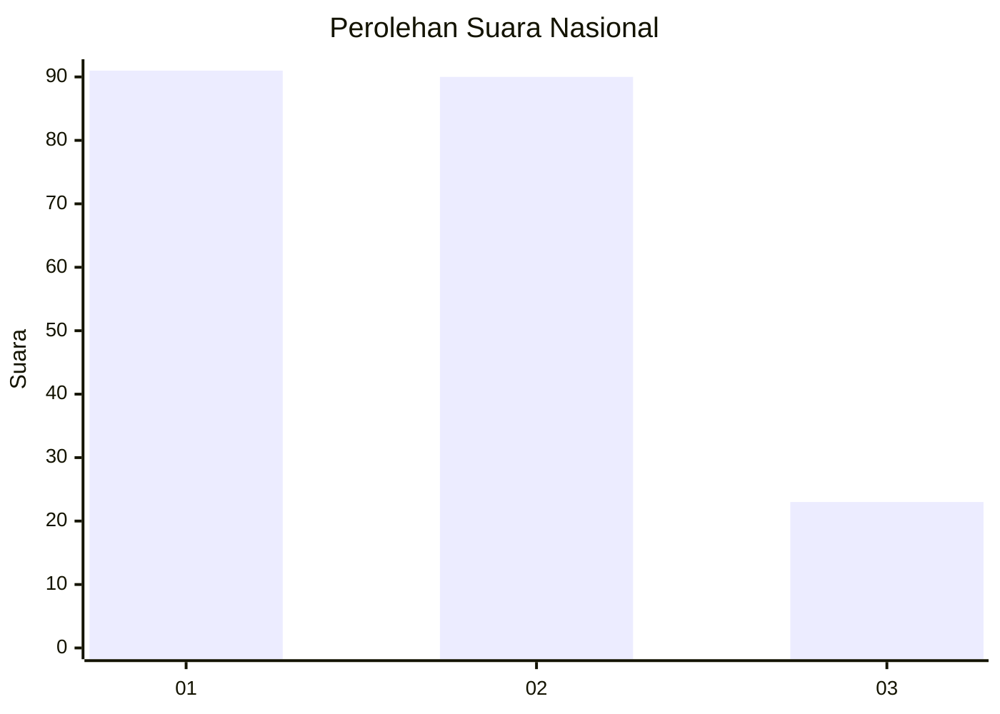
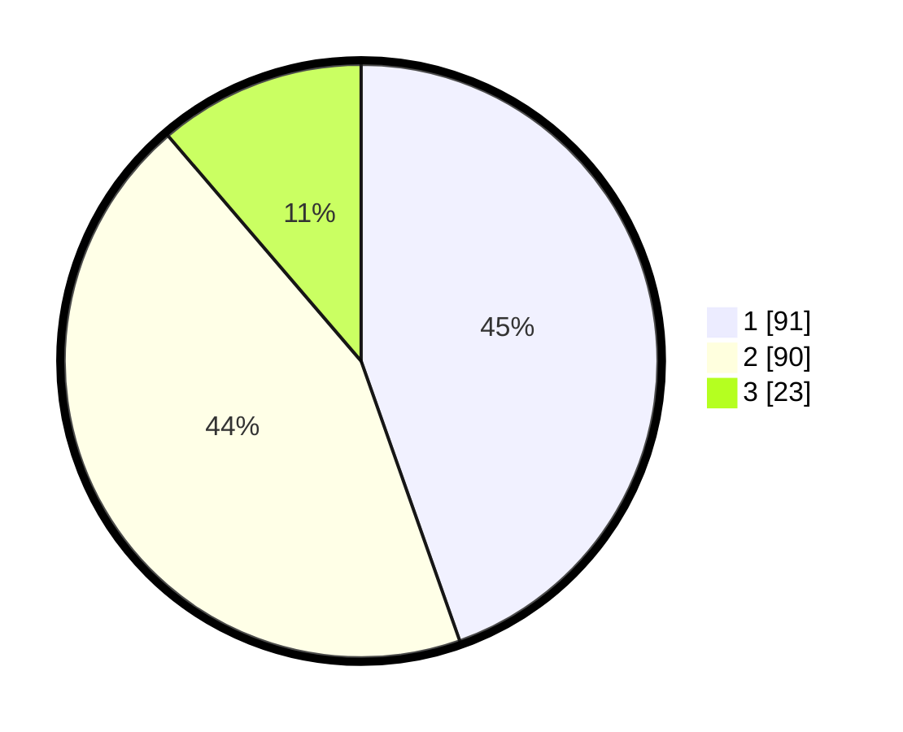

# Hasil

## Grafik

## Tabel

| No.    | Nama Paslon    | Suara | Suara (raw) | Persentase |
|:------ |:-------------- | -----:| -----------:| ----------:|
| 100025 | ANIES MUHAIMIN | 91    | [91][p-1]   | 44,61      |
| 100026 | PRABOWO GIBRAN | 90    | [90][p-2]   | 44,12      |
| 100027 | GANJAR MAHFUD  | 23    | [23][p-3]   | 11,27      |

[p-1]: https://github.com/gigit-pemilu/pemilu-2024/blob/main/pilpres/hitung-suara/sub/31-dki-jakarta/sub/74-jakarta-selatan/sub/02-setiabudi/sub/1005-menteng-atas/sub/042-tps/sub/paslon-1.txt
[p-2]: https://github.com/gigit-pemilu/pemilu-2024/blob/main/pilpres/hitung-suara/sub/31-dki-jakarta/sub/74-jakarta-selatan/sub/02-setiabudi/sub/1005-menteng-atas/sub/042-tps/sub/paslon-2.txt
[p-3]: https://github.com/gigit-pemilu/pemilu-2024/blob/main/pilpres/hitung-suara/sub/31-dki-jakarta/sub/74-jakarta-selatan/sub/02-setiabudi/sub/1005-menteng-atas/sub/042-tps/sub/paslon-3.txt

## Foto C Plano

https://sirekap-obj-formc.kpu.go.id/7a1d/pemilu/ppwp/31/74/02/10/05/3174021005042-20240214-200719--785d16da-c7a1-47dc-a807-053570a86085.jpg

https://sirekap-obj-formc.kpu.go.id/7a1d/pemilu/ppwp/31/74/02/10/05/3174021005042-20240214-200818--5fa0d6df-bb33-4a96-90b5-a07c491890f6.jpg

https://sirekap-obj-formc.kpu.go.id/7a1d/pemilu/ppwp/31/74/02/10/05/3174021005042-20240214-195005--00fc739c-191f-48fe-ab3a-cbfa41f053c9.jpg

## Metadata

| Key        | Value               |
| ---------- | ------------------- |
| Time Stamp | 2024-02-24 22:31:28 |

