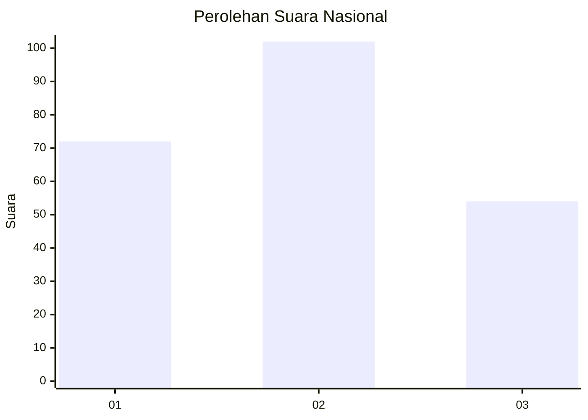
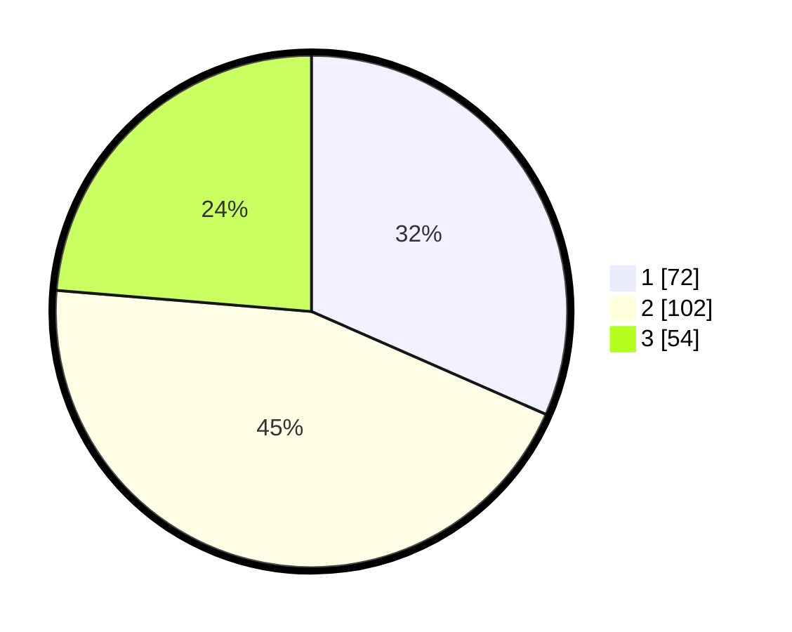

# Hasil

## Grafik

## Tabel

| No.    | Nama Paslon    | Suara | Suara (raw) | Persentase |
|:------ |:-------------- | -----:| -----------:| ----------:|
| 100025 | ANIES MUHAIMIN | 72    | [72][p-1]   | 31,58      |
| 100026 | PRABOWO GIBRAN | 102   | [102][p-2]  | 44,74      |
| 100027 | GANJAR MAHFUD  | 54    | [54][p-3]   | 23,68      |

[p-1]: https://github.com/gigit-pemilu/pemilu-2024/blob/main/pilpres/hitung-suara/sub/31-dki-jakarta/sub/74-jakarta-selatan/sub/02-setiabudi/sub/1005-menteng-atas/sub/051-tps/sub/paslon-1.txt
[p-2]: https://github.com/gigit-pemilu/pemilu-2024/blob/main/pilpres/hitung-suara/sub/31-dki-jakarta/sub/74-jakarta-selatan/sub/02-setiabudi/sub/1005-menteng-atas/sub/051-tps/sub/paslon-2.txt
[p-3]: https://github.com/gigit-pemilu/pemilu-2024/blob/main/pilpres/hitung-suara/sub/31-dki-jakarta/sub/74-jakarta-selatan/sub/02-setiabudi/sub/1005-menteng-atas/sub/051-tps/sub/paslon-3.txt

## Foto C Plano

https://sirekap-obj-formc.kpu.go.id/24db/pemilu/ppwp/31/74/02/10/05/3174021005051-20240215-005603--56a5e8e9-4013-4a98-9108-c2f8ea9b9efc.jpg

https://sirekap-obj-formc.kpu.go.id/24db/pemilu/ppwp/31/74/02/10/05/3174021005051-20240215-005723--ed86503d-19bc-4ce3-bfae-7bd4377e900c.jpg

https://sirekap-obj-formc.kpu.go.id/24db/pemilu/ppwp/31/74/02/10/05/3174021005051-20240215-005906--cde90076-0fe4-4dda-b9a3-78d17295d85a.jpg

## Metadata

| Key        | Value               |
| ---------- | ------------------- |
| Time Stamp | 2024-02-24 22:31:28 |

