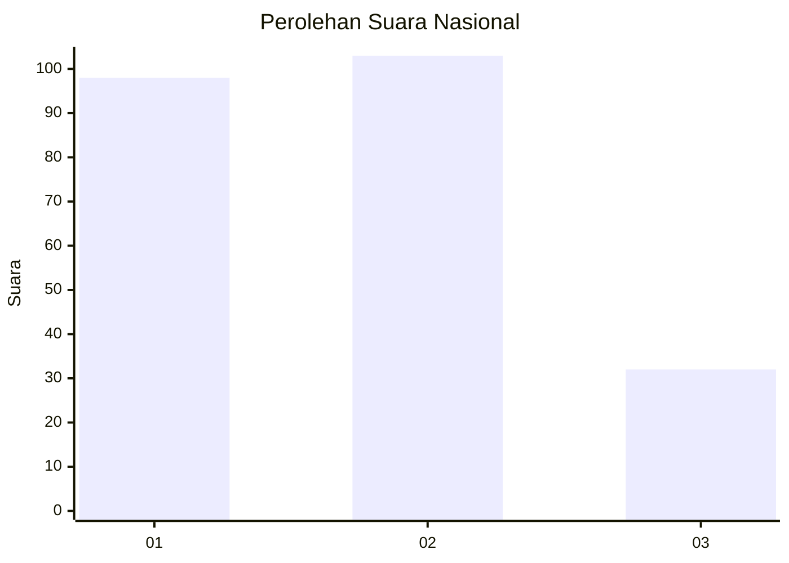
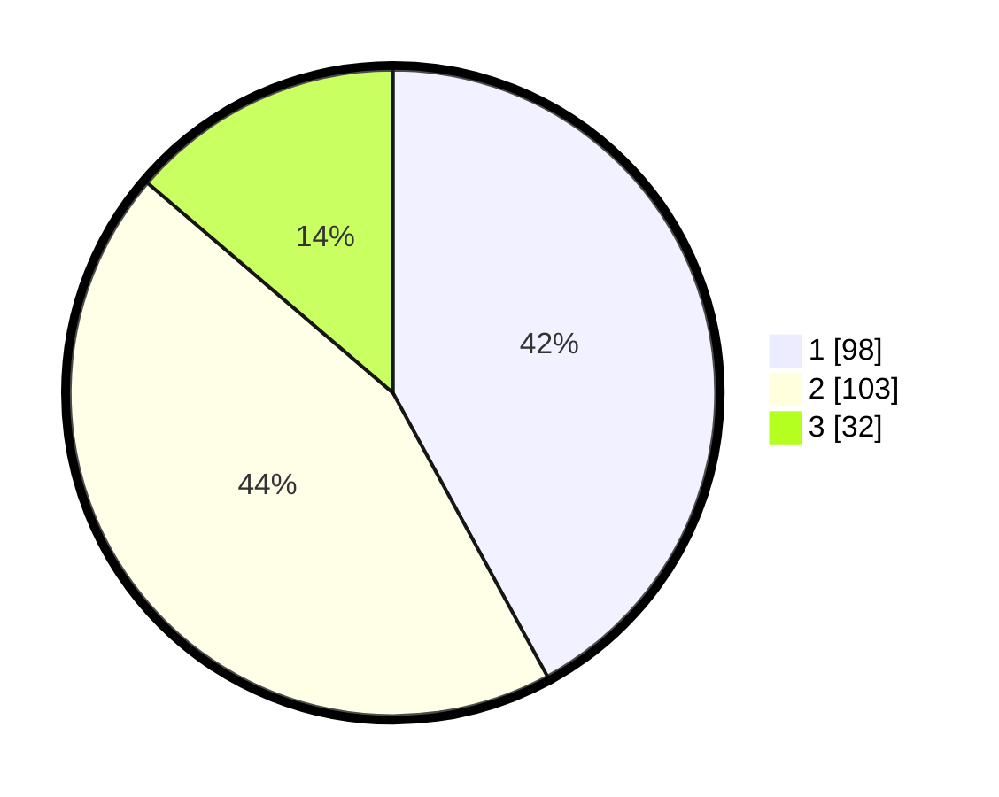

# Hasil

## Grafik

## Tabel

| No.    | Nama Paslon    | Suara | Suara (raw) | Persentase |
|:------ |:-------------- | -----:| -----------:| ----------:|
| 100025 | ANIES MUHAIMIN | 98    | [98][p-1]   | 42,06      |
| 100026 | PRABOWO GIBRAN | 103   | [103][p-2]  | 44,21      |
| 100027 | GANJAR MAHFUD  | 32    | [32][p-3]   | 13,73      |

[p-1]: https://github.com/gigit-pemilu/pemilu-2024/blob/main/pilpres/hitung-suara/sub/31-dki-jakarta/sub/74-jakarta-selatan/sub/02-setiabudi/sub/1005-menteng-atas/sub/056-tps/sub/paslon-1.txt
[p-2]: https://github.com/gigit-pemilu/pemilu-2024/blob/main/pilpres/hitung-suara/sub/31-dki-jakarta/sub/74-jakarta-selatan/sub/02-setiabudi/sub/1005-menteng-atas/sub/056-tps/sub/paslon-2.txt
[p-3]: https://github.com/gigit-pemilu/pemilu-2024/blob/main/pilpres/hitung-suara/sub/31-dki-jakarta/sub/74-jakarta-selatan/sub/02-setiabudi/sub/1005-menteng-atas/sub/056-tps/sub/paslon-3.txt

## Foto C Plano

https://sirekap-obj-formc.kpu.go.id/a7d2/pemilu/ppwp/31/74/02/10/05/3174021005056-20240215-045005--e7173a3d-db10-4e34-9d04-9686881a78a8.jpg

https://sirekap-obj-formc.kpu.go.id/a7d2/pemilu/ppwp/31/74/02/10/05/3174021005056-20240215-045045--e3e514a7-de0a-4629-b45d-b68c8c737d2d.jpg

https://sirekap-obj-formc.kpu.go.id/a7d2/pemilu/ppwp/31/74/02/10/05/3174021005056-20240215-045136--336d4572-e0d3-428e-824d-ee6d5129b56c.jpg

## Metadata

| Key        | Value               |
| ---------- | ------------------- |
| Time Stamp | 2024-02-24 22:31:28 |

