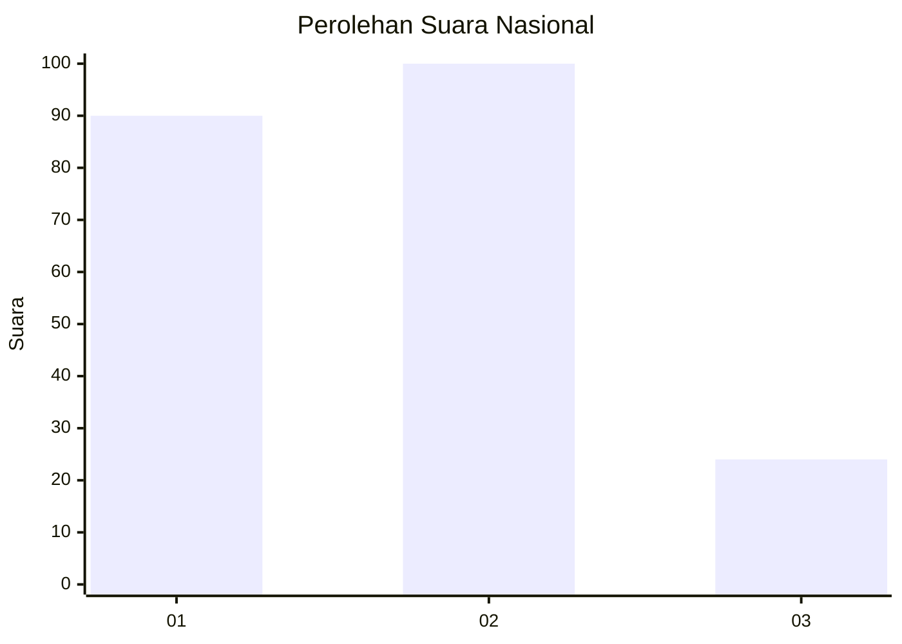
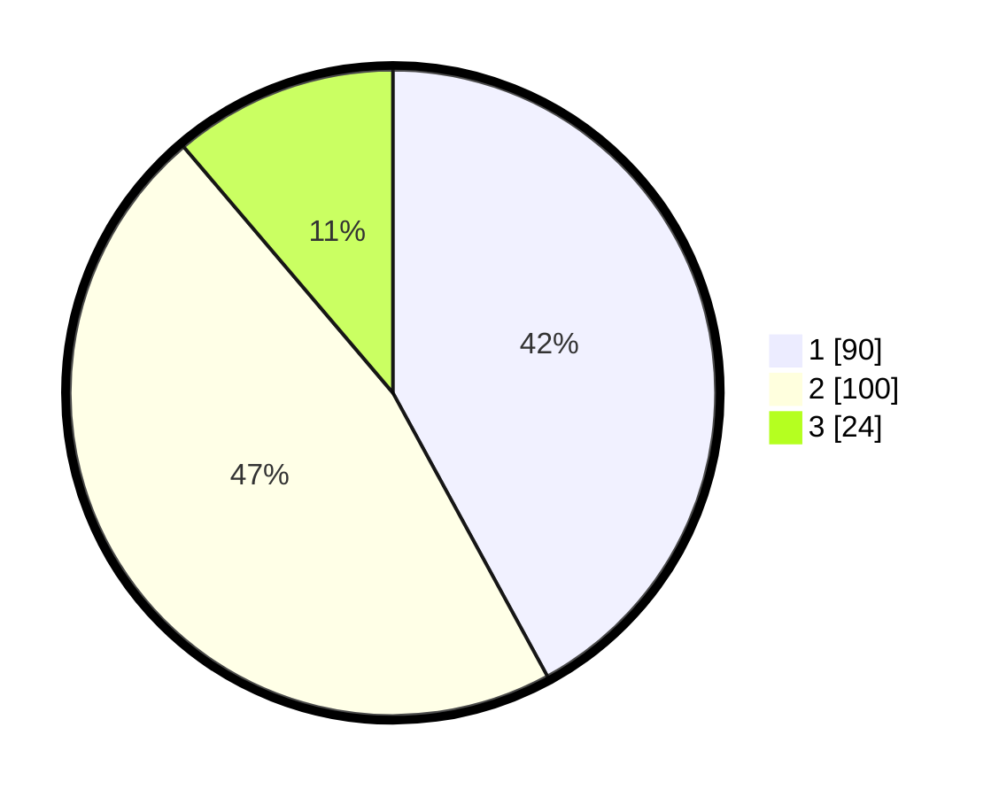

# Hasil

## Grafik

## Tabel

| No.    | Nama Paslon    | Suara | Suara (raw) | Persentase |
|:------ |:-------------- | -----:| -----------:| ----------:|
| 100025 | ANIES MUHAIMIN | 90    | [90][p-1]   | 42,06      |
| 100026 | PRABOWO GIBRAN | 100   | [100][p-2]  | 46,73      |
| 100027 | GANJAR MAHFUD  | 24    | [24][p-3]   | 11,21      |

[p-1]: https://github.com/gigit-pemilu/pemilu-2024/blob/main/pilpres/hitung-suara/sub/31-dki-jakarta/sub/74-jakarta-selatan/sub/02-setiabudi/sub/1005-menteng-atas/sub/058-tps/sub/paslon-1.txt
[p-2]: https://github.com/gigit-pemilu/pemilu-2024/blob/main/pilpres/hitung-suara/sub/31-dki-jakarta/sub/74-jakarta-selatan/sub/02-setiabudi/sub/1005-menteng-atas/sub/058-tps/sub/paslon-2.txt
[p-3]: https://github.com/gigit-pemilu/pemilu-2024/blob/main/pilpres/hitung-suara/sub/31-dki-jakarta/sub/74-jakarta-selatan/sub/02-setiabudi/sub/1005-menteng-atas/sub/058-tps/sub/paslon-3.txt

## Foto C Plano

https://sirekap-obj-formc.kpu.go.id/e31a/pemilu/ppwp/31/74/02/10/05/3174021005058-20240214-184906--7045f841-2dc0-4a6b-8e4b-643ceec12ab0.jpg

https://sirekap-obj-formc.kpu.go.id/e31a/pemilu/ppwp/31/74/02/10/05/3174021005058-20240214-184921--12a0d42d-f7f2-4f05-a043-df858cf3ad58.jpg

https://sirekap-obj-formc.kpu.go.id/e31a/pemilu/ppwp/31/74/02/10/05/3174021005058-20240214-184945--9460b121-6d3c-499e-8e0a-16a6b3c47491.jpg

## Metadata

| Key        | Value               |
| ---------- | ------------------- |
| Time Stamp | 2024-02-25 16:00:00 |

