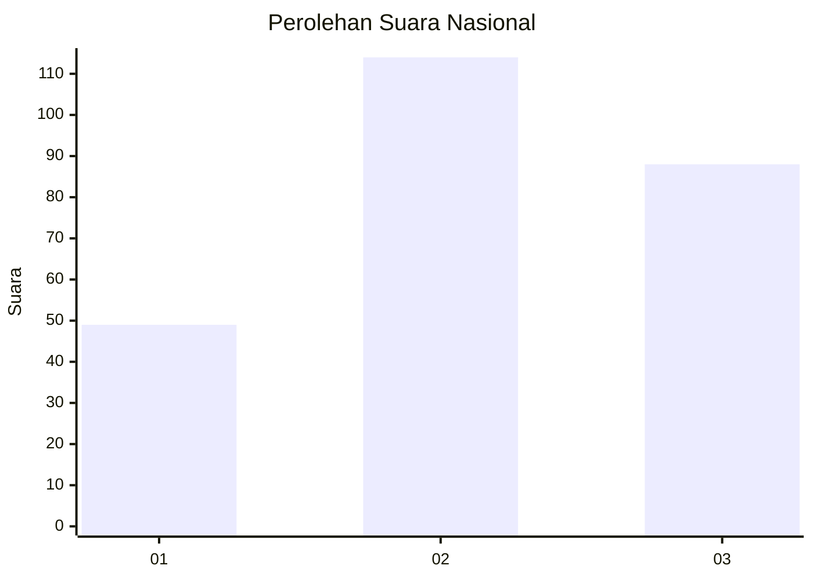
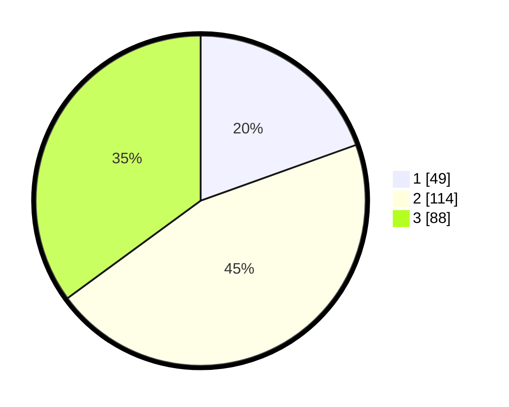

# Hasil

## Grafik

## Tabel

| No.    | Nama Paslon    | Suara | Suara (raw) | Persentase |
|:------ |:-------------- | -----:| -----------:| ----------:|
| 100025 | ANIES MUHAIMIN | 49    | [49][p-1]   | 19,52      |
| 100026 | PRABOWO GIBRAN | 114   | [114][p-2]  | 45,42      |
| 100027 | GANJAR MAHFUD  | 88    | [88][p-3]   | 35,06      |

[p-1]: https://github.com/gigit-pemilu/pemilu-2024/blob/main/pilpres/hitung-suara/sub/31-dki-jakarta/sub/74-jakarta-selatan/sub/02-setiabudi/sub/1005-menteng-atas/sub/064-tps/sub/paslon-1.txt
[p-2]: https://github.com/gigit-pemilu/pemilu-2024/blob/main/pilpres/hitung-suara/sub/31-dki-jakarta/sub/74-jakarta-selatan/sub/02-setiabudi/sub/1005-menteng-atas/sub/064-tps/sub/paslon-2.txt
[p-3]: https://github.com/gigit-pemilu/pemilu-2024/blob/main/pilpres/hitung-suara/sub/31-dki-jakarta/sub/74-jakarta-selatan/sub/02-setiabudi/sub/1005-menteng-atas/sub/064-tps/sub/paslon-3.txt

## Foto C Plano

https://sirekap-obj-formc.kpu.go.id/4167/pemilu/ppwp/31/74/02/10/05/3174021005064-20240215-013953--46f4533b-804b-4d36-b99b-c9b3b90d06dc.jpg

https://sirekap-obj-formc.kpu.go.id/4167/pemilu/ppwp/31/74/02/10/05/3174021005064-20240215-014417--0b8d0e98-ee09-4643-8abc-8a88b6aadf61.jpg

https://sirekap-obj-formc.kpu.go.id/4167/pemilu/ppwp/31/74/02/10/05/3174021005064-20240215-014505--40a84277-3022-462d-8229-1a3f0bb6b62f.jpg

## Metadata

| Key        | Value               |
| ---------- | ------------------- |
| Time Stamp | 2024-02-26 09:00:00 |

