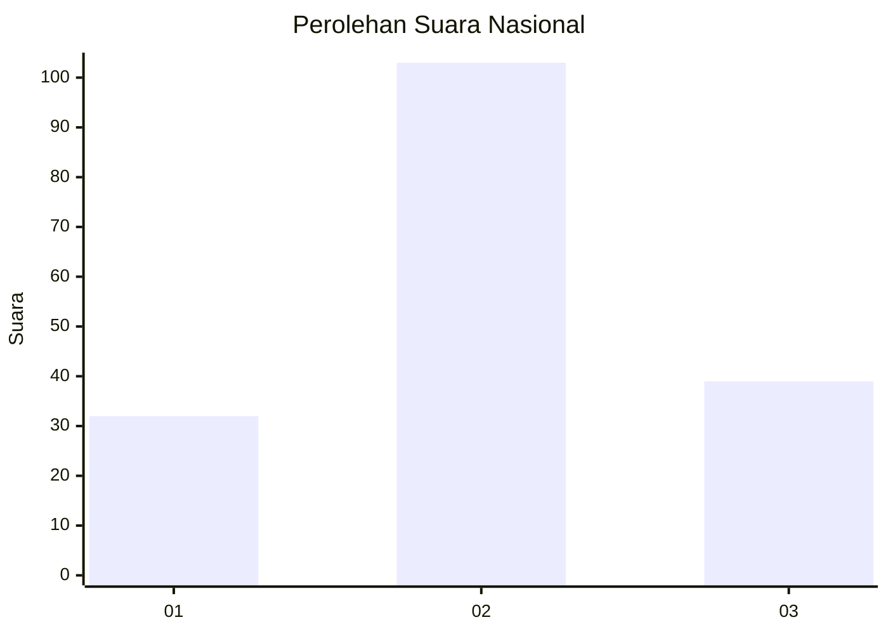
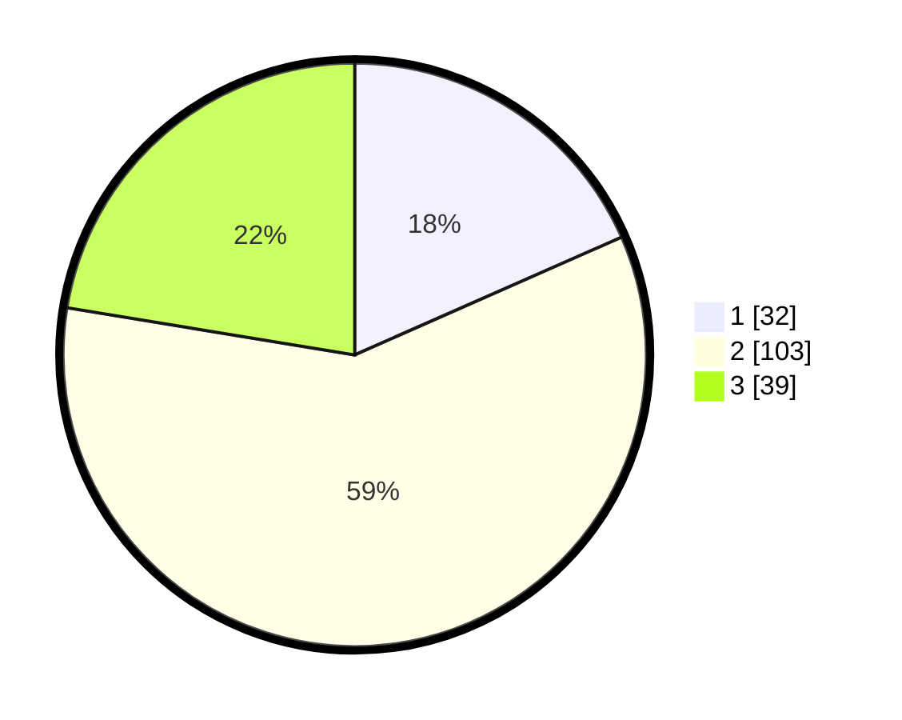

# Hasil

## Grafik

## Tabel

| No.    | Nama Paslon    | Suara | Suara (raw) | Persentase |
|:------ |:-------------- | -----:| -----------:| ----------:|
| 100025 | ANIES MUHAIMIN | 32    | [32][p-1]   | 18,39      |
| 100026 | PRABOWO GIBRAN | 103   | [103][p-2]  | 59,20      |
| 100027 | GANJAR MAHFUD  | 39    | [39][p-3]   | 22,41      |

[p-1]: https://github.com/gigit-pemilu/pemilu-2024/blob/main/pilpres/hitung-suara/sub/31-dki-jakarta/sub/74-jakarta-selatan/sub/02-setiabudi/sub/1005-menteng-atas/sub/091-tps/sub/paslon-1.txt
[p-2]: https://github.com/gigit-pemilu/pemilu-2024/blob/main/pilpres/hitung-suara/sub/31-dki-jakarta/sub/74-jakarta-selatan/sub/02-setiabudi/sub/1005-menteng-atas/sub/091-tps/sub/paslon-2.txt
[p-3]: https://github.com/gigit-pemilu/pemilu-2024/blob/main/pilpres/hitung-suara/sub/31-dki-jakarta/sub/74-jakarta-selatan/sub/02-setiabudi/sub/1005-menteng-atas/sub/091-tps/sub/paslon-3.txt

## Foto C Plano

https://sirekap-obj-formc.kpu.go.id/8b28/pemilu/ppwp/31/74/02/10/05/3174021005091-20240214-210517--c9eacd9d-9697-40a0-9b3d-8221b85c28b3.jpg

https://sirekap-obj-formc.kpu.go.id/8b28/pemilu/ppwp/31/74/02/10/05/3174021005091-20240214-212417--9a582338-0af5-4658-ade9-7fdbdcf2a15f.jpg

https://sirekap-obj-formc.kpu.go.id/8b28/pemilu/ppwp/31/74/02/10/05/3174021005091-20240214-212542--1908bd94-37c7-4223-8403-4a87e7bb1ec0.jpg

## Metadata

| Key        | Value               |
| ---------- | ------------------- |
| Time Stamp | 2024-02-24 22:31:28 |

