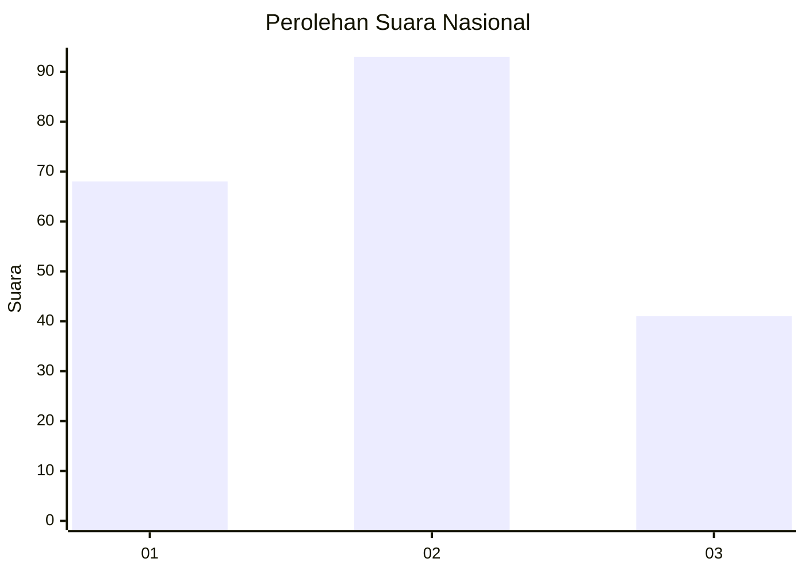
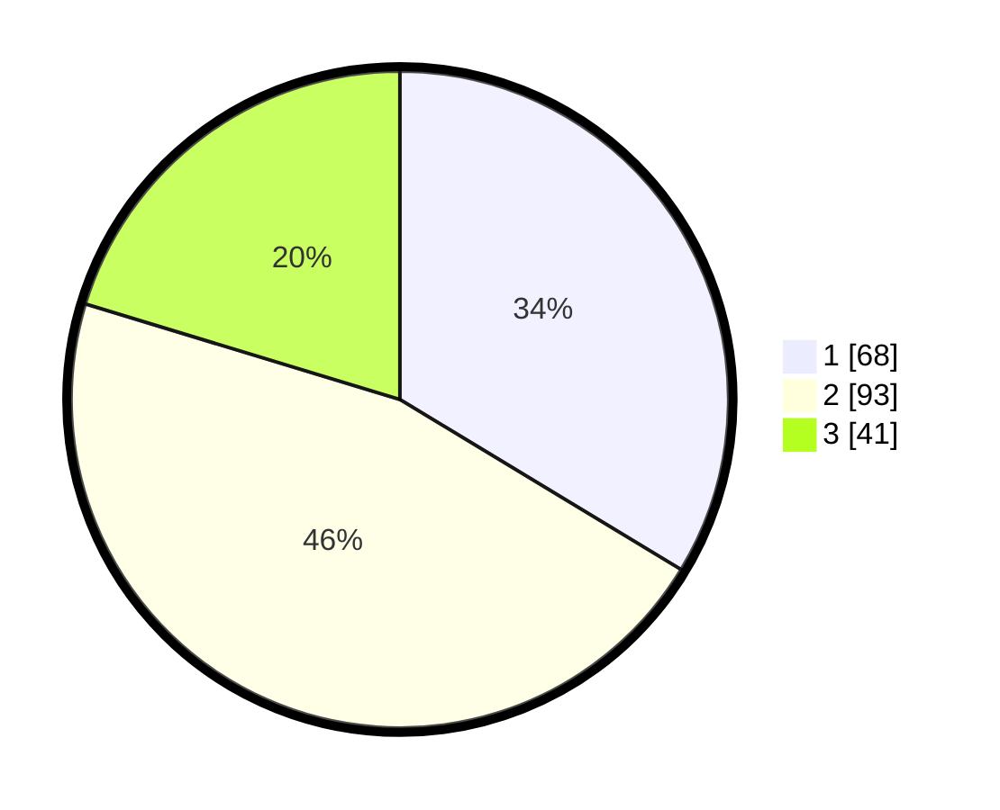

# Hasil

## Grafik

## Tabel

| No.    | Nama Paslon    | Suara | Suara (raw) | Persentase |
|:------ |:-------------- | -----:| -----------:| ----------:|
| 100025 | ANIES MUHAIMIN | 68    | [68][p-1]   | 33,66      |
| 100026 | PRABOWO GIBRAN | 93    | [93][p-2]   | 46,04      |
| 100027 | GANJAR MAHFUD  | 41    | [41][p-3]   | 20,30      |

[p-1]: https://github.com/gigit-pemilu/pemilu-2024/blob/main/pilpres/hitung-suara/sub/31-dki-jakarta/sub/74-jakarta-selatan/sub/02-setiabudi/sub/1005-menteng-atas/sub/093-tps/sub/paslon-1.txt
[p-2]: https://github.com/gigit-pemilu/pemilu-2024/blob/main/pilpres/hitung-suara/sub/31-dki-jakarta/sub/74-jakarta-selatan/sub/02-setiabudi/sub/1005-menteng-atas/sub/093-tps/sub/paslon-2.txt
[p-3]: https://github.com/gigit-pemilu/pemilu-2024/blob/main/pilpres/hitung-suara/sub/31-dki-jakarta/sub/74-jakarta-selatan/sub/02-setiabudi/sub/1005-menteng-atas/sub/093-tps/sub/paslon-3.txt

## Foto C Plano

https://sirekap-obj-formc.kpu.go.id/26f4/pemilu/ppwp/31/74/02/10/05/3174021005093-20240215-033756--3605a828-5867-41b4-9e12-c75744f46d32.jpg

https://sirekap-obj-formc.kpu.go.id/26f4/pemilu/ppwp/31/74/02/10/05/3174021005093-20240215-033806--12895dc9-2501-447e-89a9-fb4029adfa16.jpg

https://sirekap-obj-formc.kpu.go.id/26f4/pemilu/ppwp/31/74/02/10/05/3174021005093-20240215-033810--17992569-f17b-447d-9d39-05ee7cdf6d02.jpg

## Metadata

| Key        | Value               |
| ---------- | ------------------- |
| Time Stamp | 2024-02-25 15:00:00 |

