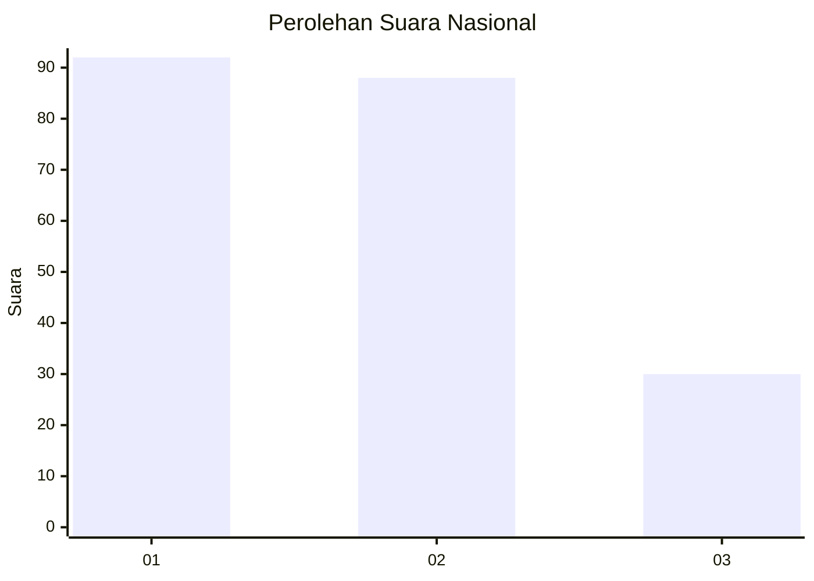
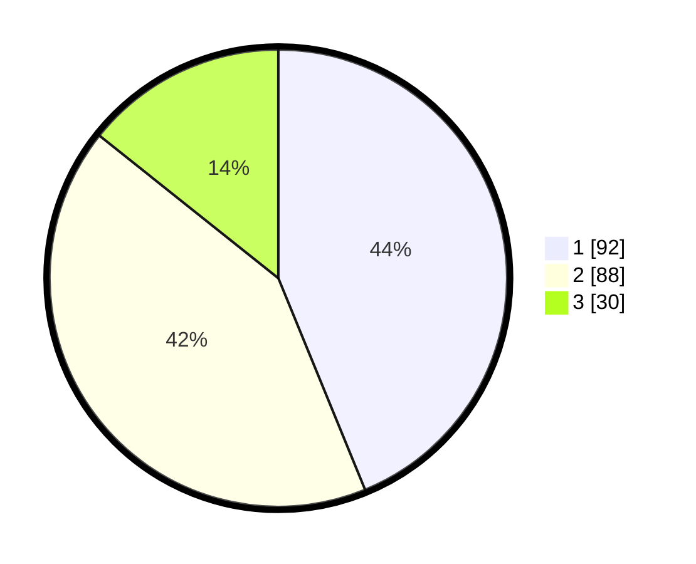

# Hasil

## Grafik

## Tabel

| No.    | Nama Paslon    | Suara | Suara (raw) | Persentase |
|:------ |:-------------- | -----:| -----------:| ----------:|
| 100025 | ANIES MUHAIMIN | 92    | [92][p-1]   | 43,81      |
| 100026 | PRABOWO GIBRAN | 88    | [88][p-2]   | 41,90      |
| 100027 | GANJAR MAHFUD  | 30    | [30][p-3]   | 14,29      |

[p-1]: https://github.com/gigit-pemilu/pemilu-2024/blob/main/pilpres/hitung-suara/sub/31-dki-jakarta/sub/74-jakarta-selatan/sub/02-setiabudi/sub/1005-menteng-atas/sub/095-tps/sub/paslon-1.txt
[p-2]: https://github.com/gigit-pemilu/pemilu-2024/blob/main/pilpres/hitung-suara/sub/31-dki-jakarta/sub/74-jakarta-selatan/sub/02-setiabudi/sub/1005-menteng-atas/sub/095-tps/sub/paslon-2.txt
[p-3]: https://github.com/gigit-pemilu/pemilu-2024/blob/main/pilpres/hitung-suara/sub/31-dki-jakarta/sub/74-jakarta-selatan/sub/02-setiabudi/sub/1005-menteng-atas/sub/095-tps/sub/paslon-3.txt

## Foto C Plano

https://sirekap-obj-formc.kpu.go.id/72cd/pemilu/ppwp/31/74/02/10/05/3174021005095-20240219-043313--da0bcb2e-7e76-4205-9e13-dd5f97dee85c.jpg

https://sirekap-obj-formc.kpu.go.id/72cd/pemilu/ppwp/31/74/02/10/05/3174021005095-20240215-023123--ae49f6cc-a267-4cb6-8f90-2771da368f2b.jpg

https://sirekap-obj-formc.kpu.go.id/72cd/pemilu/ppwp/31/74/02/10/05/3174021005095-20240218-215225--468f7690-cb85-4d97-a14d-41b1a7753eab.jpg

## Metadata

| Key        | Value               |
| ---------- | ------------------- |
| Time Stamp | 2024-02-19 06:16:00 |

