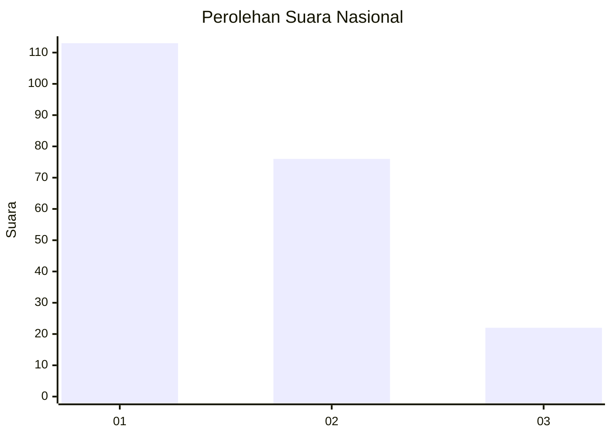
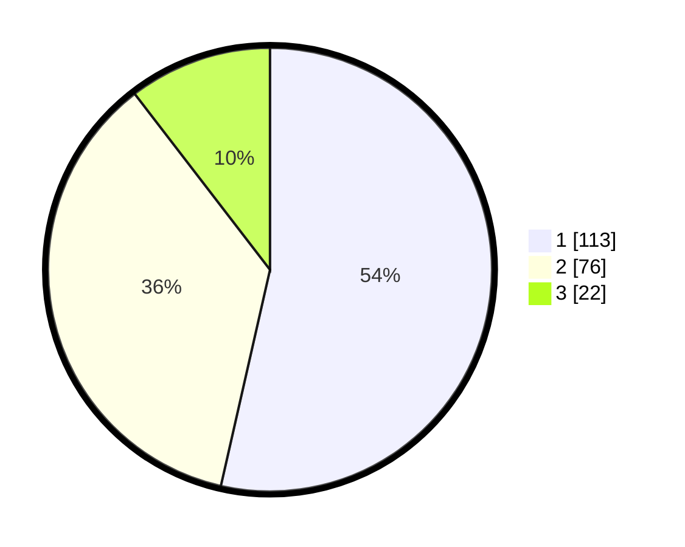

# Hasil

## Grafik

## Tabel

| No.    | Nama Paslon    | Suara | Suara (raw) | Persentase |
|:------ |:-------------- | -----:| -----------:| ----------:|
| 100025 | ANIES MUHAIMIN | 113   | [113][p-1]  | 53,55      |
| 100026 | PRABOWO GIBRAN | 76    | [76][p-2]   | 36,02      |
| 100027 | GANJAR MAHFUD  | 22    | [22][p-3]   | 10,43      |

[p-1]: https://github.com/gigit-pemilu/pemilu-2024/blob/main/pilpres/hitung-suara/sub/31-dki-jakarta/sub/74-jakarta-selatan/sub/02-setiabudi/sub/1006-pasar-manggis/sub/016-tps/sub/paslon-1.txt
[p-2]: https://github.com/gigit-pemilu/pemilu-2024/blob/main/pilpres/hitung-suara/sub/31-dki-jakarta/sub/74-jakarta-selatan/sub/02-setiabudi/sub/1006-pasar-manggis/sub/016-tps/sub/paslon-2.txt
[p-3]: https://github.com/gigit-pemilu/pemilu-2024/blob/main/pilpres/hitung-suara/sub/31-dki-jakarta/sub/74-jakarta-selatan/sub/02-setiabudi/sub/1006-pasar-manggis/sub/016-tps/sub/paslon-3.txt

## Foto C Plano

https://sirekap-obj-formc.kpu.go.id/0248/pemilu/ppwp/31/74/02/10/06/3174021006016-20240214-231013--353b10c3-edb9-42b0-9cee-0093a40728e7.jpg

https://sirekap-obj-formc.kpu.go.id/0248/pemilu/ppwp/31/74/02/10/06/3174021006016-20240214-214759--9c5a0e39-c06f-4bb0-998e-86c218ac691c.jpg

https://sirekap-obj-formc.kpu.go.id/0248/pemilu/ppwp/31/74/02/10/06/3174021006016-20240214-214907--65037b9c-343a-47c7-b941-b10e8746639b.jpg

## Metadata

| Key        | Value               |
| ---------- | ------------------- |
| Time Stamp | 2024-02-24 22:31:28 |

