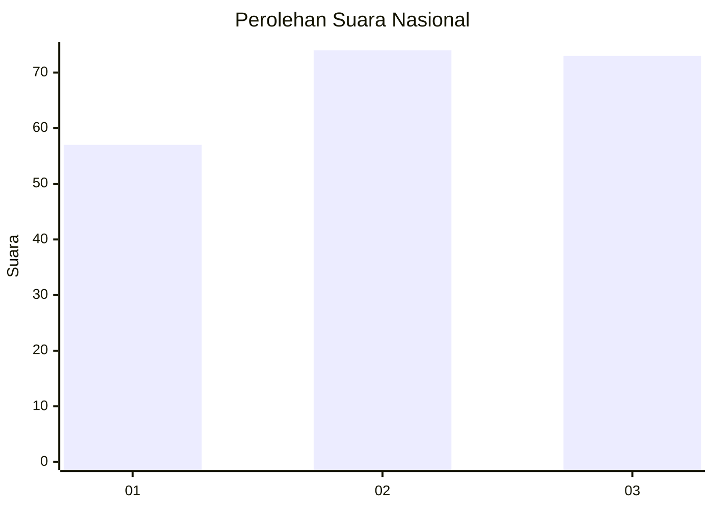
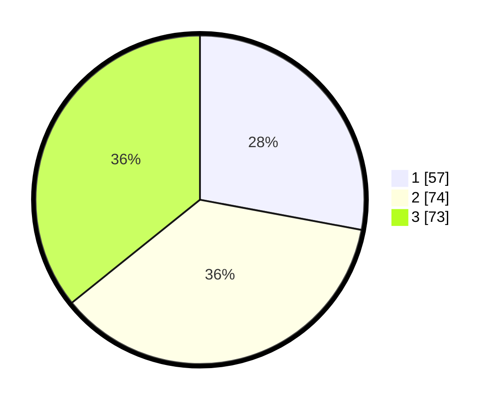

# Hasil

## Grafik

## Tabel

| No.    | Nama Paslon    | Suara | Suara (raw) | Persentase |
|:------ |:-------------- | -----:| -----------:| ----------:|
| 100025 | ANIES MUHAIMIN | 57    | [57][p-1]   | 27,94      |
| 100026 | PRABOWO GIBRAN | 74    | [74][p-2]   | 36,27      |
| 100027 | GANJAR MAHFUD  | 73    | [73][p-3]   | 35,78      |

[p-1]: https://github.com/gigit-pemilu/pemilu-2024/blob/main/pilpres/hitung-suara/sub/31-dki-jakarta/sub/74-jakarta-selatan/sub/02-setiabudi/sub/1006-pasar-manggis/sub/043-tps/sub/paslon-1.txt
[p-2]: https://github.com/gigit-pemilu/pemilu-2024/blob/main/pilpres/hitung-suara/sub/31-dki-jakarta/sub/74-jakarta-selatan/sub/02-setiabudi/sub/1006-pasar-manggis/sub/043-tps/sub/paslon-2.txt
[p-3]: https://github.com/gigit-pemilu/pemilu-2024/blob/main/pilpres/hitung-suara/sub/31-dki-jakarta/sub/74-jakarta-selatan/sub/02-setiabudi/sub/1006-pasar-manggis/sub/043-tps/sub/paslon-3.txt

## Foto C Plano

https://sirekap-obj-formc.kpu.go.id/cb21/pemilu/ppwp/31/74/02/10/06/3174021006043-20240214-213038--6dc23245-a691-491d-80e3-91ffad2cbefa.jpg

https://sirekap-obj-formc.kpu.go.id/cb21/pemilu/ppwp/31/74/02/10/06/3174021006043-20240214-213359--58caf472-f532-4840-bb2c-c50fec4fef38.jpg

https://sirekap-obj-formc.kpu.go.id/cb21/pemilu/ppwp/31/74/02/10/06/3174021006043-20240214-213605--4f02f74c-c46d-47d9-9231-8ae11f9c45c8.jpg

## Metadata

| Key        | Value               |
| ---------- | ------------------- |
| Time Stamp | 2024-02-24 22:31:28 |

