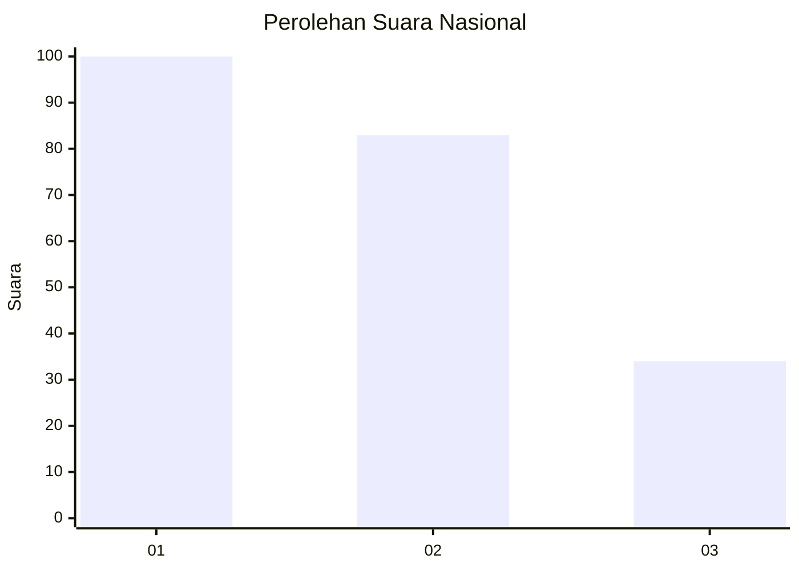
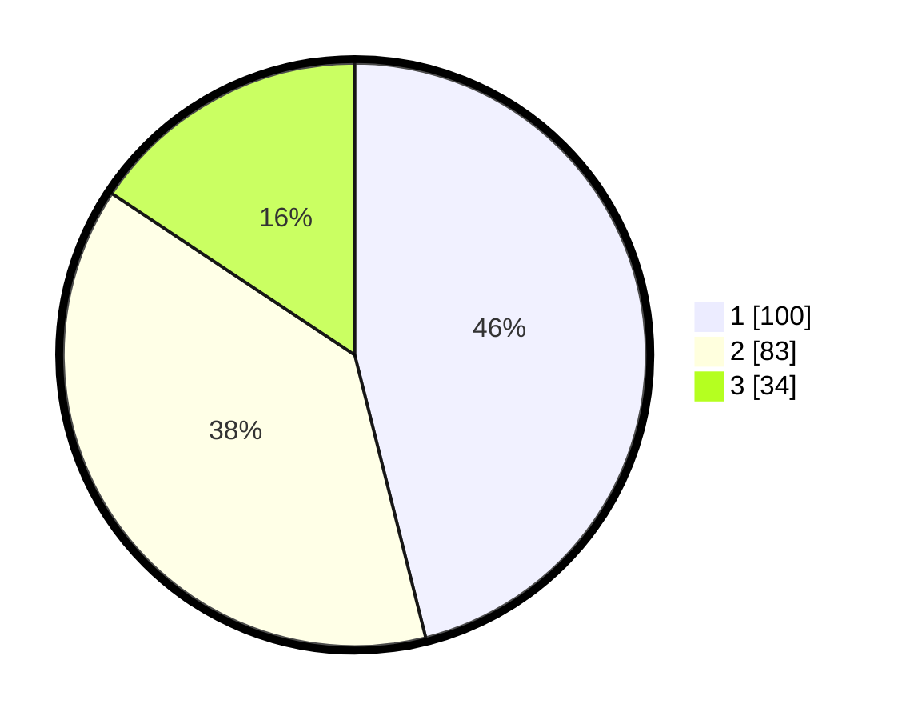

# Hasil

## Grafik

## Tabel

| No.    | Nama Paslon    | Suara | Suara (raw) | Persentase |
|:------ |:-------------- | -----:| -----------:| ----------:|
| 100025 | ANIES MUHAIMIN | 100   | [100][p-1]  | 46,08      |
| 100026 | PRABOWO GIBRAN | 83    | [83][p-2]   | 38,25      |
| 100027 | GANJAR MAHFUD  | 34    | [34][p-3]   | 15,67      |

[p-1]: https://github.com/gigit-pemilu/pemilu-2024/blob/main/pilpres/hitung-suara/sub/31-dki-jakarta/sub/74-jakarta-selatan/sub/02-setiabudi/sub/1006-pasar-manggis/sub/044-tps/sub/paslon-1.txt
[p-2]: https://github.com/gigit-pemilu/pemilu-2024/blob/main/pilpres/hitung-suara/sub/31-dki-jakarta/sub/74-jakarta-selatan/sub/02-setiabudi/sub/1006-pasar-manggis/sub/044-tps/sub/paslon-2.txt
[p-3]: https://github.com/gigit-pemilu/pemilu-2024/blob/main/pilpres/hitung-suara/sub/31-dki-jakarta/sub/74-jakarta-selatan/sub/02-setiabudi/sub/1006-pasar-manggis/sub/044-tps/sub/paslon-3.txt

## Foto C Plano

https://sirekap-obj-formc.kpu.go.id/f053/pemilu/ppwp/31/74/02/10/06/3174021006044-20240214-222948--0ba0eb7a-887d-400c-980d-16cb45f112fb.jpg

https://sirekap-obj-formc.kpu.go.id/f053/pemilu/ppwp/31/74/02/10/06/3174021006044-20240214-223124--2d9cb24d-f894-48be-89df-ee3ab5f71c54.jpg

https://sirekap-obj-formc.kpu.go.id/f053/pemilu/ppwp/31/74/02/10/06/3174021006044-20240214-223215--0b37603e-caf0-43b3-a4cb-68db4d14f8ef.jpg

## Metadata

| Key        | Value               |
| ---------- | ------------------- |
| Time Stamp | 2024-02-24 22:31:28 |

