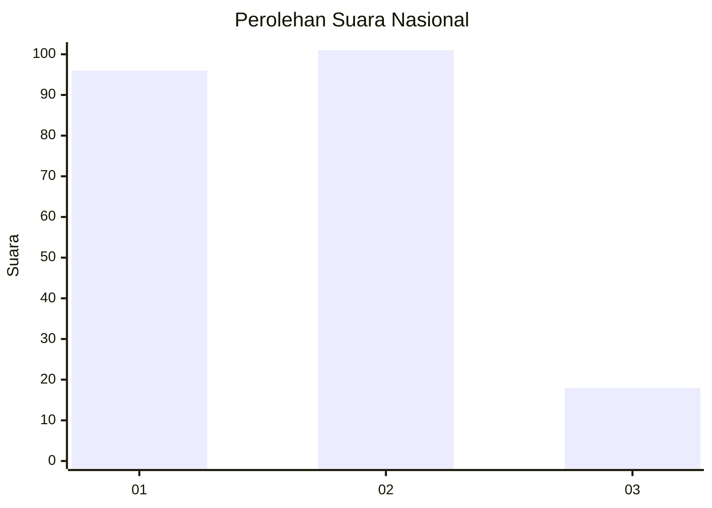
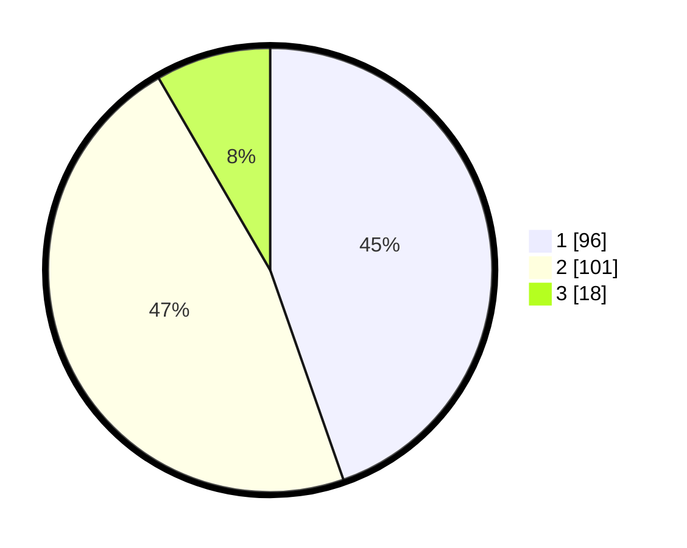

# Hasil

## Grafik

## Tabel

| No.    | Nama Paslon    | Suara | Suara (raw) | Persentase |
|:------ |:-------------- | -----:| -----------:| ----------:|
| 100025 | ANIES MUHAIMIN | 96    | [96][p-1]   | 44,65      |
| 100026 | PRABOWO GIBRAN | 101   | [101][p-2]  | 46,98      |
| 100027 | GANJAR MAHFUD  | 18    | [18][p-3]   | 8,37       |

[p-1]: https://github.com/gigit-pemilu/pemilu-2024/blob/main/pilpres/hitung-suara/sub/31-dki-jakarta/sub/74-jakarta-selatan/sub/02-setiabudi/sub/1006-pasar-manggis/sub/045-tps/sub/paslon-1.txt
[p-2]: https://github.com/gigit-pemilu/pemilu-2024/blob/main/pilpres/hitung-suara/sub/31-dki-jakarta/sub/74-jakarta-selatan/sub/02-setiabudi/sub/1006-pasar-manggis/sub/045-tps/sub/paslon-2.txt
[p-3]: https://github.com/gigit-pemilu/pemilu-2024/blob/main/pilpres/hitung-suara/sub/31-dki-jakarta/sub/74-jakarta-selatan/sub/02-setiabudi/sub/1006-pasar-manggis/sub/045-tps/sub/paslon-3.txt

## Foto C Plano

https://sirekap-obj-formc.kpu.go.id/a107/pemilu/ppwp/31/74/02/10/06/3174021006045-20240214-233413--429c5fa9-0776-4f01-9e47-081503fa05e7.jpg

https://sirekap-obj-formc.kpu.go.id/a107/pemilu/ppwp/31/74/02/10/06/3174021006045-20240214-233418--c4101649-bab4-462a-b527-62a94e0cf43f.jpg

https://sirekap-obj-formc.kpu.go.id/a107/pemilu/ppwp/31/74/02/10/06/3174021006045-20240214-233403--145a0ea5-49e5-4ce2-ae61-42b34ad440e0.jpg

## Metadata

| Key        | Value               |
| ---------- | ------------------- |
| Time Stamp | 2024-02-24 22:31:28 |

