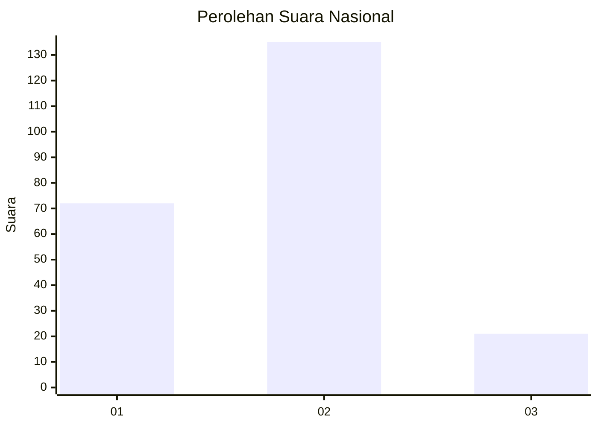
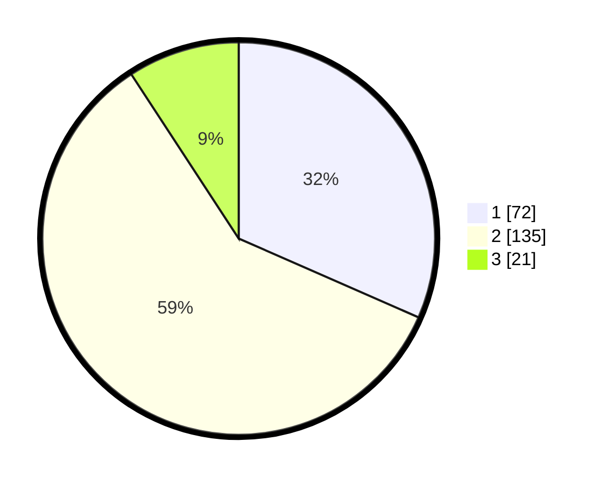

# Hasil

## Grafik

## Tabel

| No.    | Nama Paslon    | Suara | Suara (raw) | Persentase |
|:------ |:-------------- | -----:| -----------:| ----------:|
| 100025 | ANIES MUHAIMIN | 72    | [72][p-1]   | 31,58      |
| 100026 | PRABOWO GIBRAN | 135   | [135][p-2]  | 59,21      |
| 100027 | GANJAR MAHFUD  | 21    | [21][p-3]   | 9,21       |

[p-1]: https://github.com/gigit-pemilu/pemilu-2024/blob/main/pilpres/hitung-suara/sub/31-dki-jakarta/sub/74-jakarta-selatan/sub/02-setiabudi/sub/1006-pasar-manggis/sub/046-tps/sub/paslon-1.txt
[p-2]: https://github.com/gigit-pemilu/pemilu-2024/blob/main/pilpres/hitung-suara/sub/31-dki-jakarta/sub/74-jakarta-selatan/sub/02-setiabudi/sub/1006-pasar-manggis/sub/046-tps/sub/paslon-2.txt
[p-3]: https://github.com/gigit-pemilu/pemilu-2024/blob/main/pilpres/hitung-suara/sub/31-dki-jakarta/sub/74-jakarta-selatan/sub/02-setiabudi/sub/1006-pasar-manggis/sub/046-tps/sub/paslon-3.txt

## Foto C Plano

https://sirekap-obj-formc.kpu.go.id/f892/pemilu/ppwp/31/74/02/10/06/3174021006046-20240215-010134--e102feb9-7f4c-44f6-ac3f-268a919ef2fa.jpg

https://sirekap-obj-formc.kpu.go.id/f892/pemilu/ppwp/31/74/02/10/06/3174021006046-20240215-010440--4efa64e2-1ad5-480b-865c-336a9e1f1a68.jpg

https://sirekap-obj-formc.kpu.go.id/f892/pemilu/ppwp/31/74/02/10/06/3174021006046-20240215-010613--e18001c4-0f31-4b57-b589-422552aa3559.jpg

## Metadata

| Key        | Value               |
| ---------- | ------------------- |
| Time Stamp | 2024-02-24 22:31:28 |

