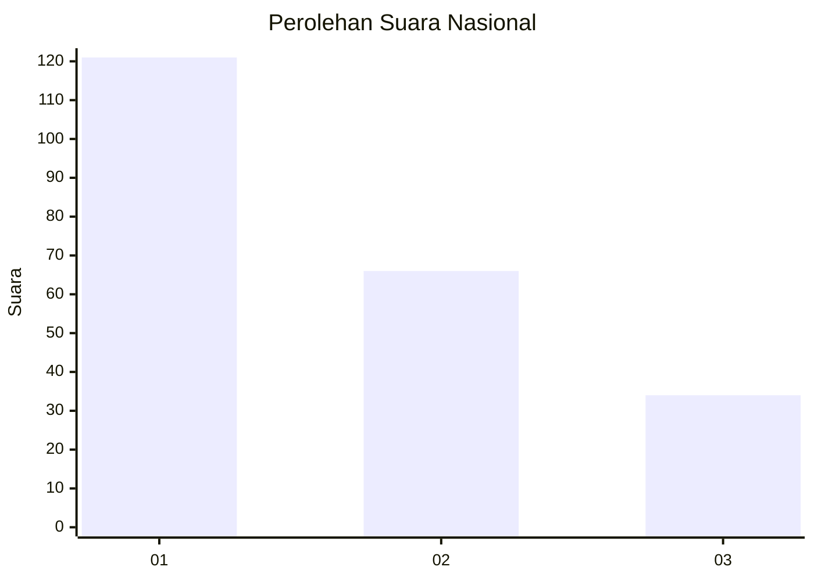
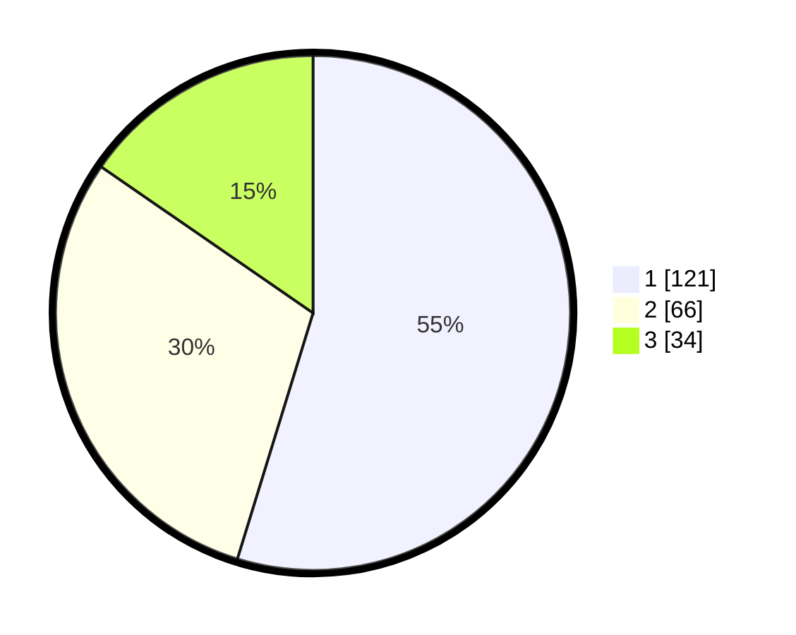

# Hasil

## Grafik

## Tabel

| No.    | Nama Paslon    | Suara | Suara (raw) | Persentase |
|:------ |:-------------- | -----:| -----------:| ----------:|
| 100025 | ANIES MUHAIMIN | 121   | [121][p-1]  | 54,75      |
| 100026 | PRABOWO GIBRAN | 66    | [66][p-2]   | 29,86      |
| 100027 | GANJAR MAHFUD  | 34    | [34][p-3]   | 15,38      |

[p-1]: https://github.com/gigit-pemilu/pemilu-2024/blob/main/pilpres/hitung-suara/sub/31-dki-jakarta/sub/74-jakarta-selatan/sub/02-setiabudi/sub/1006-pasar-manggis/sub/065-tps/sub/paslon-1.txt
[p-2]: https://github.com/gigit-pemilu/pemilu-2024/blob/main/pilpres/hitung-suara/sub/31-dki-jakarta/sub/74-jakarta-selatan/sub/02-setiabudi/sub/1006-pasar-manggis/sub/065-tps/sub/paslon-2.txt
[p-3]: https://github.com/gigit-pemilu/pemilu-2024/blob/main/pilpres/hitung-suara/sub/31-dki-jakarta/sub/74-jakarta-selatan/sub/02-setiabudi/sub/1006-pasar-manggis/sub/065-tps/sub/paslon-3.txt

## Foto C Plano

https://sirekap-obj-formc.kpu.go.id/e1a6/pemilu/ppwp/31/74/02/10/06/3174021006065-20240214-201733--f11dbc15-3c80-4593-9a3a-3c3bd4d2f22d.jpg

https://sirekap-obj-formc.kpu.go.id/e1a6/pemilu/ppwp/31/74/02/10/06/3174021006065-20240214-203740--0ef83d38-d2fa-4da6-86c1-2b18648b998a.jpg

https://sirekap-obj-formc.kpu.go.id/e1a6/pemilu/ppwp/31/74/02/10/06/3174021006065-20240214-203832--eb1b870b-f2ea-41b3-8c1c-8161d3477e89.jpg

## Metadata

| Key        | Value               |
| ---------- | ------------------- |
| Time Stamp | 2024-02-24 22:31:28 |

