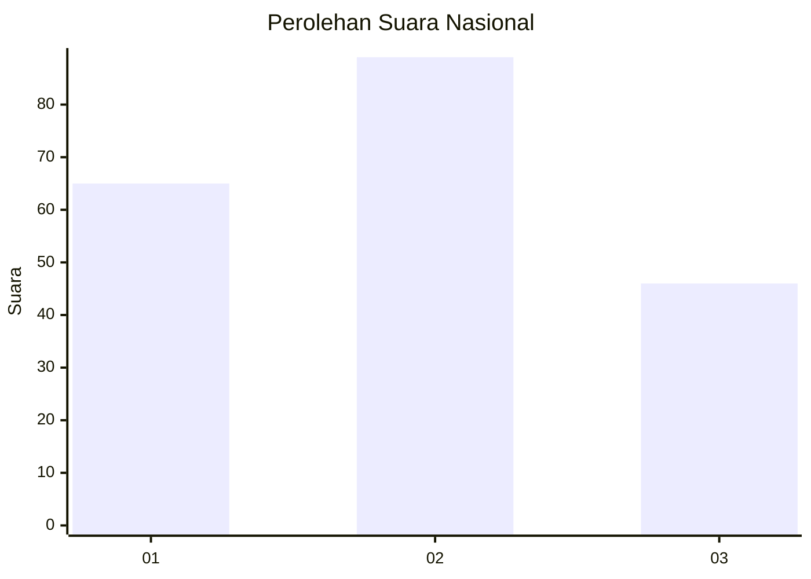
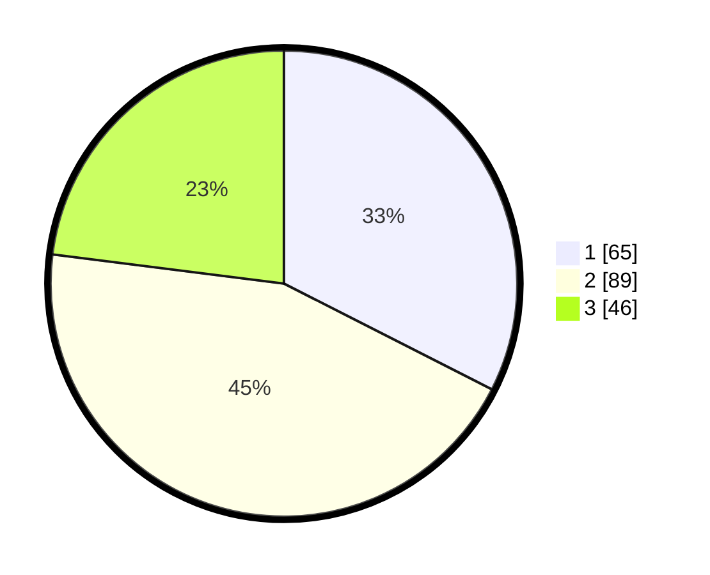

# Hasil

## Grafik

## Tabel

| No.    | Nama Paslon    | Suara | Suara (raw) | Persentase |
|:------ |:-------------- | -----:| -----------:| ----------:|
| 100025 | ANIES MUHAIMIN | 65    | [65][p-1]   | 32,50      |
| 100026 | PRABOWO GIBRAN | 89    | [89][p-2]   | 44,50      |
| 100027 | GANJAR MAHFUD  | 46    | [46][p-3]   | 23,00      |

[p-1]: https://github.com/gigit-pemilu/pemilu-2024/blob/main/pilpres/hitung-suara/sub/31-dki-jakarta/sub/74-jakarta-selatan/sub/02-setiabudi/sub/1006-pasar-manggis/sub/087-tps/sub/paslon-1.txt
[p-2]: https://github.com/gigit-pemilu/pemilu-2024/blob/main/pilpres/hitung-suara/sub/31-dki-jakarta/sub/74-jakarta-selatan/sub/02-setiabudi/sub/1006-pasar-manggis/sub/087-tps/sub/paslon-2.txt
[p-3]: https://github.com/gigit-pemilu/pemilu-2024/blob/main/pilpres/hitung-suara/sub/31-dki-jakarta/sub/74-jakarta-selatan/sub/02-setiabudi/sub/1006-pasar-manggis/sub/087-tps/sub/paslon-3.txt

## Foto C Plano

https://sirekap-obj-formc.kpu.go.id/d6f5/pemilu/ppwp/31/74/02/10/06/3174021006087-20240214-190755--d4c82cee-f985-41dd-88c1-5ccb4344b81f.jpg

https://sirekap-obj-formc.kpu.go.id/d6f5/pemilu/ppwp/31/74/02/10/06/3174021006087-20240214-193746--bcf4362b-011f-43f7-8088-b9627c64272f.jpg

https://sirekap-obj-formc.kpu.go.id/d6f5/pemilu/ppwp/31/74/02/10/06/3174021006087-20240214-190921--69f4c513-9d02-450e-adaf-84535173af03.jpg

## Metadata

| Key        | Value               |
| ---------- | ------------------- |
| Time Stamp | 2024-02-24 22:31:28 |

