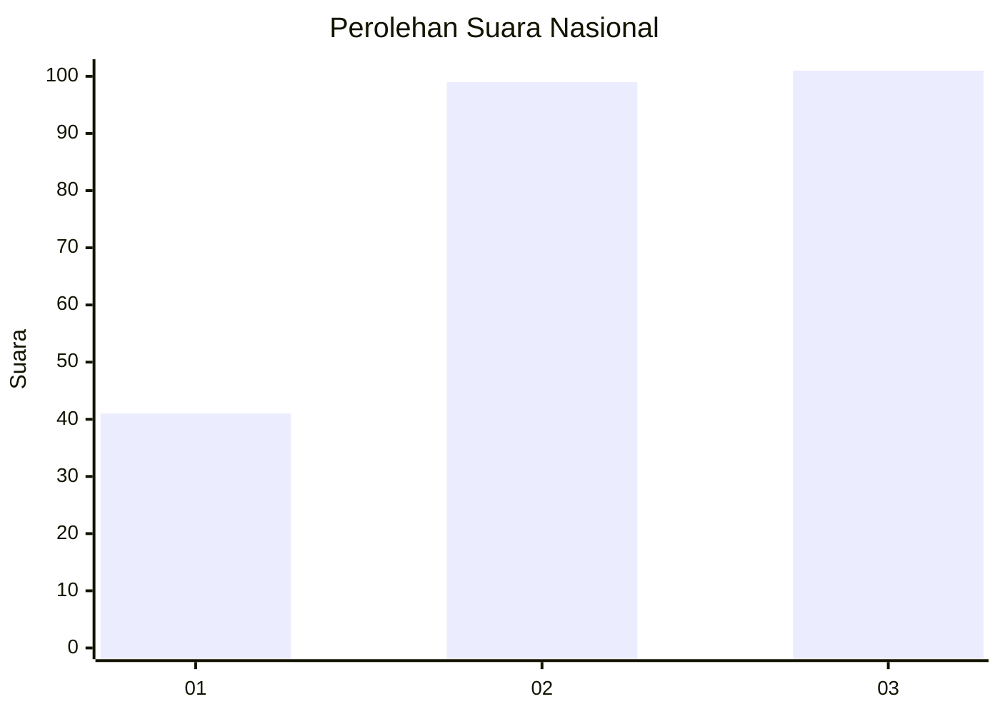
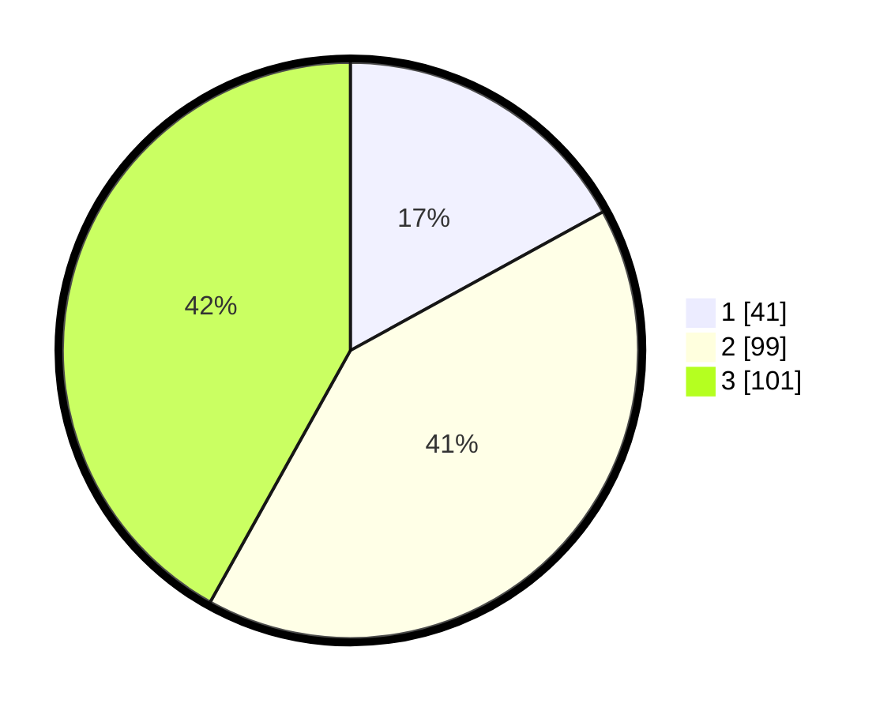

# Hasil

## Grafik

## Tabel

| No.    | Nama Paslon    | Suara | Suara (raw) | Persentase |
|:------ |:-------------- | -----:| -----------:| ----------:|
| 100025 | ANIES MUHAIMIN | 41    | [41][p-1]   | 17,01      |
| 100026 | PRABOWO GIBRAN | 99    | [99][p-2]   | 41,08      |
| 100027 | GANJAR MAHFUD  | 101   | [101][p-3]  | 41,91      |

[p-1]: https://github.com/gigit-pemilu/pemilu-2024/blob/main/pilpres/hitung-suara/sub/31-dki-jakarta/sub/74-jakarta-selatan/sub/02-setiabudi/sub/1007-guntur/sub/003-tps/sub/paslon-1.txt
[p-2]: https://github.com/gigit-pemilu/pemilu-2024/blob/main/pilpres/hitung-suara/sub/31-dki-jakarta/sub/74-jakarta-selatan/sub/02-setiabudi/sub/1007-guntur/sub/003-tps/sub/paslon-2.txt
[p-3]: https://github.com/gigit-pemilu/pemilu-2024/blob/main/pilpres/hitung-suara/sub/31-dki-jakarta/sub/74-jakarta-selatan/sub/02-setiabudi/sub/1007-guntur/sub/003-tps/sub/paslon-3.txt

## Foto C Plano

https://sirekap-obj-formc.kpu.go.id/fb4c/pemilu/ppwp/31/74/02/10/07/3174021007003-20240214-230956--50b73a44-8bd0-4a90-90c0-c84f295e368b.jpg

https://sirekap-obj-formc.kpu.go.id/fb4c/pemilu/ppwp/31/74/02/10/07/3174021007003-20240214-231302--0b0c9f46-96dd-494e-bf29-89e03ac68d0d.jpg

https://sirekap-obj-formc.kpu.go.id/fb4c/pemilu/ppwp/31/74/02/10/07/3174021007003-20240214-231749--c26d4ec0-4e64-4e34-b813-5a98326a6599.jpg

## Metadata

| Key        | Value               |
| ---------- | ------------------- |
| Time Stamp | 2024-02-24 22:31:28 |

