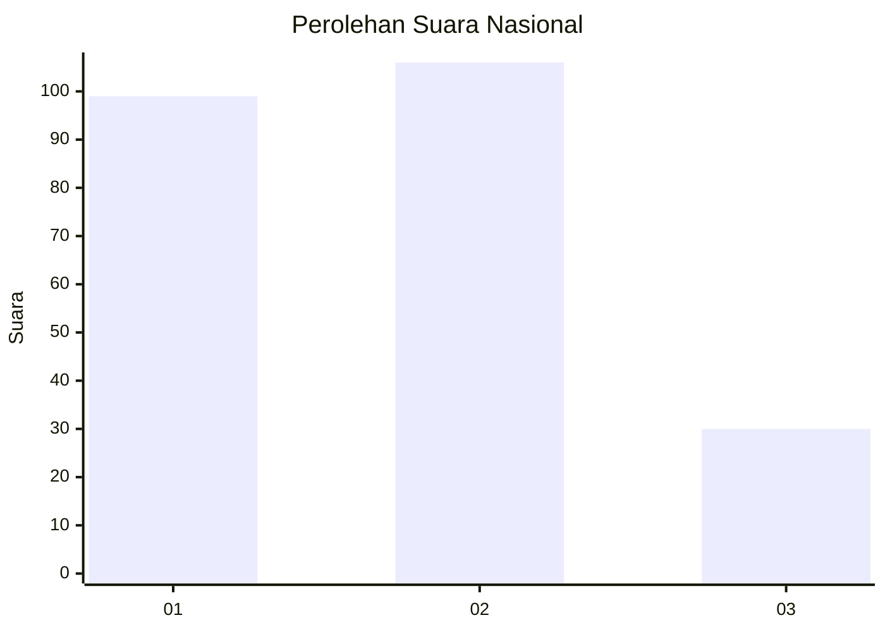
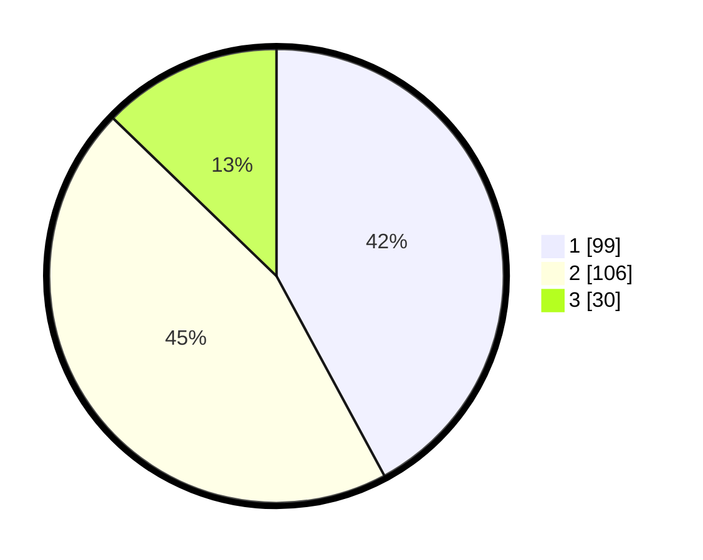

# Hasil

## Grafik

## Tabel

| No.    | Nama Paslon    | Suara | Suara (raw) | Persentase |
|:------ |:-------------- | -----:| -----------:| ----------:|
| 100025 | ANIES MUHAIMIN | 99    | [99][p-1]   | 42,13      |
| 100026 | PRABOWO GIBRAN | 106   | [106][p-2]  | 45,11      |
| 100027 | GANJAR MAHFUD  | 30    | [30][p-3]   | 12,77      |

[p-1]: https://github.com/gigit-pemilu/pemilu-2024/blob/main/pilpres/hitung-suara/sub/31-dki-jakarta/sub/74-jakarta-selatan/sub/02-setiabudi/sub/1007-guntur/sub/014-tps/sub/paslon-1.txt
[p-2]: https://github.com/gigit-pemilu/pemilu-2024/blob/main/pilpres/hitung-suara/sub/31-dki-jakarta/sub/74-jakarta-selatan/sub/02-setiabudi/sub/1007-guntur/sub/014-tps/sub/paslon-2.txt
[p-3]: https://github.com/gigit-pemilu/pemilu-2024/blob/main/pilpres/hitung-suara/sub/31-dki-jakarta/sub/74-jakarta-selatan/sub/02-setiabudi/sub/1007-guntur/sub/014-tps/sub/paslon-3.txt

## Foto C Plano

https://sirekap-obj-formc.kpu.go.id/40a1/pemilu/ppwp/31/74/02/10/07/3174021007014-20240215-001509--d84742b2-ecca-488d-b614-c4dec77d944b.jpg

https://sirekap-obj-formc.kpu.go.id/40a1/pemilu/ppwp/31/74/02/10/07/3174021007014-20240215-001608--a1b32c52-df7e-47c6-afe2-12d120e00d13.jpg

https://sirekap-obj-formc.kpu.go.id/40a1/pemilu/ppwp/31/74/02/10/07/3174021007014-20240215-001734--08c128d5-091d-491e-8b4a-af572b0b5603.jpg

## Metadata

| Key        | Value               |
| ---------- | ------------------- |
| Time Stamp | 2024-02-24 22:31:28 |

