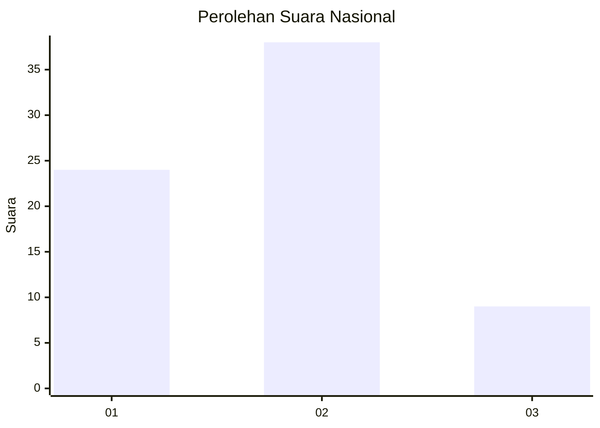
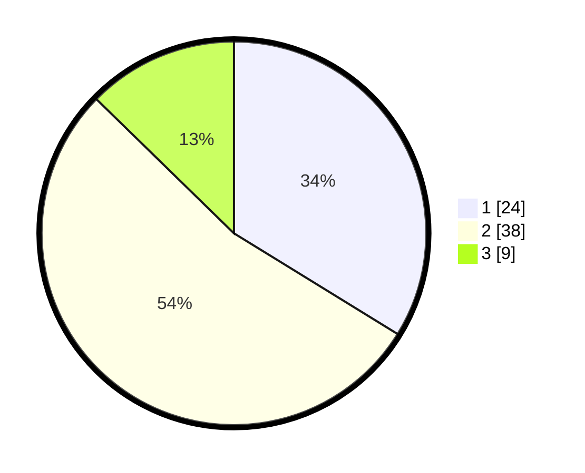

# Hasil

## Grafik

## Tabel

| No. | Nama Paslon    | Suara | Suara (raw) | Persentase |
|:--- |:-------------- | -----:| -----------:| ----------:|
| 1   | ANIES MUHAIMIN | 24    | [24][p-1]   | 33,80      |
| 2   | PRABOWO GIBRAN | 38    | [38][p-2]   | 53,52      |
| 3   | GANJAR MAHFUD  | 9     | [9][p-3]    | 12,68      |

[p-1]: https://github.com/gigit-pemilu/pemilu-2024/blob/main/pilpres/hitung-suara/sub/31-dki-jakarta/sub/74-jakarta-selatan/sub/02-setiabudi/sub/1007-guntur/sub/901-tps/sub/paslon-1.txt
[p-2]: https://github.com/gigit-pemilu/pemilu-2024/blob/main/pilpres/hitung-suara/sub/31-dki-jakarta/sub/74-jakarta-selatan/sub/02-setiabudi/sub/1007-guntur/sub/901-tps/sub/paslon-2.txt
[p-3]: https://github.com/gigit-pemilu/pemilu-2024/blob/main/pilpres/hitung-suara/sub/31-dki-jakarta/sub/74-jakarta-selatan/sub/02-setiabudi/sub/1007-guntur/sub/901-tps/sub/paslon-3.txt

## Foto C Plano

https://sirekap-obj-formc.kpu.go.id/1aa0/pemilu/ppwp/31/74/02/10/07/3174021007901-20240214-155056--31b32c48-9b1e-4582-ad94-40db1e7103b9.jpg

https://sirekap-obj-formc.kpu.go.id/1aa0/pemilu/ppwp/31/74/02/10/07/3174021007901-20240214-184929--cd542f1f-cdb9-42ce-8aa8-ff3f45e856aa.jpg

https://sirekap-obj-formc.kpu.go.id/1aa0/pemilu/ppwp/31/74/02/10/07/3174021007901-20240214-155044--fdefea73-0290-4a98-ba39-7c5b7963c4ec.jpg

## Metadata

| Key        | Value               |
| ---------- | ------------------- |
| Time Stamp | 2024-02-15 17:00:25 |

## DATA PEMILIH TETAP

Jumlah pemilih dalam DPT: **88**.
 * L: **83**.
 * P: **5**.

## DATA PENGGUNA HAK PILIH

Jumlah pengguna hak pilih dalam DPT: **23**.
 * L: **21**.
 * P: **2**.

Jumlah pengguna hak pilih dalam DPTb: **53**.
 * L: **50**.
 * P: **3**.

Jumlah pengguna hak pilih dalam DPK: **0**.
 * L: **0**.
 * P: **0**.

Jumlah pengguna hak pilih: **76**.
 * L: **71**.
 * P: **5**.

## JUMLAH SUARA SAH DAN TIDAK SAH

JUMLAH SELURUH SUARA SAH: **71**.

JUMLAH SUARA TIDAK SAH: **5**.

JUMLAH SELURUH SUARA SAH DAN SUARA TIDAK SAH: **76**.

