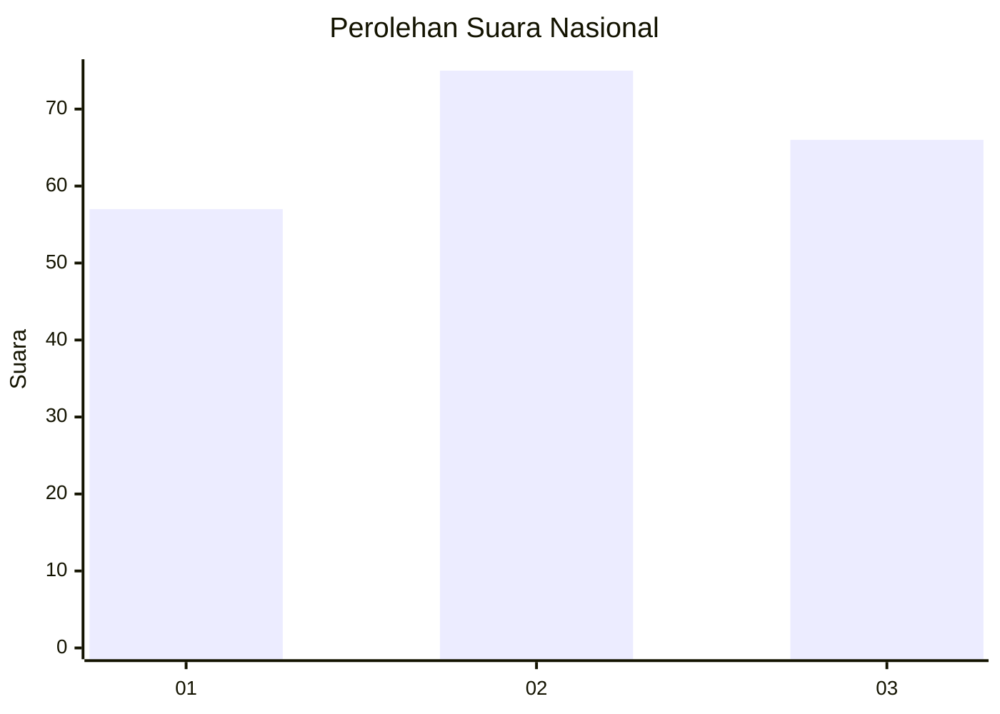
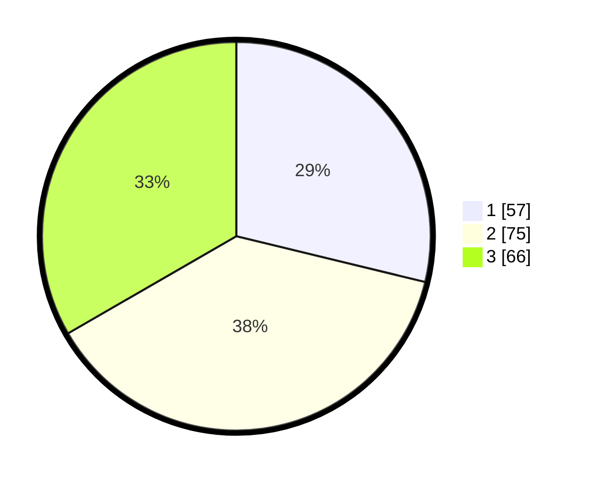

# Hasil

## Grafik

## Tabel

| No.    | Nama Paslon    | Suara | Suara (raw) | Persentase |
|:------ |:-------------- | -----:| -----------:| ----------:|
| 100025 | ANIES MUHAIMIN | 57    | [57][p-1]   | 28,79      |
| 100026 | PRABOWO GIBRAN | 75    | [75][p-2]   | 37,88      |
| 100027 | GANJAR MAHFUD  | 66    | [66][p-3]   | 33,33      |

[p-1]: https://github.com/gigit-pemilu/pemilu-2024/blob/main/pilpres/hitung-suara/sub/31-dki-jakarta/sub/74-jakarta-selatan/sub/02-setiabudi/sub/1008-kuningan-timur/sub/013-tps/sub/paslon-1.txt
[p-2]: https://github.com/gigit-pemilu/pemilu-2024/blob/main/pilpres/hitung-suara/sub/31-dki-jakarta/sub/74-jakarta-selatan/sub/02-setiabudi/sub/1008-kuningan-timur/sub/013-tps/sub/paslon-2.txt
[p-3]: https://github.com/gigit-pemilu/pemilu-2024/blob/main/pilpres/hitung-suara/sub/31-dki-jakarta/sub/74-jakarta-selatan/sub/02-setiabudi/sub/1008-kuningan-timur/sub/013-tps/sub/paslon-3.txt

## Foto C Plano

https://sirekap-obj-formc.kpu.go.id/4bf4/pemilu/ppwp/31/74/02/10/08/3174021008013-20240214-202228--dd3e1fb3-7167-4845-b0ac-ecd860a4c132.jpg

https://sirekap-obj-formc.kpu.go.id/4bf4/pemilu/ppwp/31/74/02/10/08/3174021008013-20240214-203437--fd21ff5c-c336-40ee-89b5-8dc9d16ff06e.jpg

https://sirekap-obj-formc.kpu.go.id/4bf4/pemilu/ppwp/31/74/02/10/08/3174021008013-20240214-204100--dd596820-8b0e-4b82-b8a1-c0c9421696e9.jpg

## Metadata

| Key        | Value               |
| ---------- | ------------------- |
| Time Stamp | 2024-02-24 22:31:28 |

