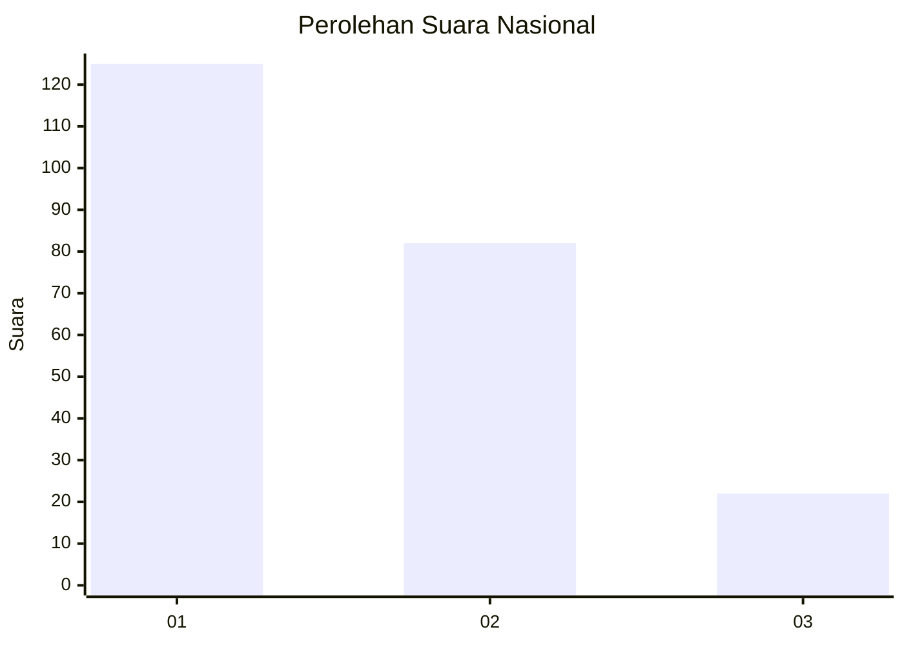
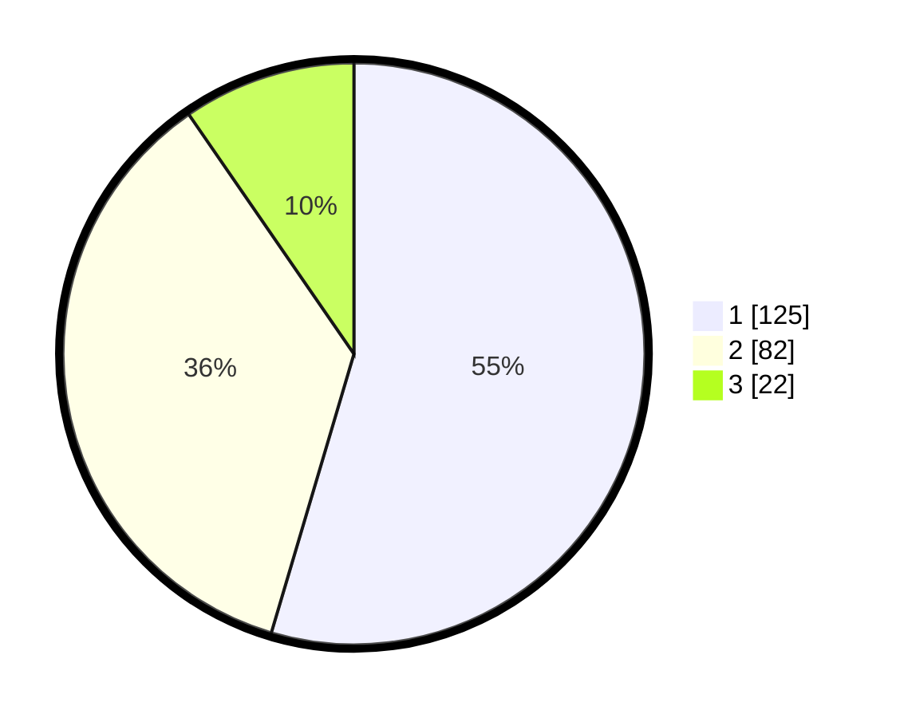

# Hasil

## Grafik

## Tabel

| No.    | Nama Paslon    | Suara | Suara (raw) | Persentase |
|:------ |:-------------- | -----:| -----------:| ----------:|
| 100025 | ANIES MUHAIMIN | 125   | [125][p-1]  | 54,59      |
| 100026 | PRABOWO GIBRAN | 82    | [82][p-2]   | 35,81      |
| 100027 | GANJAR MAHFUD  | 22    | [22][p-3]   | 9,61       |

[p-1]: https://github.com/gigit-pemilu/pemilu-2024/blob/main/pilpres/hitung-suara/sub/31-dki-jakarta/sub/74-jakarta-selatan/sub/02-setiabudi/sub/1008-kuningan-timur/sub/015-tps/sub/paslon-1.txt
[p-2]: https://github.com/gigit-pemilu/pemilu-2024/blob/main/pilpres/hitung-suara/sub/31-dki-jakarta/sub/74-jakarta-selatan/sub/02-setiabudi/sub/1008-kuningan-timur/sub/015-tps/sub/paslon-2.txt
[p-3]: https://github.com/gigit-pemilu/pemilu-2024/blob/main/pilpres/hitung-suara/sub/31-dki-jakarta/sub/74-jakarta-selatan/sub/02-setiabudi/sub/1008-kuningan-timur/sub/015-tps/sub/paslon-3.txt

## Foto C Plano

https://sirekap-obj-formc.kpu.go.id/8e71/pemilu/ppwp/31/74/02/10/08/3174021008015-20240214-235251--cb96bad0-6a3a-4e2d-990c-7df6916f8f62.jpg

https://sirekap-obj-formc.kpu.go.id/8e71/pemilu/ppwp/31/74/02/10/08/3174021008015-20240214-235522--579befec-0799-4bfe-b613-c8d746a288ed.jpg

https://sirekap-obj-formc.kpu.go.id/8e71/pemilu/ppwp/31/74/02/10/08/3174021008015-20240214-235426--df460d82-6f8c-4450-81c7-a1a63aa2bd08.jpg

## Metadata

| Key        | Value               |
| ---------- | ------------------- |
| Time Stamp | 2024-02-25 12:00:00 |

