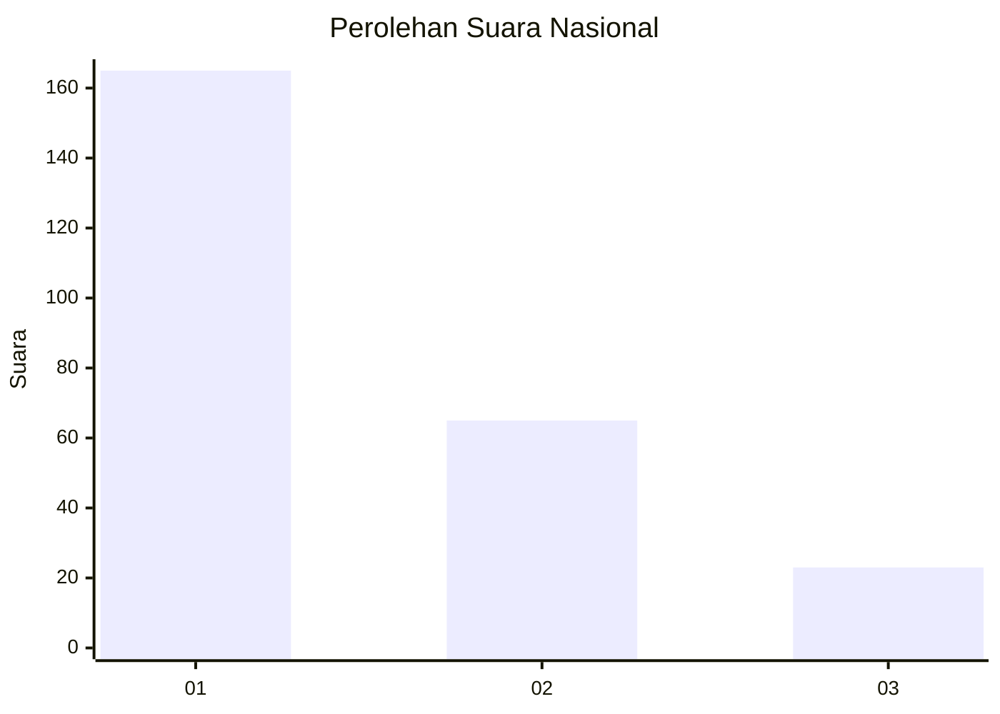
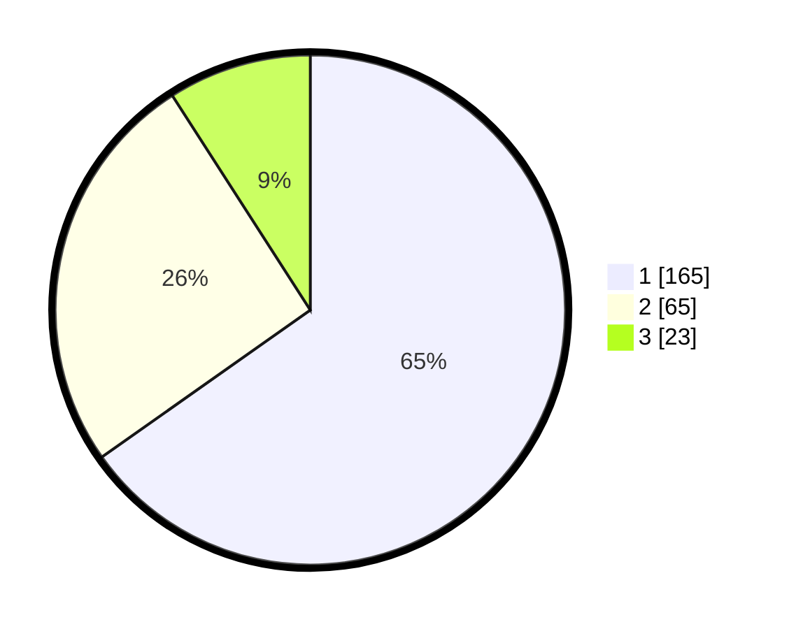

# Hasil

## Grafik

## Tabel

| No.    | Nama Paslon    | Suara | Suara (raw) | Persentase |
|:------ |:-------------- | -----:| -----------:| ----------:|
| 100025 | ANIES MUHAIMIN | 165   | [165][p-1]  | 65,22      |
| 100026 | PRABOWO GIBRAN | 65    | [65][p-2]   | 25,69      |
| 100027 | GANJAR MAHFUD  | 23    | [23][p-3]   | 9,09       |

[p-1]: https://github.com/gigit-pemilu/pemilu-2024/blob/main/pilpres/hitung-suara/sub/31-dki-jakarta/sub/74-jakarta-selatan/sub/02-setiabudi/sub/1008-kuningan-timur/sub/020-tps/sub/paslon-1.txt
[p-2]: https://github.com/gigit-pemilu/pemilu-2024/blob/main/pilpres/hitung-suara/sub/31-dki-jakarta/sub/74-jakarta-selatan/sub/02-setiabudi/sub/1008-kuningan-timur/sub/020-tps/sub/paslon-2.txt
[p-3]: https://github.com/gigit-pemilu/pemilu-2024/blob/main/pilpres/hitung-suara/sub/31-dki-jakarta/sub/74-jakarta-selatan/sub/02-setiabudi/sub/1008-kuningan-timur/sub/020-tps/sub/paslon-3.txt

## Foto C Plano

https://sirekap-obj-formc.kpu.go.id/f8ec/pemilu/ppwp/31/74/02/10/08/3174021008020-20240215-005739--7e95143e-bb4b-455b-bab6-5af615b783c6.jpg

https://sirekap-obj-formc.kpu.go.id/f8ec/pemilu/ppwp/31/74/02/10/08/3174021008020-20240214-155822--f2a530bc-b0c9-4ece-8d87-9004e3cd837b.jpg

https://sirekap-obj-formc.kpu.go.id/f8ec/pemilu/ppwp/31/74/02/10/08/3174021008020-20240214-155853--f58162e9-05f7-4e81-bafb-31d4797f4fdf.jpg

## Metadata

| Key        | Value               |
| ---------- | ------------------- |
| Time Stamp | 2024-02-25 16:00:00 |

