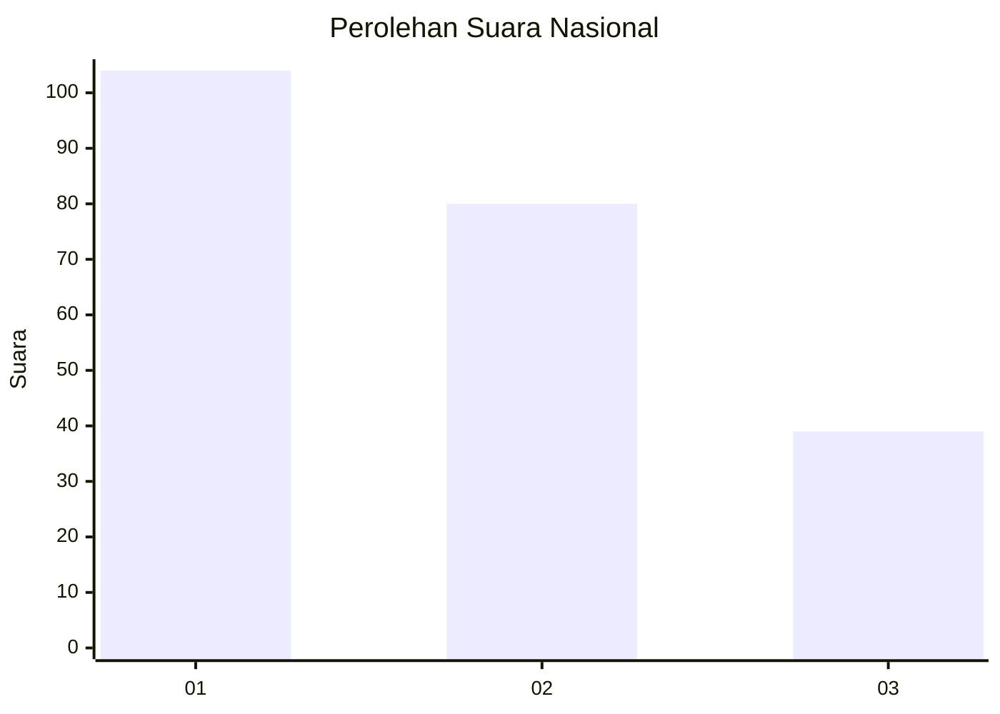
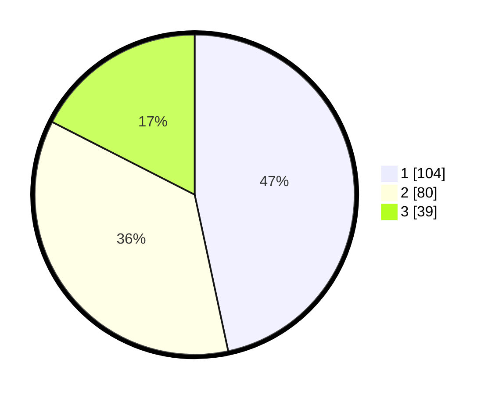

# Hasil

## Grafik

## Tabel

| No.    | Nama Paslon    | Suara | Suara (raw) | Persentase |
|:------ |:-------------- | -----:| -----------:| ----------:|
| 100025 | ANIES MUHAIMIN | 104   | [104][p-1]  | 46,64      |
| 100026 | PRABOWO GIBRAN | 80    | [80][p-2]   | 35,87      |
| 100027 | GANJAR MAHFUD  | 39    | [39][p-3]   | 17,49      |

[p-1]: https://github.com/gigit-pemilu/pemilu-2024/blob/main/pilpres/hitung-suara/sub/31-dki-jakarta/sub/74-jakarta-selatan/sub/03-mampang-prapatan/sub/1001-mampang-prapatan/sub/004-tps/sub/paslon-1.txt
[p-2]: https://github.com/gigit-pemilu/pemilu-2024/blob/main/pilpres/hitung-suara/sub/31-dki-jakarta/sub/74-jakarta-selatan/sub/03-mampang-prapatan/sub/1001-mampang-prapatan/sub/004-tps/sub/paslon-2.txt
[p-3]: https://github.com/gigit-pemilu/pemilu-2024/blob/main/pilpres/hitung-suara/sub/31-dki-jakarta/sub/74-jakarta-selatan/sub/03-mampang-prapatan/sub/1001-mampang-prapatan/sub/004-tps/sub/paslon-3.txt

## Foto C Plano

https://sirekap-obj-formc.kpu.go.id/9f27/pemilu/ppwp/31/74/03/10/01/3174031001004-20240215-004751--b42596b2-8069-4ba8-914c-71fff861f7c2.jpg

https://sirekap-obj-formc.kpu.go.id/9f27/pemilu/ppwp/31/74/03/10/01/3174031001004-20240215-004201--49ea837f-89a3-44c0-aafb-0a509331ac9a.jpg

## Metadata

| Key        | Value               |
| ---------- | ------------------- |
| Time Stamp | 2024-02-24 22:31:28 |

