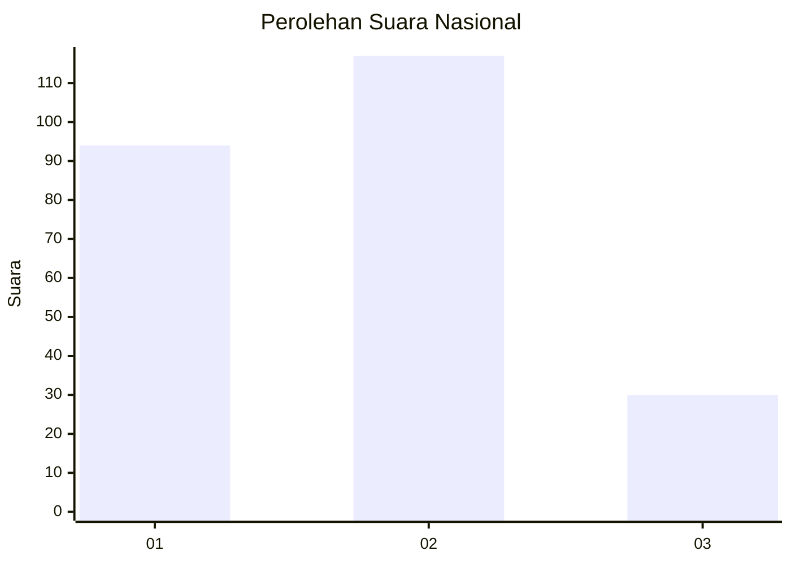
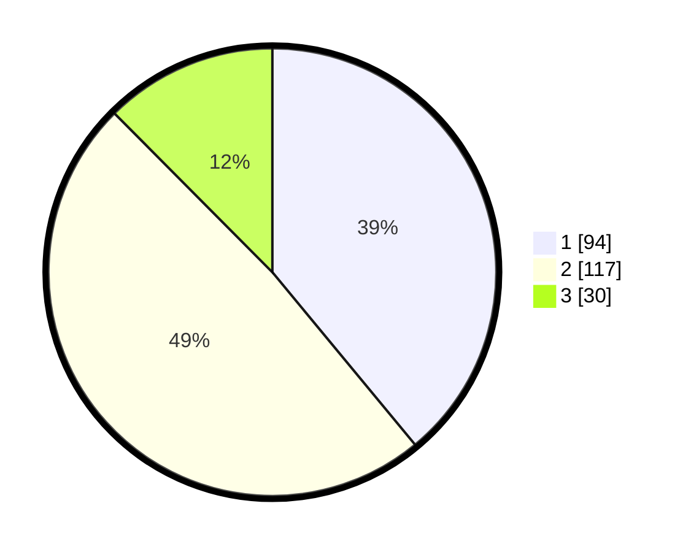

# Hasil

## Grafik

## Tabel

| No. | Nama Paslon    | Suara | Suara (raw) | Persentase |
|:--- |:-------------- | -----:| -----------:| ----------:|
| 1   | ANIES MUHAIMIN | 94    | [94][p-1]   | 39,00      |
| 2   | PRABOWO GIBRAN | 117   | [117][p-2]  | 48,55      |
| 3   | GANJAR MAHFUD  | 30    | [30][p-3]   | 12,45      |

[p-1]: https://github.com/gigit-pemilu/pemilu-2024/blob/main/pilpres/hitung-suara/sub/31-dki-jakarta/sub/74-jakarta-selatan/sub/03-mampang-prapatan/sub/1001-mampang-prapatan/sub/005-tps/sub/paslon-1.txt
[p-2]: https://github.com/gigit-pemilu/pemilu-2024/blob/main/pilpres/hitung-suara/sub/31-dki-jakarta/sub/74-jakarta-selatan/sub/03-mampang-prapatan/sub/1001-mampang-prapatan/sub/005-tps/sub/paslon-2.txt
[p-3]: https://github.com/gigit-pemilu/pemilu-2024/blob/main/pilpres/hitung-suara/sub/31-dki-jakarta/sub/74-jakarta-selatan/sub/03-mampang-prapatan/sub/1001-mampang-prapatan/sub/005-tps/sub/paslon-3.txt

## Foto C Plano

https://sirekap-obj-formc.kpu.go.id/3108/pemilu/ppwp/31/74/03/10/01/3174031001005-20240215-021505--9f214bbe-78c7-47e0-9a4a-d5e7e1dab78b.jpg

https://sirekap-obj-formc.kpu.go.id/3108/pemilu/ppwp/31/74/03/10/01/3174031001005-20240215-021554--dbfae513-be57-4990-9983-b2ae7ba49a72.jpg

https://sirekap-obj-formc.kpu.go.id/3108/pemilu/ppwp/31/74/03/10/01/3174031001005-20240215-021753--acf73fc6-1099-4bfd-ab20-50f9a7dd1f79.jpg

## Metadata

| Key        | Value               |
| ---------- | ------------------- |
| Time Stamp | 2024-02-24 22:31:28 |

