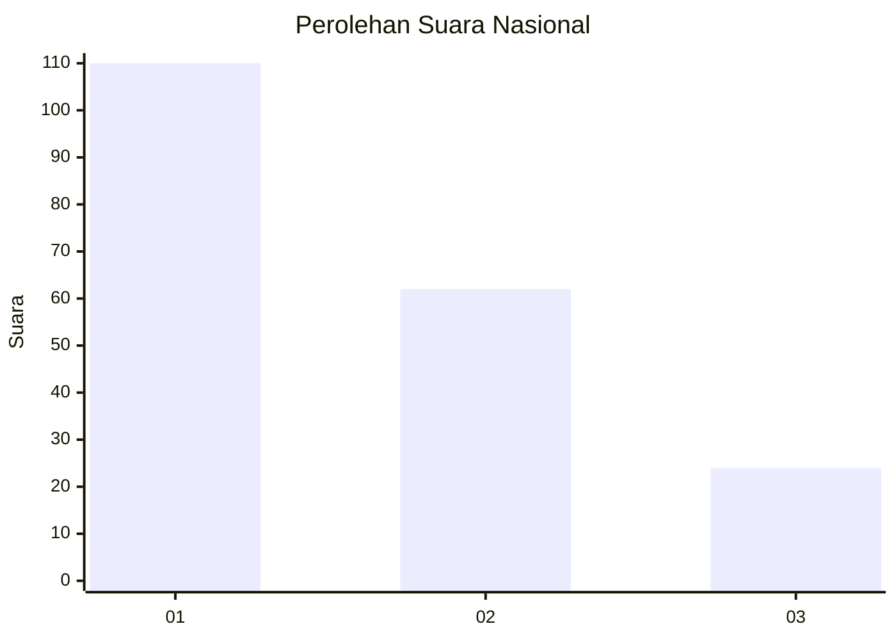
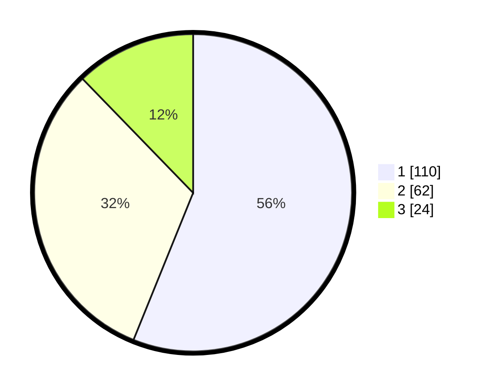

# Hasil

## Grafik

## Tabel

| No.    | Nama Paslon    | Suara | Suara (raw) | Persentase |
|:------ |:-------------- | -----:| -----------:| ----------:|
| 100025 | ANIES MUHAIMIN | 110   | [110][p-1]  | 56,12      |
| 100026 | PRABOWO GIBRAN | 62    | [62][p-2]   | 31,63      |
| 100027 | GANJAR MAHFUD  | 24    | [24][p-3]   | 12,24      |

[p-1]: https://github.com/gigit-pemilu/pemilu-2024/blob/main/pilpres/hitung-suara/sub/31-dki-jakarta/sub/74-jakarta-selatan/sub/03-mampang-prapatan/sub/1001-mampang-prapatan/sub/013-tps/sub/paslon-1.txt
[p-2]: https://github.com/gigit-pemilu/pemilu-2024/blob/main/pilpres/hitung-suara/sub/31-dki-jakarta/sub/74-jakarta-selatan/sub/03-mampang-prapatan/sub/1001-mampang-prapatan/sub/013-tps/sub/paslon-2.txt
[p-3]: https://github.com/gigit-pemilu/pemilu-2024/blob/main/pilpres/hitung-suara/sub/31-dki-jakarta/sub/74-jakarta-selatan/sub/03-mampang-prapatan/sub/1001-mampang-prapatan/sub/013-tps/sub/paslon-3.txt

## Foto C Plano

https://sirekap-obj-formc.kpu.go.id/ef7b/pemilu/ppwp/31/74/03/10/01/3174031001013-20240214-204237--f4cd1ba6-f7df-4049-8c9a-9197d7577a80.jpg

https://sirekap-obj-formc.kpu.go.id/ef7b/pemilu/ppwp/31/74/03/10/01/3174031001013-20240214-204245--626606cd-40a1-48e8-abef-3ec4a6aaeba4.jpg

https://sirekap-obj-formc.kpu.go.id/ef7b/pemilu/ppwp/31/74/03/10/01/3174031001013-20240214-204228--40a26249-fd21-42dc-bd42-b8b5c60f4245.jpg

## Metadata

| Key        | Value               |
| ---------- | ------------------- |
| Time Stamp | 2024-02-24 22:31:28 |

