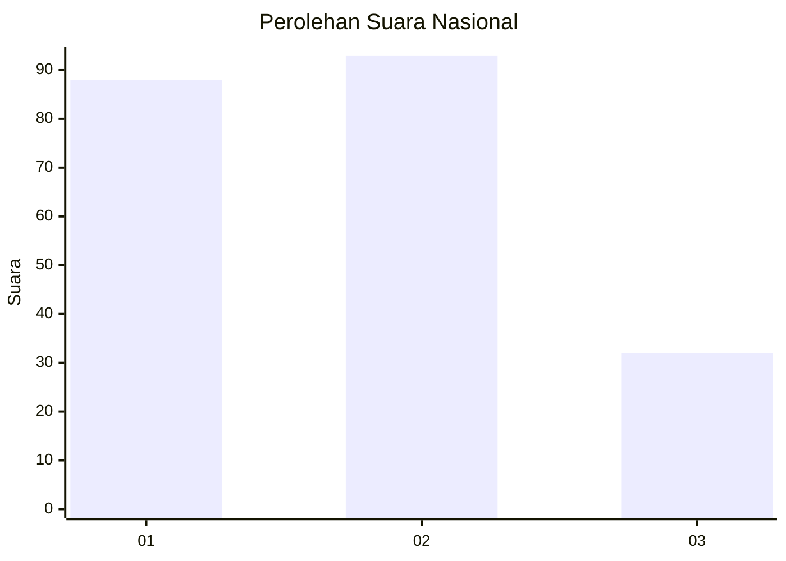
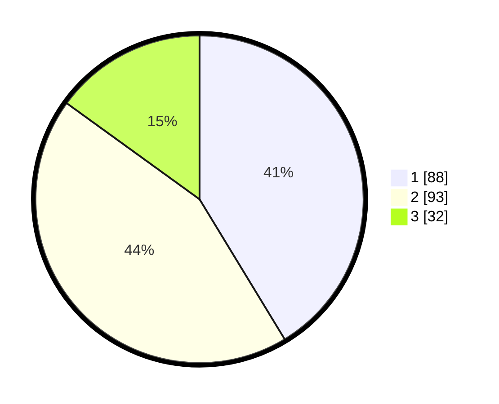

# Hasil

## Grafik

## Tabel

| No.    | Nama Paslon    | Suara | Suara (raw) | Persentase |
|:------ |:-------------- | -----:| -----------:| ----------:|
| 100025 | ANIES MUHAIMIN | 88    | [88][p-1]   | 41,31      |
| 100026 | PRABOWO GIBRAN | 93    | [93][p-2]   | 43,66      |
| 100027 | GANJAR MAHFUD  | 32    | [32][p-3]   | 15,02      |

[p-1]: https://github.com/gigit-pemilu/pemilu-2024/blob/main/pilpres/hitung-suara/sub/31-dki-jakarta/sub/74-jakarta-selatan/sub/03-mampang-prapatan/sub/1001-mampang-prapatan/sub/026-tps/sub/paslon-1.txt
[p-2]: https://github.com/gigit-pemilu/pemilu-2024/blob/main/pilpres/hitung-suara/sub/31-dki-jakarta/sub/74-jakarta-selatan/sub/03-mampang-prapatan/sub/1001-mampang-prapatan/sub/026-tps/sub/paslon-2.txt
[p-3]: https://github.com/gigit-pemilu/pemilu-2024/blob/main/pilpres/hitung-suara/sub/31-dki-jakarta/sub/74-jakarta-selatan/sub/03-mampang-prapatan/sub/1001-mampang-prapatan/sub/026-tps/sub/paslon-3.txt

## Foto C Plano

https://sirekap-obj-formc.kpu.go.id/c609/pemilu/ppwp/31/74/03/10/01/3174031001026-20240214-160109--3c6ec7a2-c3eb-49b3-b6c2-a91fd6d0e381.jpg

https://sirekap-obj-formc.kpu.go.id/c609/pemilu/ppwp/31/74/03/10/01/3174031001026-20240214-160058--980275bb-506c-4806-8d5b-8f50d1eda724.jpg

https://sirekap-obj-formc.kpu.go.id/c609/pemilu/ppwp/31/74/03/10/01/3174031001026-20240214-160133--341413d1-8766-4241-a87d-c02fd7d354e4.jpg

## Metadata

| Key        | Value               |
| ---------- | ------------------- |
| Time Stamp | 2024-02-24 22:31:28 |

